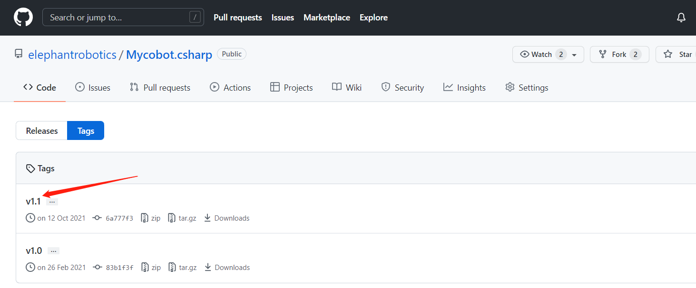
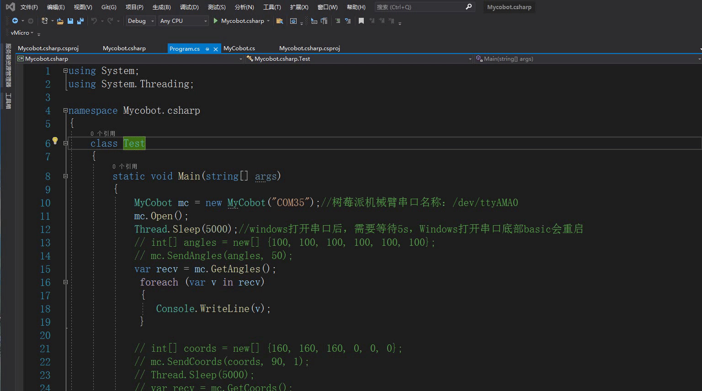
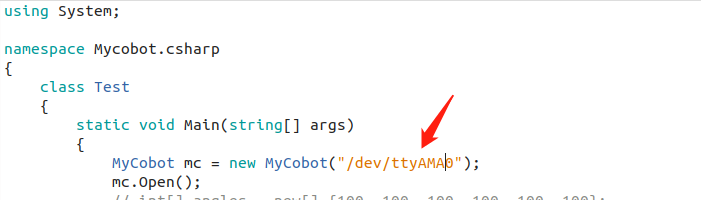

# Mycobot.csharp案例编译运行

## 1 下载
### 1.1 源码下载
github上下载[Mycobot.csharp](https://github.com/elephantrobotics/Mycobot.csharp)。 

### 1.2 动态库下载
运行案例，需要用到此[动态库](https://github.com/elephantrobotics/Mycobot.csharp/tags)，它封装了控制机械臂的API： 
选择最新版本，具体如下图所示： 
	
动态库分Windows（Windows分.net和.net framework，如何区分，请看下面的Windows下运行）和树莓派系统版本，具体如下图所示： 

1 适用于树莓派机械臂系统 
2 适用于Windows系统 

## 2 Windows下运行

### 2.1 直接运行github下载的Mycobot.csharp案例:
双击打开Mycobot.csharp.sln(确保电脑安装了vs2019，如果未安装，请看9.1环境搭建） 

编译运行项目，查看机械臂串口号，如果与示例不一致，请修改串口号，具体可看下图： 

### 2.2 在自己的项目中调用Mycobot.csharp动态库:
检查项目的目标框架，然后下载相应动态库。如果你项目的目标框架（target frame）是.net core,下载 **net core/Mycobot.csharp.dll**,如果目标框架是.net framework,下载 **net framework/Mycobot.csharp.dll**)<br（target frame） 

导入**Mycobot.csharp.dll**到项目中 

添加**system.io.ports**到 .csproj( 项目名称,该文件位于项目目录中),具体请看像下面的图片: 

在vs2019以前的版本，只要using System.IO.Ports就可以用SerialPort。如果显示错误：未能在命名空间中找到对应类型名，则需要给项目配置对应的dll,方法如下：
工具–>Nuget包管理器（N）–>管理解决方案的Nuget程序包（N） –>浏览，左边搜索栏对应的dll(例如SerialPort),右边勾选要添加的项目，点击下载安装。 

关于库函数的使用可以查看Mycobot API章节、使用案例章节和后面关于关节、坐标等的单独使用部分。 

### 2.3 问题
在使用过程中可能碰到的问题: 
问题1 : System.Runtime, Version=5.0.0.0, Culture=neutral, PublicKeyToken=b03f5f7f11d50a3a' or one of its dependencies... 
解决:**更新你的sdk**(if .net core,update to 5.0 and choose,if .net framework update to 4.0 and choose 4.7.2),看下面的动图: 

问题2 :System.IO.FileNotFoundException:“Could not load file or assembly 'System.IO.Ports, Version=6.0.0.0, Culture=neutral, PublicKeyToken=cc7b13ffcd2ddd51'. 
解决:**请看上面9.2.2.2的第3步** 

## 3 树莓派机械臂上运行
3.1 创建一个 C#控制台应用程序（console application）; 
3.2 **复制**文件**program.cs**,然后将program.cs**粘贴**到新创建的C#控制台应用程序; 
3.3 将program.cs中的**端口号**改为**/dev/ttyAMA0**(MyCobot mc = new MyCobot("/dev/ttyAMA0")); 

3.4 将编译方式改为**Release**; 

3.5 将Mycobot.csharp.dll库文件加入项目中，library:ReFerences-->Edit References-->.Net Assembly-->Browse(path for .dll) 

3.6 运行.
注意:编译&&运行,整个操作过程可以看下面的动图: 

