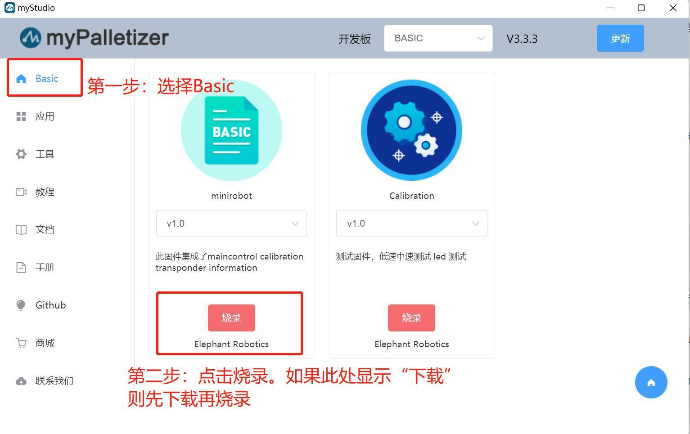
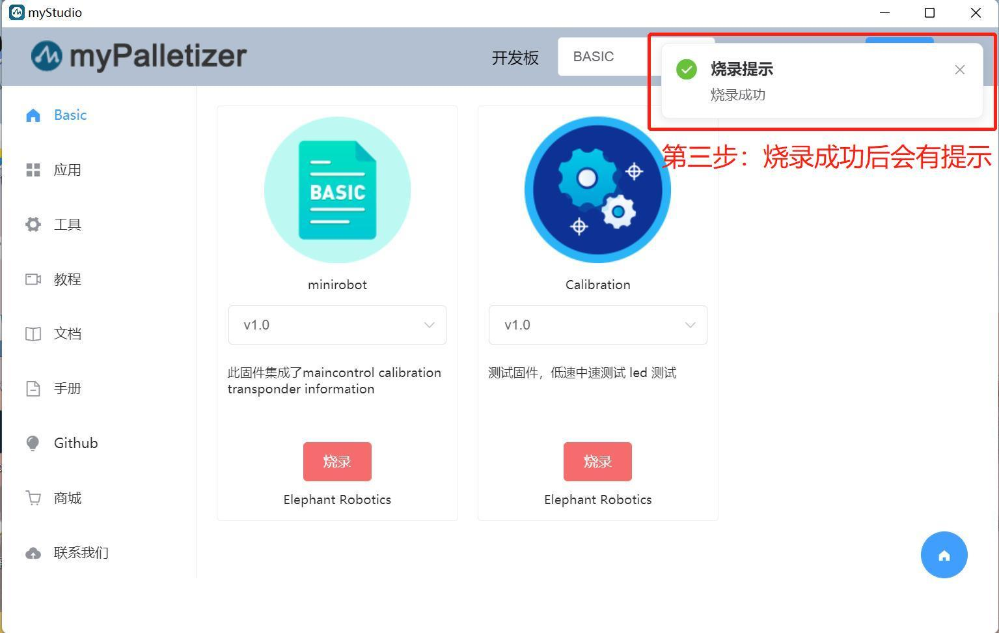
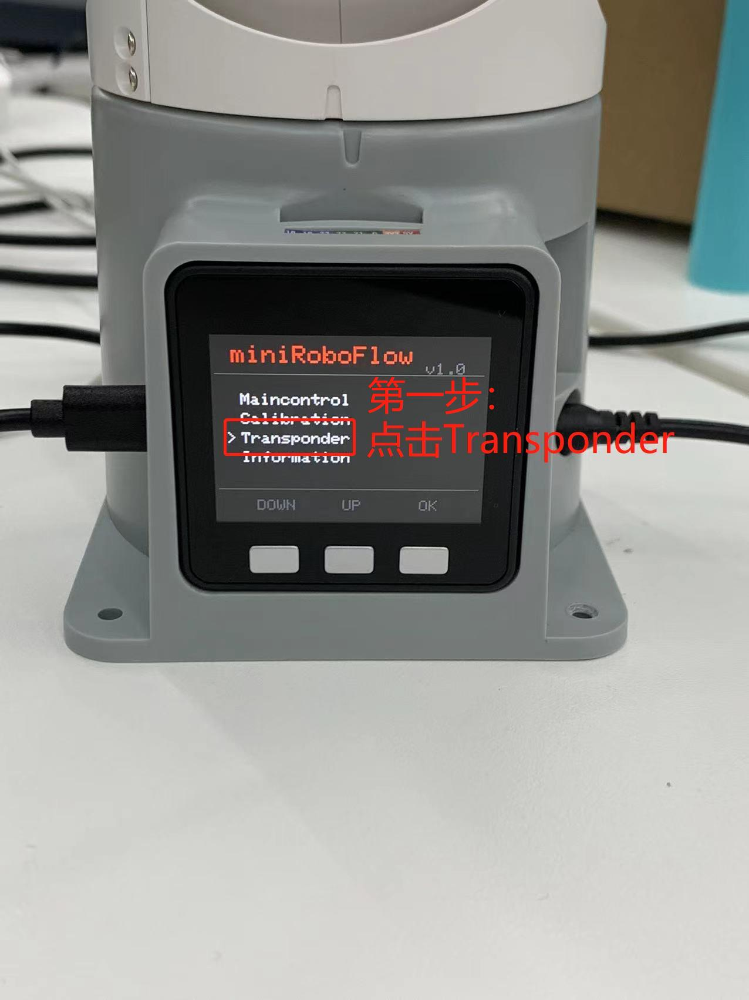
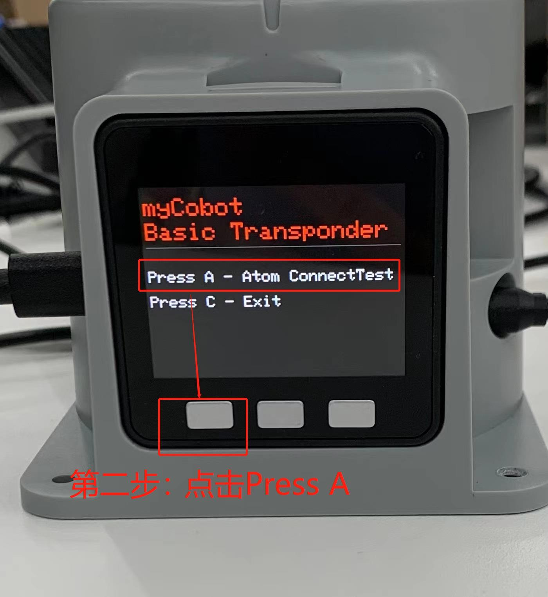
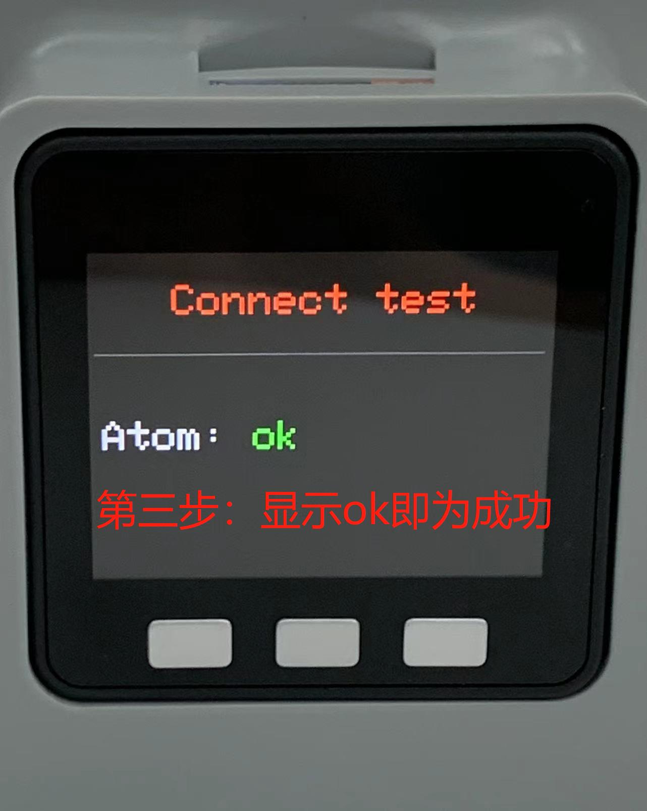
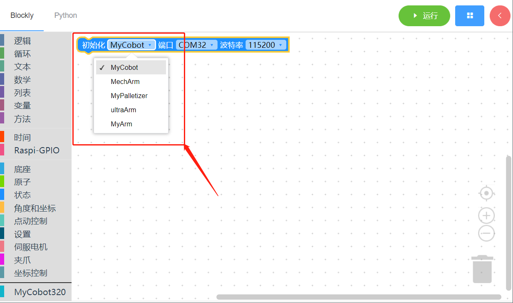
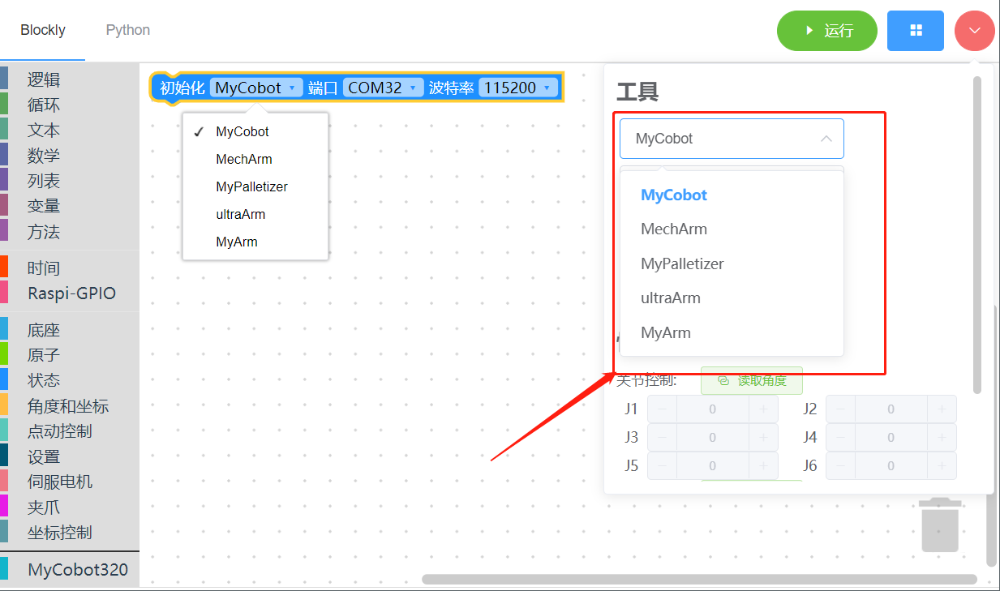
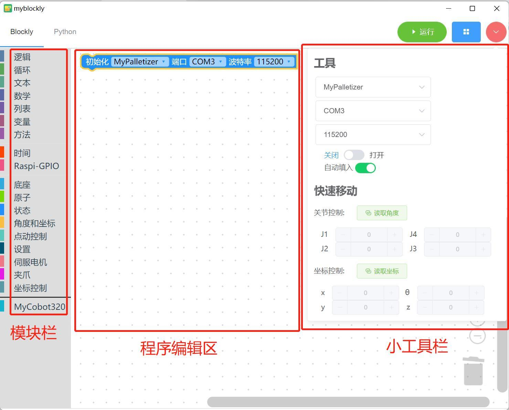
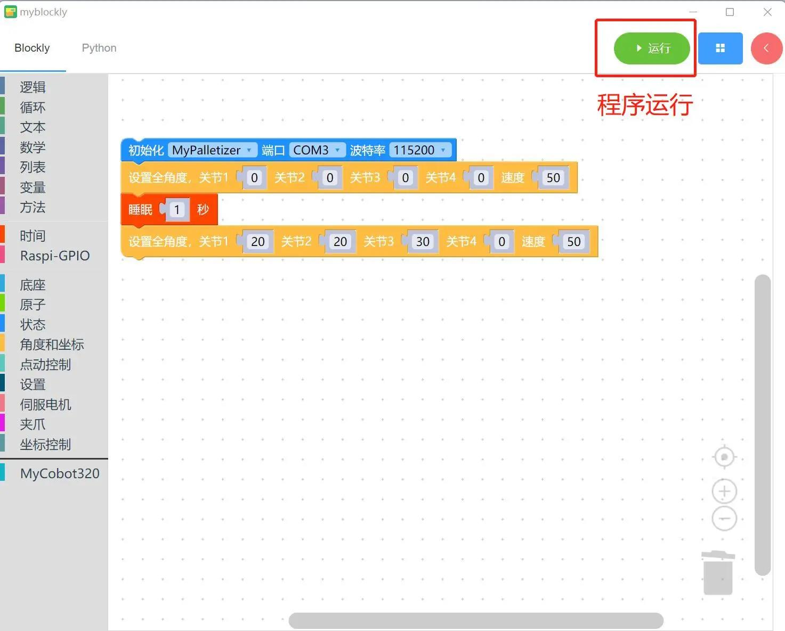

# 1 myBlockly初始使用

## **准备工作**

下载myBlockly之前需要配置Python环境并使用myStudio进行固件的烧录。具体请参照下列操作方式。

1. 环境配置。使用myBlockly之前，请确保电脑上已配置了Python环境（Python的下载安装和环境配置详情请参考**基于Python开发使用 环境搭建**）。

2. 固件烧录。

   * 在使用myStudio进行烧录之前需要下载串口驱动程序，即 CP210X 或 CP34X 驱动程序压缩包。目前存在两种驱动芯片版本， CP210X （适用于CP2104版本）/CP34X （适用于CH9102版本）驱动程序压缩包。若您不确定您的设备所使用的USB芯片，可同时安装两种驱动。（ CH9102_VCP_SER_MacOS 在安装过程中，可能出现报错，但实际上已经完成安装，直接忽略即可）。请根据电脑系统点击下方链接自行下载（具体安装步骤请参考**myStudio安装驱动**部分的动图展示）。

     + 底部M5Stack Basic串口驱动程序
       + CP210X：**[Windows 10](https://download.elephantrobotics.com/software/drivers/CP210x_VCP_Windows.zip)**、**[MacOS](https://download.elephantrobotics.com/software/drivers/CP210x_VCP_MacOS.zip)**、**[Linux](https://download.elephantrobotics.com/software/drivers/CP210x_VCP_Linux.zip)**
       + CP34X：**[Windows 10](https://download.elephantrobotics.com/software/drivers/CH9102_VCP_SER_Windows.exe)**、**[MacOS](https://download.elephantrobotics.com/software/drivers/CH9102_VCP_MacOS.zip)**

     - 末端Atom串口驱动程序
       - **[Windows 10](https://download.elephantrobotics.com/software/drivers/CDM21228_Setup.zip)**

     **注意**：对于 MacOS，在安装之前确保系统 "偏好设置->安全性和隐私->通用" ，并允许从 App Store 和被认可的开发者。

   * <mark>Raspberry Pi以及JETSON NANO版本机械臂无需烧录M5Stack-Basic固件</mark>。末端ATOM需烧录最新版的atomMain（出厂默认已烧录，无需再自行烧录）。

   * M5Stack系列需要通过myStudio烧录底部M5Stack Basic所需的固件miniRobot，且末端ATOM需要烧录最新版的 atomMain (出厂默认已烧录)。烧录需要用到myStudio这一固件烧录器。其下载安装请点击**[基础功能应用 myStudio](https://docs.elephantrobotics.com/docs/gitbook/4-BasicApplication/4.1-myStudio/)**。下图为使用myStudio进行固件烧录的具体步骤（具体烧录步骤详情请参考**[更新设备固件](https://docs.elephantrobotics.com/docs/gitbook/4-BasicApplication/4.1-myStudio/4.1.2-myStudio_flash_firmwares.html)**）。下图为使用myStudio进行固件烧录的具体步骤。 
   
     

     

   * 烧录完成后通过底部M5Stack Basic选择Transponder功能（设备出场固件功能之一，详情请参考**[出场固件介绍](https://docs.elephantrobotics.com/docs/gitbook/4-BasicApplication/4.2-firmwares_intro/?h=Transpo)**），然后点击Press A。出现Atom: ok提示，即为成功。具体步骤如下所示。

     

     

     

## myBlockly下载安装

准备工作完成后可以下载安装myBlockly。下载地址：

- **[Github地址](https://github.com/elephantrobotics/myblockly-package/releases)**
- **[官网地址](https://www.elephantrobotics.com/download/)**

**注意**:请确保下载最新版本。

## 使用前提

- 正式开始编程使用前，一定要选择对应的**机器型号**，否则容易造成硬件损害

- 用控制面板控制机器时，一定要选择对应的**机器型号**，否则容易造成硬件损害

## **myBlockly界面展示**

- 模块栏：

  * 包含程序编写所需的方法模块，可以通过鼠标放入程序编辑区进行拼接
  * MyCobot320模块

- 小工具栏：

  点击右上角粉红色按钮会出现一个小工具栏，此处可以选择正确的机型、串口号以及波特率。也可以通过点击“读取角度”或“读取坐标”按钮获取机械臂实时关节角度和坐标。点击关节控制或坐标控制栏中的“+/-”可以控制机械臂移动。

- 程序编辑区域：

  * 运行程序之前需要在初始化模块中或者小工具栏内选择正确的机型、端口以及波特率，否则程序无法正常运行。
  * 把所需的模块方法拖拽到该区域拼接起来实现自己的程序。
  * 如果右侧小工具栏已经修改了波特率和串口，但是此处仍然是/dev/ttyAMA0，则是myBlockly版本原因，需要先到官网更新软件版本（最新版本在小工具栏选择了串口和波特率后，编辑区的信息会随之改变）。

**注意**:

1.M5Stack系列的波特率一般为115200，Raspberry Pi系列的波特率一般为1000000。

  | 机器型号 | 串口号 | 波特率 |
  |:---------:| :--------:|:--------:|
  |260 M5| Win: COM*; Linux: /dev/ttyUSB*;|115200|
  |270 M5| Win: COM*; Linux: /dev/ttyUSB*;|115200|
  |280 M5| Win: COM*; Linux: /dev/ttyUSB*;|115200|
  |320 M5| Win: COM*; Linux: /dev/ttyUSB*;|115200|
  |260 PI|  /dev/ttyAMA0|1000000|
  |270 PI|  /dev/ttyAMA0|1000000|
  |280 PI|  /dev/ttyAMA0|1000000|
  |320 PI|  /dev/ttyAMA0|115200|
  |280 Jetson Nano|  /dev/ttyTHS1|1000000|
  |280 Arduino| Win: COM*; Linux: /dev/ttyUSB* 或 /dev/ttyACM* ;|1000000|

2.查询机器的串口号和波特率的方法，请前往**myStudio安装驱动**章节查看。

3.当程序无法运行的时候请检查小工具栏是否断开链接（如下图所示）。

  

  

## **程序运行**

拖动想要的方法模块，编辑自己的程序（如上图所示），每个模块结构相结合在一起（有ki的声音），再点击“运行”就可以将代码上传到机械臂当中运行了。

**注意：**操作机械臂运动的程序是需要时间来完成的，所以在一个动作之后需要接上一个`睡眠`模块，给机械臂运动的时间再进行下一个运动。（自己因情况决定所需的时间，机械臂默认设定跑myBlockly最低的睡眠时间不低于0.5s）否则会导致机械臂无法达到理想的运动。

点击左上角“Python”选项可以查阅对应的Python代码，如下图所示。

## **程序保存和载入**

myBlockly的程序以*.json格式保存，点击界面右上角蓝色方框，出现“保存”选项点击后，即可保存程序。

同样点击蓝色方框，点击”加载“选项，可以导入已保存的程序。

