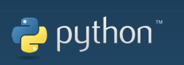

## Python 是什么？

**我司产品对于python的支持较为友好，对于pythonAPI库的开发也日益完善，通过python能对机器人的关节角度，坐标，夹爪等多方面进行操控，选择性较多，如果你想通过Python编程来控制我们的机械臂，那么您可学习该章节。**

## 

**Python** 由荷兰数学和计算机科学研究学会的 Guido van Rossum 于1990 年代初设计，作为一门叫做 ABC 语言的替代品。

**Python** 提供了高效的高级数据结构，还能简单有效地面向对象编程。

**Python** 语法和动态类型，以及解释型语言的本质，使它成为多数平台上写脚本和快速开发应用的编程语言， 随着版本的不断更新和语言新功能的添加，逐渐被用于独立的、大型项目的开发。

**Python** 解释器易于扩展，可以使用 C 或 C++（或者其他可以通过C调用的语言）扩展新的功能和数据类型。

**Python** 也可用于可定制化软件中的扩展程序语言。**Python** 丰富的标准库，提供了适用于各个主要系统平台的源码或机器码。

## python开发使用引导

您可以根据以下指引来使用python对我们的机械臂进行开发

1.[环境搭建](1_download.md)

2.[api说明](2_API.md)

3.[关节控制](3_angle.md)

4.[坐标控制](4_coord.md)

5.[IO控制](5_IO.md)

6.[夹爪控制](6_gripper.md)

7.[TCP&IP](7_TCPIP.md)

8.[手柄控制](9_HandleControl.md)

9.[绘制图案](15_280_gcode_draw.md)

10.[演示代码与视频](8_example.md)