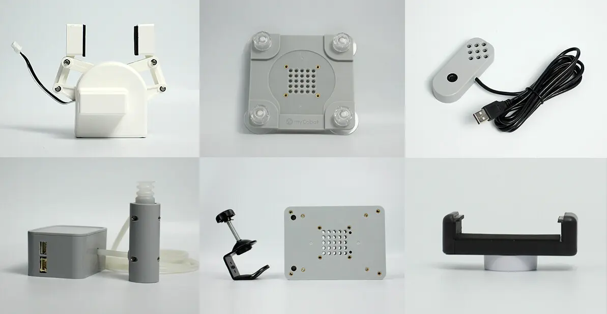

# Chapter 1 Product Introduction
## 1.product description

##### myCobot 280 M5

##### Desktop six-axis collaborative robot

### Product Introduction

myCobot is jointly produced by **Elephant Robot** and **M5stack**. It is the **world's smallest and lightest six-axis collaborative robot**. It can be redeveloped according to user needs to achieve user customization. It is a productivity tool and a tool to expand the boundaries of imagination.

myCobot weighs 850g, has a payload of 250g, and an effective working radius of 280mm. It is small in size but powerful in function. It can be matched with a variety of end effectors to adapt to a variety of application scenarios, and can also support the secondary development of multi-platform software to meet the needs of various scenarios such as **scientific research and education, smart home, and commercial exploration**.

### design concept

The myCobot 280 series robot arm is a six-degree-of-freedom collaborative robot developed by Elephant Robotics for scenarios such as scientific research and education, maker applications, and commercial displays. The robot arm has a compact and exquisite appearance and structure, and a one-piece fully enclosed body design without any leaking cables. It is equipped with the robot motion control algorithm independently developed by Elephant Robotics, and supports multiple control modes such as angle, coordinate, potential value, and radian value, making it easier for users to understand the complex working principles of robots and the application principles of robots. It supports the development of application cooperation and can be expanded to a variety of main controls such as PCs, industrial computers, and embedded devices, suitable for a variety of application scenarios.

### Design goals

| Design goals                                             | description                                                  | Application scenarios and features                           |
| -------------------------------------------------------- | ------------------------------------------------------------ | ------------------------------------------------------------ |
| **Universal multi-functional platform**                  | myCobot 280 M5 is suitable for a variety of application scenarios such as education, research and commercial display, maker development, etc. | Its six degrees of freedom and 280mm arm span support complex motion control in various working environments. It can be equipped with a variety of end accessories such as grippers and suction pumps to meet various application scenarios. |
| **Educational Support**                                  | myCobot 280 M5 supports drag-and-drop programming language and interactive drag-and-drop teaching, which facilitates the intuitive display of how the robot arm works. | The product supports the myblocky graphical programming tool, which allows beginners to intuitively experience robot applications by dragging and combining different modules for programming. |
| **Programmability and scalability**                      | The myCobot 280 M5 is highly programmable, allowing users to customize and program it to meet the needs of future technologies based on emerging technologies. | Through user-defined programming, the equipment can achieve optimized operation and experimental results to meet the ever-changing needs of research and development. |
| **Technological innovation and knowledge dissemination** | myCobot 280 M5 can be used as a platform to showcase the latest scientific and technological achievements in commercial exhibitions, aiming to enhance the public's understanding and interest in science and technology and promote the transformation of scientific and technological innovation into commercialization. | By displaying and demonstrating the latest scientific and technological achievements, we can increase public participation, promote the popularization of scientific and technological knowledge and the market acceptance of scientific and technological products. |

### Features

|                                                              |                                                              |
| ------------------------------------------------------------ | ------------------------------------------------------------ |
| **Unique industrial design, extremely compact**              | Integrated design, compact overall structure, net weight of only 850g, very easy to carry. Modular design, few spare parts, low maintenance cost, can be quickly disassembled and replaced, and realize plug and play |
| **High configuration, equipped with two displays**           | It contains 6 high-performance servo motors with fast response, small inertia and smooth rotation. It has two display screens and supports fastLED library, which is convenient for expanding application interactive output. |
| **LEGO connector, M5 has thousands of applications**         | The base uses M5Stack-basic as the main control, and thousands of application cases can be used directly. The base and the end are equipped with Lego technology parts interface, which is suitable for the development of various micro embedded devices. |
| **Graphical programming, supporting industrial robot software** | Using myBlockly visual programming software, programming is easy on the palm of your hand, and the operation is simple and easy to use. Supports Arduino + ROS open source system. |
| **Track entry, point saving**                                | myCobot 280 M5 supports drag-to-teach and can record the saved paths. It breaks away from the traditional path point storage mode and can save up to 60 minutes of different paths. |

## 2.Product Application

### Client

|                                                 |                                                              |
| ----------------------------------------------- | ------------------------------------------------------------ |
| **Educational institutions**                    | myCobot 280 can be used as a teaching and scientific research tool designed for robotic experiments and technology demonstrations. It can effectively support complex data analysis, algorithm development and verification activities, significantly improving research quality and educational effectiveness. |
| **Technical developers and engineers**          | Supporting multiple programming languages such as Python, C++, C#, myCobot 280 M5 is suitable for professionals who need personalized programming and system integration. Its modular design and high programmability make it an ideal platform for developing and testing new control algorithms or robot applications. |
| **Trade show and public exhibition organisers** | myCobot 280 has become the preferred equipment for technology display and product demonstration with its precision operation display advantage. Dynamic demonstration not only attracts the audience, but also enhances their sense of participation, effectively promoting technological innovation and products. |
| **Geek development enthusiast**                 | myCobot 280 uses myBlockly visual programming software, which allows users to easily program on the palm of their hands and is easy to operate. It supports Arduino + ROS open source systems to meet the various creative needs of enthusiasts. |

### Application Scenario

| **User Group** | **Application Scenarios** | **Advantage Target** |
| -------------------------- | ------------------------------------------------------------ | ------------------------------------------------------------ |
| **Teachers and students in the field of education** | - STEM education - Robotics projects - Interdisciplinary research projects - Education and research | - Improve students' interest in science and technology - Enhance hands-on skills and problem-solving skills - Promote innovative thinking and teamwork - Provide a practical platform for data collection and robotics |
| **Makers and technical developers** | - Prototype development - Experimental research - Algorithm testing and verification - Robot trial teaching | - Accelerate research progress - Connect theory and practice - Promote technological innovation - Support multiple programming languages ​​and development environments |
| **Business presentations and marketing professionals** | - Exhibition displays - Technology demonstrations - Brand promotion | - Attract potential customers and investors - Showcase the company's technological strength and innovative products - Enhance brand influence |

---

## 3.Supported extension development

The mycobot series of robotic arms are extremely valuable in the fields of education and scientific research, especially in Python and ROS (Robot Operating System), two widely used development environments. These environments provide strong support, allowing the mycobot series of products to be widely used in machine learning, artificial intelligence research, complex motion control, and visual processing tasks. At the same time, with dozens of accessories such as adaptive grippers, camera flanges, suction pumps, etc., you can give full play to myCobot's creative ideas.

| | |
| ------------------------------------------------------------ | ------------------------------------------------------------ |
| **Python** | The robot supports Python and has a complete Python API library. The robot's joint angles, coordinates, grippers, etc. can be controlled through Python. |
| **ROS** | Supports both ROS1 and ROS2 versions, and provides RVIZ simulation environment support.   Allows users to display the robot arm and collect the robot arm's status information in real time, making mycobot 280 M5 suitable for ROS beginners and educational purposes. |
| **Hardware interface** | Including IO, USB, etc., to facilitate the connection of various sensors and actuators. |
| **Software library** | Provides a wealth of open source libraries and APIs to simplify the development process. |
| **System compatibility** | Compatible with Windows, Linux, MacOS, and adaptable to a variety of development environments. |
| **C++** | Using the C++ language, you can freely develop (coordinate control, angle control, IO control, gripper control, etc.) through the C++ dynamic library developed by our company, and control some robots that our company has developed. |
| **C#** | Using the C# language, you can freely develop (coordinate control, angle control, io control, gripper control, etc.) through the C# dynamic library provided by our company, and control some robots that our company has developed. |
| **Arduino** | Provides the open source program MyCobotBasic sample program. At the same time, users can also modify the open source program according to their own needs. |
| **JavaScript** | The robot can be controlled through the company's JavaScript language ecosystem library. |
| **myBlockly** | It is both a graphical programming software and a visualization tool. Users can drag and drop modules to create programs. This process is very similar to building blocks, which is convenient, fast and easy to use. |

---

## 4.purchase address

If you are interested in purchasing this device, please click on the link below

Taobao：[https://shop504055678.taobao.com](https://shop504055678.taobao.com)  
Shopify：[https://shop.elephantrobotics.com/](https://shop.elephantrobotics.com/)  
AliExpress：[https://elephantrobotics.aliexpress.com/store/1101941423](https://elephantrobotics.aliexpress.com/store/1101941423)

---

[Next Chapter →](../2.ProductParameter/2-ProductParameters.md)