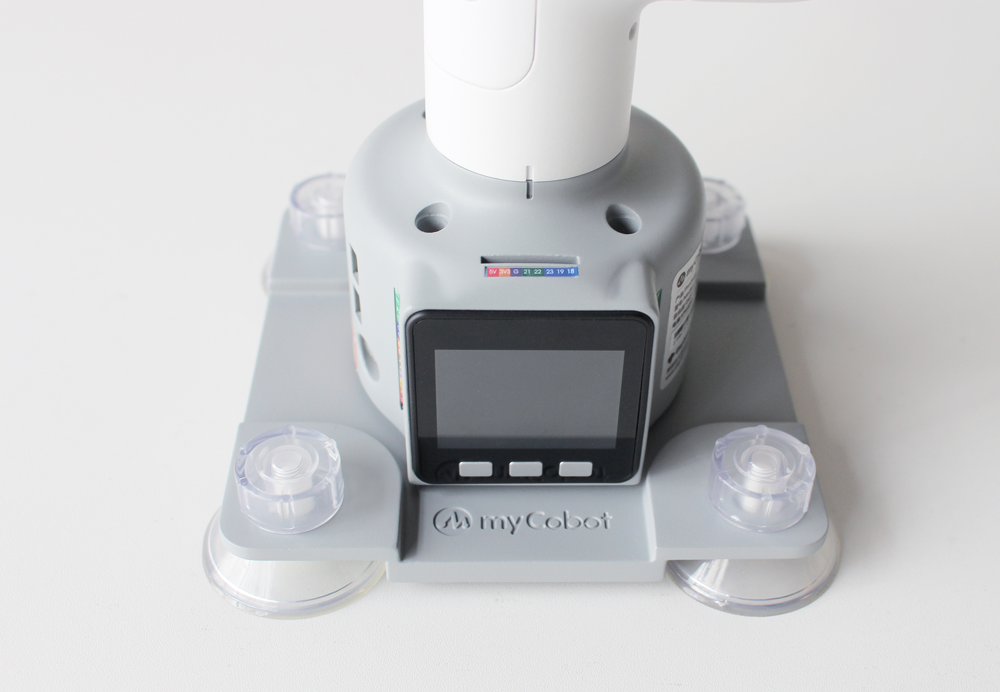
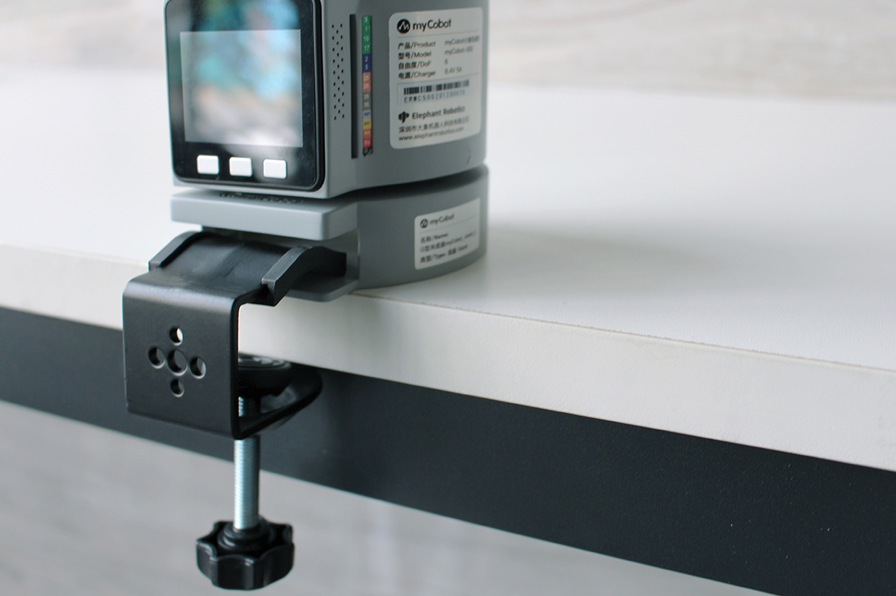

# Chapter 4 First Installation
## 1.Product Standard List
## Product List Image
> Thank you for choosing the Elephant Robot myCobot 280 M5 robot arm. This chapter is designed to help you easily get started with Elephant Robot products and enjoy every wonderful moment brought by the product.

## Product Standard List Comparison Table

| Serial Number | Product |
| :----: | :------------------------------------ |
| 1 | myCobot Robotic Arm (Model myCobot-280 M5) |
| 2 | myCobot Robotic Arm-Product Brochure |
| 3 | myCobot Robotic Arm-Supporting Power Supply |
| 4 | USB-Type C |
| 5 | Jumper |
| 6 | M4*35, Cup Head Hexagon, Full Thread, Stainless Steel Screws |
| 7 | Hexagon Wrench |

**Note:** After the packing box arrives, please confirm that the robot packaging is intact. If there is any damage, please contact the logistics company and the supplier in your area in time. After unpacking, please check the actual items in the box according to the item list.

---
## 2.Product Unpacking Guide
## Product Unpacking Graphic Guide

**Why do you need to follow the steps to disassemble the product**

In this section, we strongly recommend that you follow the specified steps to disassemble the product. This will not only help ensure that the product is not damaged during transportation, but also minimize the risk of unexpected failures. Please read the following graphic guide carefully to ensure the safety of your product during the unpacking process.

- **1** Check the packaging box for damage. If there is damage or missing accessories, please contact the logistics company and the supplier in your area in time.

- **2** Open the box and take out the product brochure, sponge packaging cover, myCobot robot arm, matching power supply, flat base and accessory bag.

- **3** Make sure each step is completed before proceeding to the next step to prevent unnecessary damage or omissions.

**Note:** After taking out the product, please carefully check the appearance of each item. Please check the actual items in the box against the item list.

## 3.Product unboxing video guide

<video id="my-video" class="video-js" controls preload="auto" width="100%"
poster="" data-setup='{"aspectRatio":"16:9"}'>
  <source src="https://download.elephantrobotics.com/video/myCobot%20280%20M5%20Unboxing%200319.mp4"></video>

If the video above does not play, you can click the link below to view the unboxing video
[unboxing video guide](https://www.youtube.com/embed/Lwi8UoihzNc)

## 4.Power-on inspection guide

## Structural installation and fixation

During the movement of the **robot arm**, if the **bottom surface of myCobot is not connected to the desktop or other bottom surface**, myCobot will still **shake or overturn**.

**There are three common ways to fix the robot arm**:

1) Use the Lego key to fix it on a base with a Lego interface
We sell two types of bases: flat suction cup base and G-clip base

​ Flat base Applicable model: myCobot 280

* Install suction cups at the four corners of the base and tighten them.

* Use the included Lego technology parts to connect the flat base and the bottom of the robot arm.

* Fix the four suction cups on a flat and smooth surface before starting to use.

* Tips: You can add a small amount of non-conductive liquid under the suction cup to fill the gap between the suction cup and the desktop to obtain the best adsorption effect.

---

G-type base Applicable models: myCobot 280, myPalletizer 260

- Use the G-clip to fix the base to the edge of the table

- Use the included Lego tech parts to connect the base and the bottom of the robot arm

- Make sure it is stable before starting to use

2 myCobot base screw hole connection

The robot needs to be fixed on a solid base for normal use. Base weight requirement: fixed base or mobile base.

Please make sure there are corresponding threaded holes on the fixed base before installation.

Before formal installation, please confirm:

* The installation environment meets the requirements of the above "Working Environment and Conditions" table.

* The installation location is not less than the robot's working range, and there is enough space for installation, use, maintenance, and repair.

* Place the base in a suitable position.

* The installation related tools are ready, such as screws, wrenches, etc.
**After confirming the above content**, please move the robot to the base installation table, adjust the robot position, and align the robot base fixing holes with the holes on the base installation table. After aligning the holes, align the screws with the holes and tighten them.

* Note: When adjusting the robot position on the base installation table, please try to avoid pushing and pulling the robot directly on the base installation table to avoid scratches. When manually moving the robot, please try to avoid applying external force to the fragile parts of the robot body to avoid unnecessary damage to the robot.

---

## 5. Common Problem Solving
This section aims to help users solve common problems encountered during use, covering hardware, software, accessories, and how to self-check for the first time. If you encounter problems while using the robot arm, please read the contents of this section first to find solutions. If the listed problems cannot help you solve and you have more after-sales questions to consult, please add the after-sales butler WeChat.

[First-time self-check](../../4-SupportAndService/9.Troubleshooting/9.4-first-time-self-check.md)

[Common software problems and solutions](../../4-SupportAndService/9.Troubleshooting/9.2-software.md)

[Common hardware problems and solutions](../../4-SupportAndService/9.Troubleshooting/9.3-hardware.md)

[Common accessories problems and solutions](../../4-SupportAndService/9.Troubleshooting/9.1-accessories.md)

[Other problems and solutions](../../4-SupportAndService/9.Troubleshooting/9.0-other.md)

---

If you have read all the contents of this chapter, please continue to the next chapter.  
[← Previous Chapter](../3.UserNotice/3-UserInstructions.md) | [Next Chapter →](../../3-FunctionsAndApplications/5.BasicFunction/README.md)
