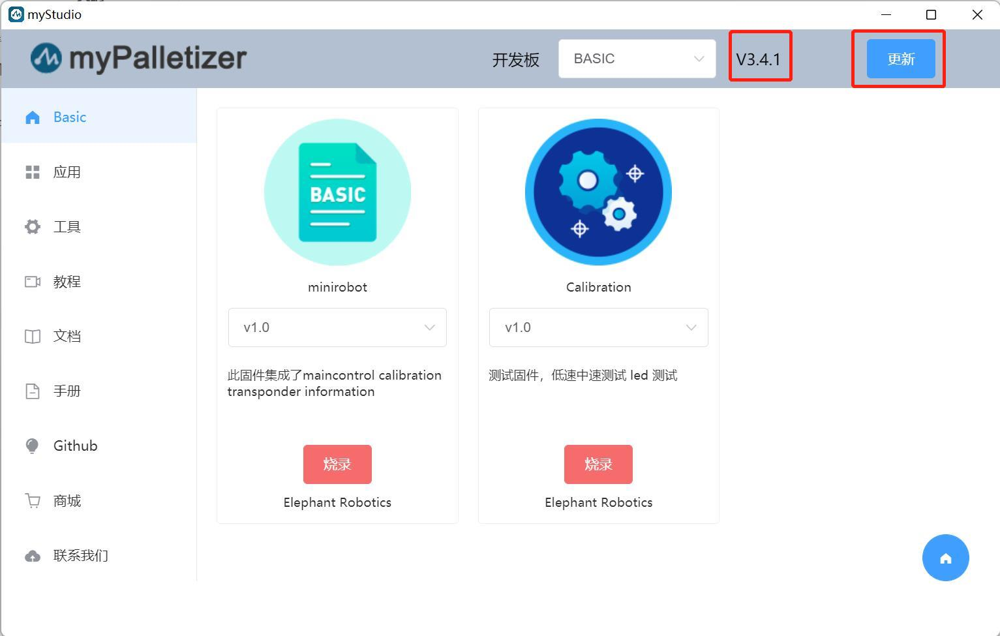

# 1 myStudio environment setup

## 1.1 myStudio download and installation

>Note: The installation path of myStudio cannot have any spaces

Download address:

**1. [GitHub address](https://github.com/elephantrobotics/myStudio)**

* After entering the download address, click `myStudio` on the right and select the corresponding version to download.

* Different suffixes represent different systems, please download the corresponding version:
* *.tra.xz —— Linux system
* *.dmg —— Mac system
* *.exe —— Window system

**2. [Official website address](https://www.elephantrobotics.com/download/)**

You can download it according to your computer system.

> **Note:** Please download the latest version. You can view the current version in the downloaded myStudio interface and update to the latest version.
>
>

## 1.2 Driver Installation

Users can click the button below to download the corresponding **CP210X** or **CP34X** driver package according to their operating system. After decompressing the package, select the installation package corresponding to the operating system bit number for installation.

There are currently two driver chip versions, **CP210X** (for CP2104 version) and **CP34X** (for CH9102 version) driver package. If you are not sure which USB chip your device uses, you can install both drivers at the same time. ( During the installation process, an error may appear for **CH9102_VCP_SER_MacOS**, but the installation has actually been completed, so just ignore it.)

For Mac OS, before installing, make sure that the system "Preferences->Security and Privacy->General" is set and that it allows downloads from the App Store and approved developers.

- Download the bottom **M5Stack-basic** serial port driver

- **CP210X**
- [ **Windows10** ](https://download.elephantrobotics.com/software/drivers/CP210x_VCP_Windows.zip)
- [ **MacOS** ](https://download.elephantrobotics.com/software/drivers/CP210x_VCP_MacOS.zip)
- [ **Linux** ](https://download.elephantrobotics.com/software/drivers/CP210x_VCP_Linux.zip)

* **CP34X**

- [ **Windows10** ](https://download.elephantrobotics.com/software/drivers/CH9102_VCP_SER_Windows.exe)

- [ **MacOS** ](https://download.elephantrobotics.com/software/drivers/CH9102_VCP_MacOS.zip)

- Download the terminal **Atom** serial port driver
- [ **Windows10** ](https://download.elephantrobotics.com/software/drivers/CDM21228_Setup.zip)

## 1.3 How to distinguish CP210X and CP34X chips

- As shown in the figure below, open **Device Manager** and check **Ports (COM and LPT)**

* If **Port (COM and LPT)** shows **USB-Enhanced-SERIAL CH9102**, it is **CP34X chip**

* If **Port (COM and LPT)** shows **Silicon Labs CP210x USB to UART Bridge**, it is **CP210X chip**

