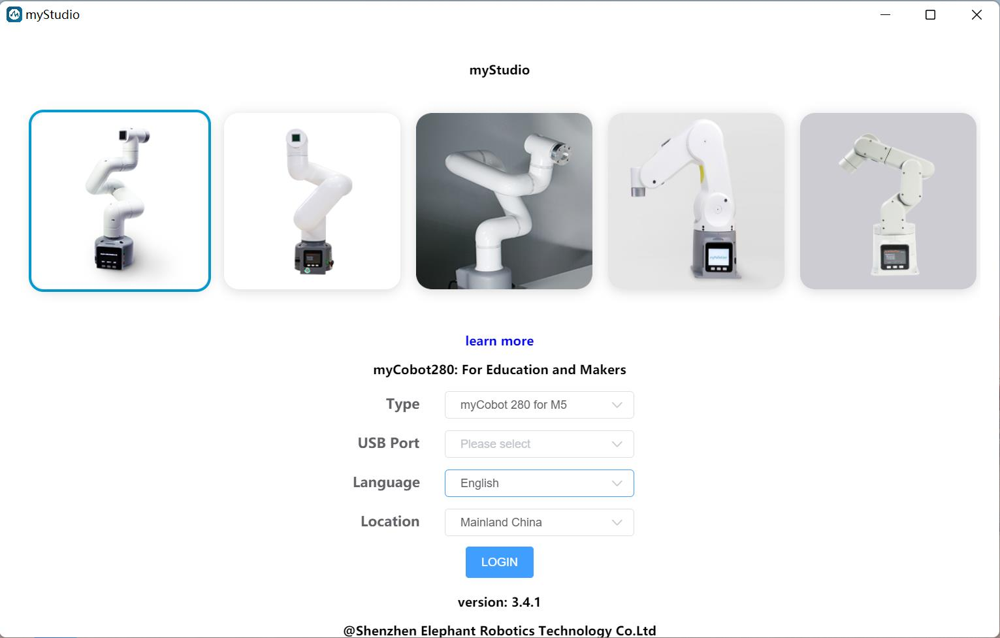
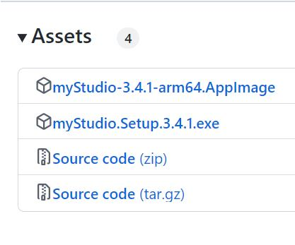
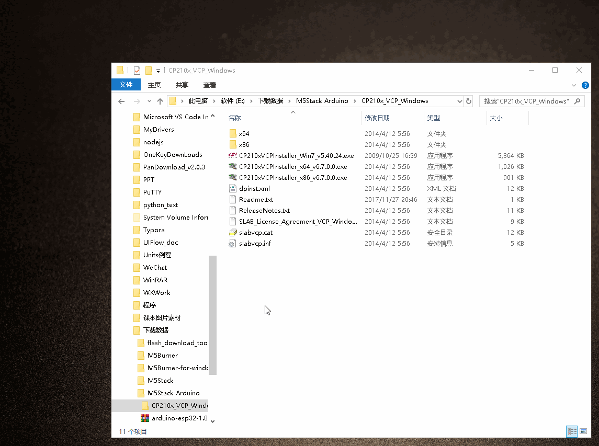
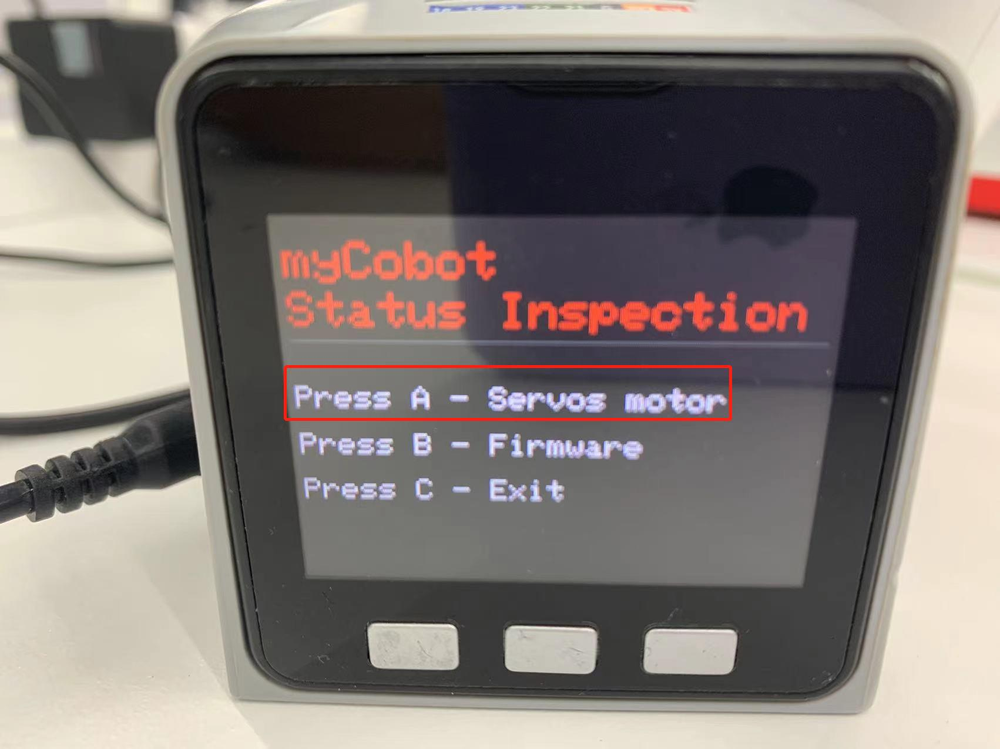
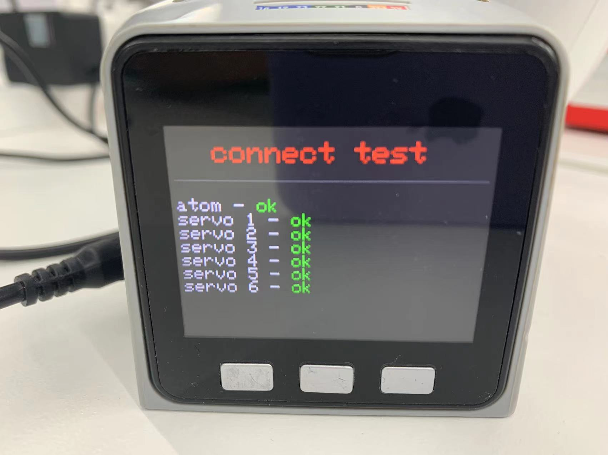

# myStudio

## Original intention of myStudio design

- myStudio is a one-stop platform for using robots such as myRobot/myCobot.

- It is convenient for users to select different firmware and download them according to their own usage scenarios, and at the same time learn related teaching materials and browse tutorial videos online.

## myStudio latest version and supported platforms

- Latest version: V3.5.8

- Applicable to: Windows, Mac, Linux

## myStudio features

- Burn and update firmware
- Provide robot tutorials, such as user manuals, video tutorials, Q&A, etc.
- Information on maintenance and repairs

## myStudio applicable devices

- myCobot 280
- **myCobot 280 M5**
- myCobot 280 PI
- myCobot 280 Jetson Nano
- myCobot 280 for Arduino

## Firmware version recommendation

Different models of robotic arms require different firmware to be burned. The following are the firmware versions recommended for burning different models of robotic arms.

**myCobot 280 series**

The myCobot 280 series has 4 versions: M5 version, PI version, ardunio version and jetsonnano version. Different versions have different core models, and the firmware and versions required to be burned are also different.

<table>
<tr>
<td>Robot version number</td>
<td>Core</td>
<td>Required firmware to be burned</td>
<td>Recommended firmware and version</td>
</tr>
<tr>
<td rowspan='2'>M5 version</td>
<td>M5Stack-Basic</td>
<td>miniRobot firmware</td>
<td>Recommended to burn v2.1 version, you can use drag teaching, wifi, Bluetooth and other functions</td>
</tr>
<tr>
<td>Atom</td>
<td>atomMain firmware</td>
<td>For products with serial numbers ER28001202200415 and earlier, or products without serial numbers, it is recommended to burn v4.1; for products with serial numbers ER28001202200416 and later, it is recommended to burn v5.1</td>
</tr>
</table>

# myStudio environment setup

## myStudio download and installation

>Note: The installation path of myStudio cannot have any spaces

Download address:

**1. [GitHub address](https://github.com/elephantrobotics/myStudio)**

* After entering the download address, click `myStudio` on the right and select the corresponding version to download.

* Different suffixes represent different systems, please download the corresponding version:
* *.tra.xz —— Linux system
* *.dmg —— Mac system
* *.exe —— Window system

**2. [Official website address](https://www.elephantrobotics.com/download/)**

You can download it according to your computer system.

> **Note:** Please download the latest version. You can view the current version in the downloaded myStudio interface and update to the latest version.
>
>

##  Driver Installation

Users can click the button below to download the corresponding **CP210X** or **CP34X** driver package according to their operating system. After decompressing the package, select the installation package corresponding to the operating system bit number for installation.

There are currently two driver chip versions, **CP210X** (for CP2104 version) and **CP34X** (for CH9102 version) driver package. If you are not sure which USB chip your device uses, you can install both drivers at the same time. ( During the installation process, an error may appear for **CH9102_VCP_SER_MacOS**, but the installation has actually been completed, so just ignore it.)

For Mac OS, before installing, make sure that the system "Preferences->Security and Privacy->General" is set and that it allows downloads from the App Store and approved developers.

- Download the bottom **M5Stack-basic** serial port driver

- **CP210X**
- [ **Windows10** ](https://download.elephantrobotics.com/software/drivers/CP210x_VCP_Windows.zip)
- [ **MacOS** ](https://download.elephantrobotics.com/software/drivers/CP210x_VCP_MacOS.zip)
- [ **Linux** ](https://download.elephantrobotics.com/software/drivers/CP210x_VCP_Linux.zip)

* **CP34X**

- [ **Windows10** ](https://download.elephantrobotics.com/software/drivers/CH9102_VCP_SER_Windows.exe)

- [ **MacOS** ](https://download.elephantrobotics.com/software/drivers/CH9102_VCP_MacOS.zip)

- Download the terminal **Atom** serial port driver
- [ **Windows10** ](https://download.elephantrobotics.com/software/drivers/CDM21228_Setup.zip)

## How to distinguish CP210X and CP34X chips

- As shown in the figure below, open **Device Manager** and check **Ports (COM and LPT)**

* If **Port (COM and LPT)** shows **USB-Enhanced-SERIAL CH9102**, it is **CP34X chip**

* If **Port (COM and LPT)** shows **Silicon Labs CP210x USB to UART Bridge**, it is **CP210X chip**

# Burn and update firmware

**[myStudio video tutorial](https://www.bilibili.com/video/BV1Qr4y1N7B5/)**

## Burn M5Stack-Basic firmware

> **Note: Pi series robot arms do not need to burn M5Stack-Basic firmware. **

Step 1: Connect to PC. The connection method between M5Stack-Basic and PC is shown in the figure below:

Step 2: Select the port. After connecting, the `USB port` in the connection window of myStudio will show the connected development board (here is the myPalletizer 260M5 version as an example):

Step 3: Click `Login`->`M5Stack-basic` to burn the required firmware:

> **Note:** The 280 PI/Jetson nano/Arduino version does not have M5Stack-basic, so it will display "No data" after connecting to myStudio.

---

## Burn Atom firmware

Step 1: Connect to PC. Connect the Atom at the end with USB.

Step 2: Select `ATOM` in the `Board` column, and the Atom firmware will appear in the `Basic` sidebar. There is only one Atom firmware, click to burn it (the following figure takes myCobot 280 as an example).

## 5.Power on and preliminary test

**myCobot must be powered by an external power supply to provide sufficient power:**
Rated voltage: 12V 
Rated current: 3-5A 
Plug Type: DC 5.5mm x 2.1 
**Note that you cannot just use the TypeC plugged into the M5Stack-basic for power. Use the official power adapter to avoid damage to the robot. **

### Graphic guide

#### Connect the power supply

Start after connecting the power cord.

Use the Type-C cable to connect to the corresponding USB port of the computer and the robot M5Stack-basic, and perform a connection test. The connection test is a detection function for the motor and **Atom** connection status in the robot. This function is convenient for customers to troubleshoot equipment failures

#### Connection detection

**Step 1:** **Atom** burns the latest version of **atomMain**.

**Step 2:** **M5Stack-basic** burns **minirobot**, select **Information** function.

**Step 3**: Press **A** key to start connection detection. The screen displays **Atom** and the connection status of the six motors.

As shown in the figure, the motor connection is in good condition
**Step 4**: Press the **B** key to start detecting the version information. The screen displays the robot version and the **Basic** firmware version.

**Step 5**: Press the **C** key to exit this function

The power-on detection is completed.