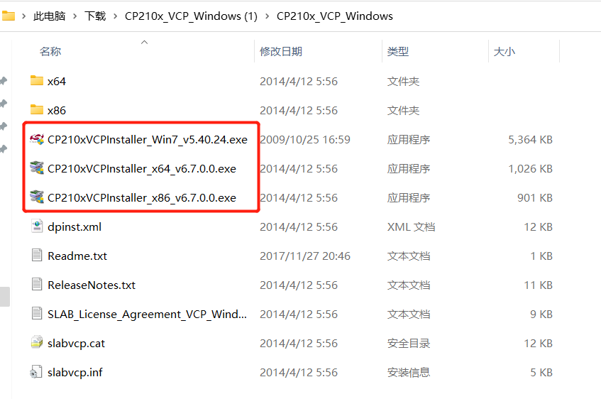
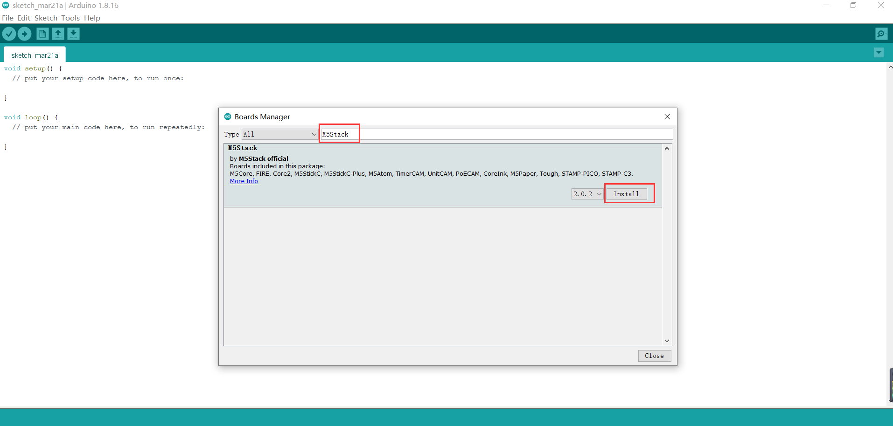
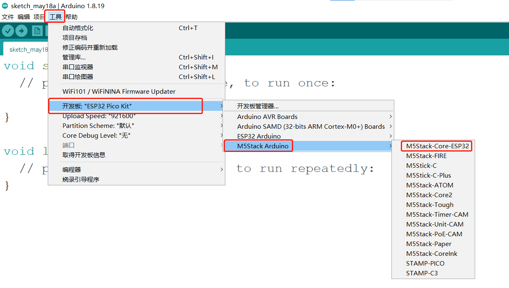
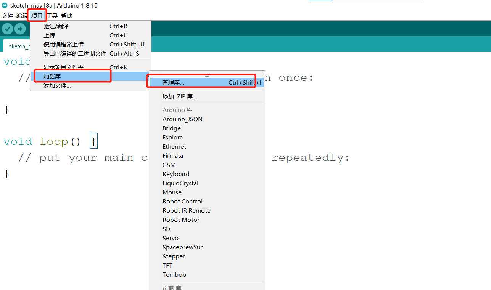
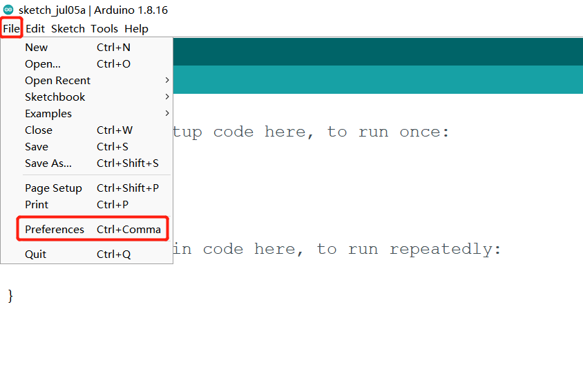

# Arduino environment setup

## 1 **Arduino IDE** download

Download **Arduino IDE** You can click [**Arduino official website**](https://www.arduino.cc/en/software) to download and install the version corresponding to the computer system.

- [Windows X64](https://downloads.arduino.cc/arduino-1.8.16-windows.exe)

- [Mac OS X](https://downloads.arduino.cc/arduino-1.8.16-macosx.zip)

- [Linux ARM 64](https://downloads.arduino.cc/arduino-1.8.16-linuxaarch64.tar.xz)

## 2 Install the driver

Before burning the program, users of M5Core host (including BASIC/GRAY/M5GO/FIRE/FACES)/ **microcontroller devices** please click the button below to download the corresponding **CP210X** driver package according to your operating system. After decompressing the package, select the installation package corresponding to the operating system bit number to install.

For **Mac OS**, before installing, make sure **System Preferences-->Security & Privacy-->General** and allow **CP2104** drivers to be downloaded from the App Store and approved developers

* [Windows10](https://m5stack.oss-cn-shenzhen.aliyuncs.com/resource/drivers/CP210x_VCP_Windows.zip)

* [MacOS](https://m5stack.oss-cn-shenzhen.aliyuncs.com/resource/drivers/CP210x_VCP_MacOS.zip)

* [Linux](https://m5stack.oss-cn-shenzhen.aliyuncs.com/resource/drivers/CP210x_VCP_Linux.zip)

After unzipping the compressed package, select the corresponding installation package according to the **operating system** of the computer for installation (select x64 or x86 for win10 and win11).

**CP34X**

- [ **Windows10** ](https://download.elephantrobotics.com/software/drivers/CH9102_VCP_SER_Windows.exe)

- [ **MacOS** ](https://download.elephantrobotics.com/software/drivers/CH9102_VCP_MacOS.zip)
## 3 Add development board

* Open Arduino IDE, select **File --> Preferences --> Settings**, add the URL below to the additional development board manager
https://m5stack.oss-cn-shenzhen.aliyuncs.com/resource/arduino/package_m5stack_index.json

* After adding, select **Tools --> Development Edition --> Development Board Manager**, enter and search **M5Stack** in the new pop-up dialog box, and click Install (if the search fails, you can try restarting the **Arduino** program; if an error occurs during downloading, click Install again), as shown below:

* After adding, select **Tools --> Development Board** , check if it is successful, as shown below:

## 4 Add related libraries
4.1 Install M5Stack library 
1. Tools --> Development Board --> M5Stack Arduino Select **M5Stack-Core-ESP32**, as shown below: 

2. Project --> Load Library --> Manage Library Enter **M5Stack** in the search box, as shown in the following figure: 

3. Click Install after finding it, scroll down, **M5Stack** is at the back, and you can see the location of the drop-down slider in the picture, as shown in the following figure: 

4.2 Install MyCobotBasic library 

**Note:** Please download the latest library, the first version is v0.0.1.

* Click to download related dependency libraries
- [**MycobotBasic**](https://github.com/elephantrobotics/MyCobotBasic/tags)(After importing the Mycobot280-Arduino model, you can refer to [10.3-arduinolib_use](10.3-arduinolib_use.md) for use). Please see the figure below for details. .zip is suitable for Windows system, and .tar.gz is suitable for Linux system: 

* Dependent library installation instructions

First check the location of the Arduino project folder. You can view it by clicking File --> Preferences (you can copy the path to the hard disk path to find the libraries folder)

---

---

1 Copy the path here and press enter to find the libraries folder

Unzip to the corresponding folder **libraries** directory. If you are using **Arduino**, please do not overwrite, just add it to the existing **Library**.

At this point, congratulations, you have built the **Arduino** related development environment.

Note: For Arduino environment configuration and case compilation, you can watch our video on Bilibili (https://www.bilibili.com/video/BV1Vi4y1c7DQ/).