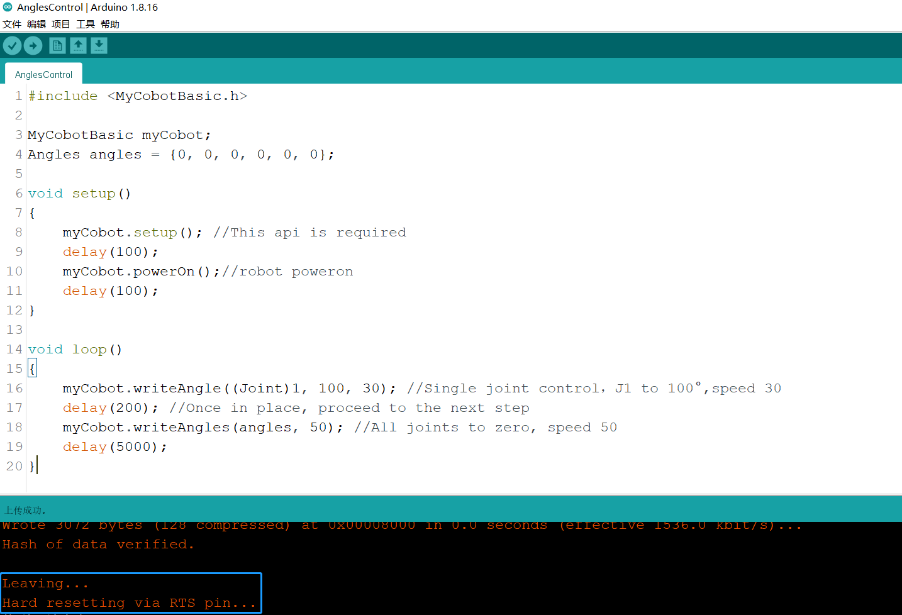

# Simple use of Arduino

## Connect the device

Take **myCobot 280-M5** as an example, use the Tyep-C data cable to connect the M5Stack-basic on the base of the robot arm to the PC.


## Firmware requirements

* ATOM: Use [**MyStudio**](../4-BasicApplication/README.md) to burn the latest version of AtomMain

* Basic: No requirements

## Check the link

Open the computer device manager to check if there is any device. If the device is not detected, please change the USB cable. If it is not available, please install and click to download **CP210X driver**. After downloading, unzip and install the required driver version to use it.

Open **Arduino IDE --> Tools --> Port** to check if there is a device. If the device is not detected, please change the USB cable to test, or check whether the driver is installed successfully.

## Start development

Take burning an official demo as an example. Open **Arduino IDE --> File --> Examples --> MyCobotBasic** to see all project examples (if you don't see the example, you can restart Arduino). Choose to burn a simple demo, for example **--> MyCobot280--> MyCobot280-M5--> AnglesControl**.

Open AnglesControl.ino from the example file


**Note:** Select the development board as **M5Stack-Core-ESP32** and the corresponding **COM port**.


If you are using myCobot280-M5, **please use ParameterList.h in the MyCobot280-M5 folder to replace ParameterList.h in the MyCobotBasic folder**. Please see the following figure for details:<br>


**Note:** When using different models, please use the "ParameterList.h" file in the respective case directory to replace the "MyCobotBasic\ParameterList.h" file

Click upload and wait for the progress bar in the lower right corner to finish running<br>


Wait until the lower right corner shows that the upload is successful, and the program has been downloaded


At this time, we can see the **robot** start working.

For the interface and driver of **basic buttons and screen**, please refer to the following documents:<br>

Button: https://docs.m5stack.com/en/api/core/button <br>
Screen: https://docs.m5stack.com/en/api/core/lcd <br>

## 5. Introduction to some cases
Currently, different models have angle, coordinate, and gripper control. MyCobot320 supports adaptive gripper and electric gripper control. <br>
miniRobot: <br>
MyCobot280, 320m5, mechArm270-M5 use cases can perform zero calibration, drag teaching, communication, etc. (on this basis, use RoboFlow, python, myblockly, etc. to control the robot arm), information acquisition (obtain the servo atom connection status, and basic, atom firmware versions). <br>

Note: For Arduino environment configuration and case compilation, please refer to the relevant chapters of gitbook and the video on Bilibili https://space.bilibili.com/2126215657/channel/seriesdetail?sid=619809.

**Case code explanation**:

The sample code in the **AnglesControl** folder is used to control the angle of the robot arm. The code includes the functions of initialization, power-on, controlling the angle of a single joint, and controlling all joints to return to the initial position. The following is a detailed comment of the code

```arduino
#include <MyCobotBasic.h> // Import the MyCobotBasic library to control the MyCobot robot

MyCobotBasic myCobot; // Declare and instantiate a MyCobotBasic object to call the robot control method
Angles angles = {0, 0, 0, 0, 0, 0}; // Define an Angles variable and initialize the angles of the six joints to 0

void setup()
{
myCobot.setup(); // Initialize the basic settings such as the communication interface of the robot, which is required to start the robot control
delay(100); // Delay 100 milliseconds to ensure that the initialization is complete
myCobot.powerOn(); // Power on the robot so that it can respond to control commands
delay(100); // Delay another 100 milliseconds to ensure that the robot is fully started
}

void loop()
{
myCobot.writeAngle((Joint)1, 100, 30); // Control the first joint (J1) to move to 100°, set the speed to 30
delay(200); // Delay 200 milliseconds, wait for the joint to move to the specified angle before executing the next step
myCobot.writeAngles(angles, 50); // Move all joints to the angle specified in angles (here is 0°), set the speed to 50
delay(5000); // Delay 5000 milliseconds, let the robot arm remain still for a while after all joints return to the initial position
}
```

The sample code in the **CoordsControl** folder is used to control the coordinates of the robot arm. The code includes robot arm initialization, power-on, and robot arm movement according to the specified coordinates. The following is a detailed comment on the code.

```
#include <MyCobotBasic.h> // Import the MyCobotBasic library to control the MyCobot robot

MyCobotBasic myCobot; // Declare and instantiate a MyCobotBasic object to call the robot's control method

Coords coords = {200.8, -87.400, 113.300, -178.260, -30.760, -60.880}; // Define a Coords variable to represent the six coordinate values ​​of the target

void setup()
{
myCobot.setup(); // Initialize the basic settings such as the robot's communication interface, which is required to start the robot control
delay(100); // Delay 100 milliseconds to ensure that the initialization is complete
myCobot.powerOn(); // Power on the robot so that it can respond to control commands
delay(100); // Delay 100 again milliseconds to ensure that the robot is fully started
myCobot.writeAngles({0, -10, -123, 45, 0, 20}, 50); // Set the initial posture of the robot, each joint angle is the specified value, and the speed is 50
delay(6000); // Delay 6000 milliseconds and wait for the robot to move to the initial posture
}

void loop()
{
myCobot.writeCoord((Axis)3, 260, 30); // Control the third axis (Z axis) of the robot to move to 260mm, with a speed of 30
delay(300); // Delay 300 milliseconds and wait for the axis to move to the specified position before executing the next step
myCobot.writeCoords(coords, 30); // Control multiple axes to move to the target position at the same time according to the defined coordinates, with a speed of 30
delay(5000); // Delay 5000 milliseconds, wait for the robot to finish moving and stay still for a while
}
```

The sample code in the **GripperControl** folder is used to control the gripper of the robot. Please connect the gripper before running the sample code. The code includes robot initialization, power-on, and movement of the robot according to the specified coordinates. The following is a detailed comment on the code.
```
#include <MyCobotBasic.h> // Import the MyCobotBasic library to control the MyCobot robot

MyCobotBasic myCobot; // Declare and instantiate a MyCobotBasic object to call the robot control method

void setup()
{
myCobot.setup(); // Initialize the robot's communication interface and other basic settings, which is required to start the robot control
delay(100); // Delay 100 milliseconds to ensure that the initialization is complete
myCobot.powerOn(); // Power on the robot so that it can respond to control commands
delay(100); // Delay another 100 milliseconds to ensure that the robot is fully started
}

void loop()
{
myCobot.setGripperValue(80, 50); // Move the gripper to 80° at a speed of 50
delay(500); // Delay 500 milliseconds and wait for the gripper to move to the specified position before executing the next step
myCobot.setGripperValue(20, 50); // Move the gripper to 20°, speed 50
delay(500); // Delay 500 milliseconds, wait for the gripper to move to the specified position before executing the next step
myCobot.setGripperState(0, 30); // Open the gripper, speed 30
delay(600); // Delay 600 milliseconds, wait for the gripper to fully open before executing the next step
myCobot.setGripperState(1, 30); // Close the gripper, speed 30
delay(600); // Delay 600 milliseconds, wait for the gripper to fully close before executing the next step
}
```