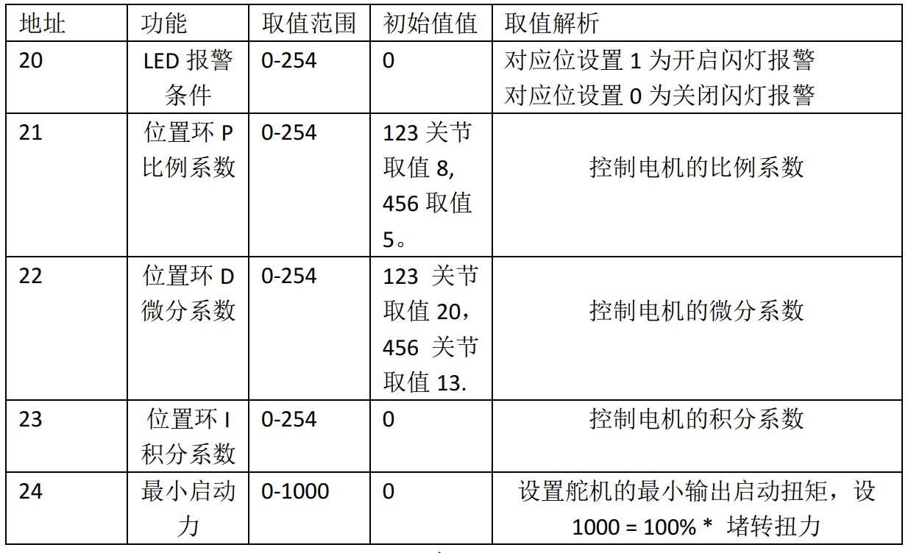

# arduino API

## 1 Overall status of the robot

1.1 `powerOn();`

- Function: Power on the robot, and the robot can be controlled only after powering on

- Return value: None

1.2 `powerOff();`

- Function: Power off the robot

- Return value: None

1.3 `isPoweredOn();`

- Function: Atom status query, return atom connection status

- Return value: TRUE for open, FALSE for close

1.4 `getAtomVersion();`

- Function: Get the Atom firmware version

- Return value: int type value, data needs /10, for example, the version number read is 12, the actual number needs to be divided by 10, and the final version number is 1.2

1.5 `setFreeMoveMode(bool mode);`

- Function: Set the free movement mode. After the free movement mode is turned on, the end LED is yellow. Long press the end atom to manually move the robot

Parameter description:
- mode: mode, 0/1, 0--turn off free movement, 1--turn on free movement

- Return value: None

## 2 Input program control mode MDI Mode and Robot Control (Manual Data Input)

2.1 `getAngles();`

- Function: Read all joint angles. When using, you should define an Angles angles to receive the read angles. Angles is a built-in variable or function definition of the library function. You can define a storage space angles with a memory of 6 to store angle variables. The method of use is the same as that of an array.

- Return value: Angles type array

2.2 `writeAngle(int joint, float value, int speed);`

- Function: Send single joint angle

- Parameter description:
Joint number = joint, value range 1-6;
Specified angle value = value, value range about -170°- +170°;
Specified speed = speed, value range 1-100;

- Return value: None

2.3 `writeAngles(Angles angles, int speed);`

- Function: Joint angles are executed synchronously, and the angles of six joints are sent to the actuator at the same time. Angles is the definition type declared by the library function. It specifies that angles is a container with a capacity of 6 data, which can be understood as an array. When assigning values, you can use for loop assignment or assign values ​​individually.

- Parameter description:
Angles[0] = specific angle, Angles[2] = specific angle, and so on. The value range is 0-90 (the range is defined, and the value range should be the same as writeAngle) Unit: degree Symbol: °
Movement speed = speed, value range 1-100 Unit %

- Return value: None

2.4 `getCoords();`

- Function: Read the x, y, z, rx, ry, rz of the current robot end. When using, a Coords tempcoords should be defined to receive the read angle. Coords is a built-in variable or function definition of the library function. You can define a storage space tempcoords with a memory of 6 to store angle variables. The method of use is the same as that of an array.

- Return value: an array of Coords type, you need to define the variable of Coords type

2.5 `writeCoord(Axis axis, float value, int speed);`

- Function: send the specific value of the individual coordinate parameters X/ Y/ Z/ RX/ RY/ RZ, the end will move in a single direction,

- Parameter description:
Moving path coordinate value = value value range -300-300 (axis=Axis::X, aixs=Axis::Y and axis=Axis::Z are position coordinates X, Y, Z respectively, unit mm, position coordinate value range is not uniform, axis=Axis::RX, aixs=Axis::RY and axis=Axis::RZ are RX, RY, RZ respectively, value range is -180°-180°, if it exceeds the value range, it will return the prompt of inverse kinematics no solution)
Specified speed = speed value range 1-100 Unit %

- Return value: None

2.6 `writeCoords(Coords coords, int speed);`

- Function: Send the specified coordinate parameter. The parameter type should be Coords. You need to declare a variable of type Coords. The usage of this variable is the same as that of an array.

- Parameter description:
coords[0] = X, coords[1] = Y, coords[2] = Z,
X,Y,Z value range -300.00-300.00 (the value range is undefined. If it exceeds the range, the prompt "inverse kinematics no solution" will be returned) Unit mm
coords[3] = RX, coords[4] = RY, coords[5] = RZ,
RX,RY,RZ value range -180-180
Specified speed = speed value range 1-100 Unit %

- Return value: None

2.7 `checkRunning();`

- Function: Check if the device is moving

- Return value: Return TRUE if it is moving, otherwise return FALSE

2.8 `setEncoder(int joint, int encoder);`

- Function: Set a single joint to rotate to a specified potential value

- Parameter description: Joint number = joint value range 1-7 (No. 7 joint is generally a gripper, and the gripper potential value range is: 1325-2048); Servo potential value = encoder value range 0-4096 (this range should be positively correlated with the range of each joint)

- Return value: None

2.9 `getEncoder(int joint);`

- Function: Get the specified joint potential value

- Parameter description: Servo number = joint value range 1-7

- Return value: int type, reference value range 0-4096

2.10 `setEncoders(Angles angleEncoders, int speed);`

- Function: Set the six joints of the robot arm to execute synchronously to the specified position

- Parameter description: It is necessary to define a variable angleEncoders of the Angles type. The use of angleEncoders is equivalent to an array. Assign values ​​to the array angleEncoders, with a value range of 0-4096 (the range should be positively correlated with the range of each joint). The length range of the array is 6. Specify speed = speed, with a value range of 1-100 units %

- Return value: None

2.11 `getEncoders();`

- Function: Get all joint potential values

- Return value: Angles type array, reference value range 0-4096

2.12 `getServoSpeeds();`

- Function: Get all servo speeds

- Return value: Angles type array, the speed is 0 when not moving

## 3 JOG Mode

3.1 `jogAngle(int joint, int direction, int speed);`

- Function: Control a single joint of the device to move in one direction

- Parameter description:
Joint servo number = joint Value range 1-6
Joint movement direction = Direction Value range -1/1
Specified speed = speed, value range 1-100 unit %

- Return value: None

3.2 `jogCoord(Axis axis, int direction, int speed);`

- Function: Control the device to move in one direction in Cartesian space

- Parameter description:
Device direction selection = axis Value X,Y,Z,RX,RY,RZ
Joint movement direction = Direction Value -1/1
Specified speed = speed, value range 1-100 unit %

- Return value: None

3.3 `jogStop();`

- Function: Stop the movement in the specified direction that has already started

- Return value: None

3.4 `ProgramPause();`

- Function: Pause the program

- Return value: None

3.5 `ProgramResume();`

- Function: Resume the program

- Return value: None

3.6 `TaskStop();`

- Function: Stop the program

- Return value: None

## 4 Running auxiliary information Running Status and Settings

4.1 `getSpeed();`

- Function: Read the current running speed of the device

- Return value: int type, value range 1-100, unit %

4.2 `setSpeed(int percentage);`

- Function: Set the running speed of the device

- Parameter description: percentage value range 1-100, unit %

4.3 `getJointMin(int joint);`

- Function: Read the minimum limit angle of the joint

- Parameter description: Joint servo number = joint, value range 1-6

- Return value: float type value

4.4 `getJointMax(int ​​joint);`

- Function: Read the maximum limit angle of the joint

- Parameter description: Joint servo number = joint, value range 1-6

- Return value: float type value

4.5 `setMovementType(MovementType movement_type);`

- Function: Set the movement mode

- Parameter description: The movement modes are nonlinear path movement (movej) and linear path movement (movel)

- Return value: None

4.6 `getMovementType();`

- Function: Read the movement mode

- Return value: Nonlinear mode returns 0; linear mode returns 1

## 5 Joint motor settings Joint Servo Control

5.1 `isServoEnabled(int joint);`

- Function: Check the connection status of a single joint

- Parameter description: Joint servo number = joint, value range 1-6

- Return value: connection status, 0/1, 1--connected, 0--unconnected

5.2 `isAllServoEnabled();`

- Function: Detect the connection status of all joints

- Return value: connection status, 0/1, 1--connected, 0--unconnected

5.3 `getServoData(int joint, byte data_id);`

- Function: Read servo system parameters

- Parameter description:
Joint servo number = joint, value range 1-6;
Data address = data_id, please refer to the address in the figure below for the value range

- Return value: The value range in Figure 1.1 below

5.4 `setServoData(int joint, byte data_id, byte data);`

- Function: Set servo system parameters

- Parameter description:
Joint servo number = joint, value range 1-6
Data address = data_id, value range please refer to the address in the figure above
Data = value range in the figure above

- Return value: None

5.5 `setServoCalibration(int joint);`

- Function: Joint zero position calibration, corresponding potential value is 2048

- Parameter description: Joint servo number = joint, value range 1-6

5.6 `releaseServo(byte servo_no);`

- Function: Relax/disable a joint of the robot

- Parameter description: servo_no is 1-6

- Return value: None

5.7 `focusServo(byte servo_no);`

- Function: Enable a joint of the robot

- Parameter description: servo_no is 1-6

- Return value: None

5.8 `getServoVoltages();`

- Function: Get all servo voltages

- Return value: Angles type array, reference value range 8.4-12.0

5.9 `getServoStatus();`

- Function：Get all servo status

- Return value: 0 means everything is normal; 1 means voltage overvoltage/undervoltage; 2 means magnetic encoding status is abnormal; 4 means temperature overheating; 8 means current overcurrent; 32 means load overload; when the number is not equal to the above abnormal number, for example: 3 means voltage overvoltage/undervoltage and magnetic encoding status is abnormal, 7 means voltage overvoltage/undervoltage, magnetic encoding status is abnormal and temperature is overheating

5.10 `getServoTemps();`

- Function: Get all servo temperatures

- Return value: Angles type array, reference value range 0-255

## 6 Atom terminal IO control Atom IO Control

6.1 `setPinMode(byte pin_no, byte pin_mode);`

- Function: Set the state mode of the atom specified pin

- Parameter description:
Pin number = `pin_no` Value range: 19, 22, 23, 26, 32, 33
Output mode = `pin_mode` Value range: 0, 1

- Return value: None

6.2 `setLEDRGB(byte r, byte g, byte b);`

- Function: Set the color of the RGB light of the atom screen:

- Parameter description:
Parameter value corresponding to red light = r, value range 0x00-0xFF;
Parameter value corresponding to green light = g, value range 0x00-0xFF;
Parameter value corresponding to blue light = b, value range 0x00-0xFF;

- Return value: None

6.3 `setGripperState(byte mode, int sp);`

- Function: Set the gripper opening and closing state

- Parameter description:
- mode, gripper opening and closing mode, range 0/1, 0--gripper opens to the maximum, 1--gripper closes to the minimum

- sp, gripper opening and closing speed, range 1-100

6.4 `setGripperValue(int data, int sp);`

- Function: Set the gripper opening and closing angle

- Parameter description:
- data, gripper opening and closing angle, range 0-100, 0--close to the minimum angle, 100--open to the maximum angle

- sp, gripper opening and closing speed, range 1-100

- Return value: None

6.5 `setGripperIni();`

- Function: Set the gripper zero point

- Return value: None

6.6 `getGripperValue();`

- Function: Get the current gripper angle

- Return value: Return the current gripper angle, range 0-100

6.7 `isGripperMoving();`

- Function: Detect whether the gripper is moving

- Return value: 0 not moving, 1 moving

6.8 `void setEletricGripper(bool mode);`

- Note: This interface is only available for MyCobot320 robot

- Function: Control the opening and closing of the electric gripper

- Parameter description:
- mode: mode, 0/1, 0--the gripper opens to the maximum, 1--the gripper closes to the minimum

- Return value: None

6.9 `void InitEletricGripper();`

- Note: This interface is only available for MyCobot320 robot

- Function: Initialize the opening and closing of the electric gripper. Each time the electric gripper is plugged in, it needs to be initialized before it can be controlled. After successful initialization, the gripper will open and close once

- Return value: None

6.10 `void setGripperMode(bool mode);`

- Note: This interface is only available for MyCobot320 robot

- Function: Set the adaptive gripper control mode

- Parameter description:
- mode: mode, 0/1, 0--485 communication control, 1--io control (in io mode, it can only be turned on or off, and the angle cannot be set. When turning on or off, pins 23 and 33 need to be set to different states, one high and one low)

- Return value: None

6.11 `bool getGripperMode();`

- Note: This interface is only available for MyCobot320 robots

- Function: Set the adaptive gripper control mode

- Return value: Adaptive gripper control mode, 0/1, 0--485 communication control, 1--io control

6.12 `setDigitalOutput(byte pin_no, byte pin_state);`

- Function: Set the working state of the IO pin

- Parameter description: 0 input; 1 output; 2 `pull_up_input`

- Return value: None

6.13 `getDitialInput(byte pin_no);`

- Function: Read input

- Parameter description: Pin number = pin_no Value range: 19, 22, 23, 26, 32, 33

- Return value: None

6.14 `setPWMOutput(byte pin_no, int freq, byte pin_write);`

- Function: Set the ATOM terminal IO to output a PWM signal with a specified duty cycle

- Parameter description:
- pin_no: IO number 
- freq: clock frequency 
- pin_write: Duty cycle 0-256; 128 means 50%

- Return value: None

## 7 Coordinate control mode

7.1 `setToolReference(Coords coords);`

- Function: Set tool coordinate system

- Parameter description:
X, Y, Z value range -300.00-300.00 (the value range is undefined, and it will be returned if it exceeds the range inverse kinematics no solution prompt) Unit mm
RX,RY,RZ value range -180.00-180.00

- Return value: None

7.2 `setWorldReference(Coords coords);`

- Function: Set the world coordinate system

- Parameter description:
X,Y,Z value range -300.00-300.00 (the value range is not defined, and the inverse kinematics no solution prompt will be returned if it exceeds the range) Unit mm
RX,RY,RZ value range -180.00-180.00

- Return value: None

7.3 `getToolReference();`

- Function: Get the tool coordinate system

- Return value:
X,Y,Z value range -300.00-300.00 (the value range is not defined, and the inverse kinematics no solution prompt will be returned if it exceeds the range) Tip) Unit mm
RX,RY,RZ Value range -180.00-180.00

7.4 `getWorldReference();`

- Function: Get the world coordinate system

- Return value:
X,Y,Z Value range -300.00-300.00 (the value range is undefined, and the inverse kinematics no solution prompt will be returned if it exceeds the range) Unit mm
RX,RY,RZ Value range -180.00-180.00

7.5 `setReferenceFrame(RFType rftype);`

- Function: Set the flange coordinate system

- Parameter description:  
RFType::BASE is to use the robot base as the base coordinate, and RFType::WORLD is to use the world coordinate system as the base coordinate.

- Return value: None

7.6 `getReferenceFrame();`

- Function: Get flange coordinate system

- Return value:
X,Y,Z range -300.00-300.00 (the range is undefined, and the inverse kinematics no solution prompt will be returned if it exceeds the range) Unit mm
RX,RY,RZ range -180.00-180.00

7.7 `setEndType(EndType end_type);`

- Function: Set the end coordinate system

- Parameter description:
EndType::FLANGE is to set the end to flange, EndType::TOOL is to set the end to tool end.

- Return value: None

7.8 `getEndType();`

- Function: Get the end coordinate system

- Return value:
X,Y,Z range -300.00-300.00 (the range is undefined, and the inverse kinematics no solution prompt will be returned if it exceeds the range) Unit mm
RX,RY,RZ range -180.00-180.00