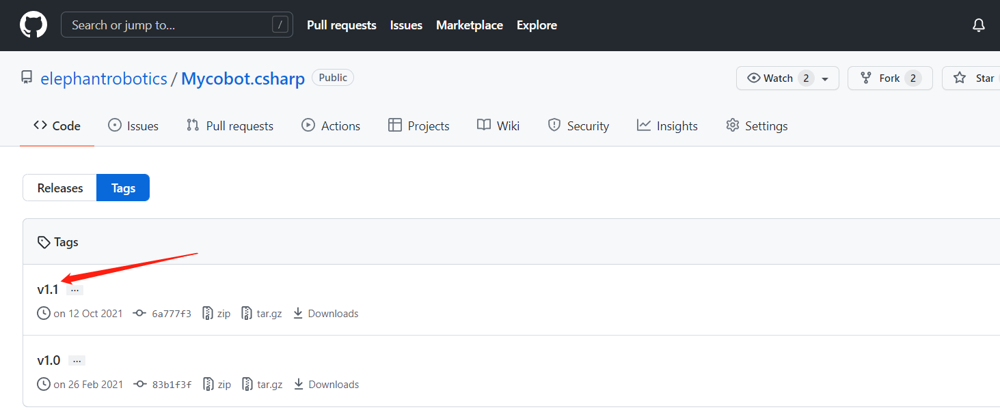
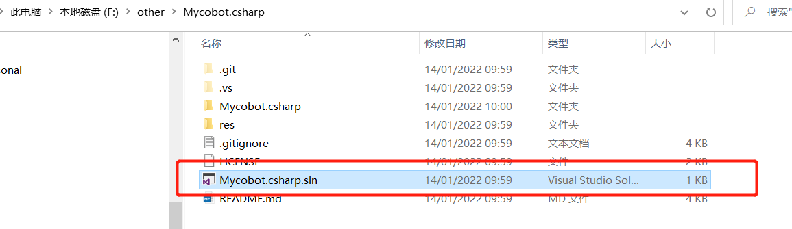
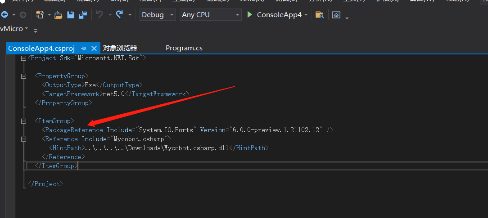
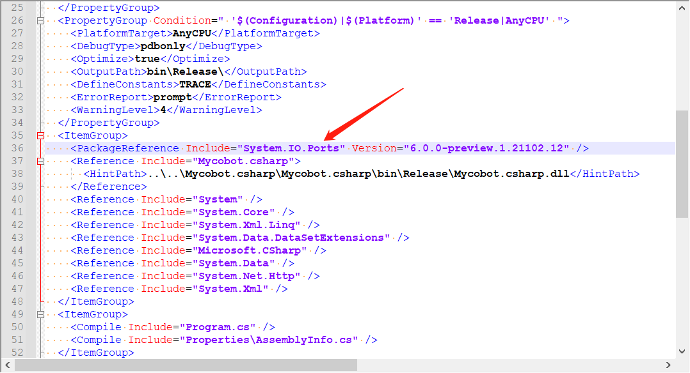
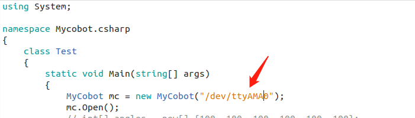
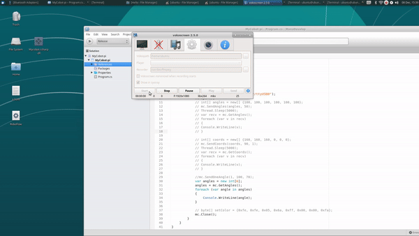

# Compile and run the Mycobot.csharp case

## 1 Download
### 1.1 Source code download
Download [Mycobot.csharp](https://github.com/elephantrobotics/Mycobot.csharp) from github.  

### 1.2 Download dynamic library
To run the example, you need to use this [dynamic library](https://github.com/elephantrobotics/Mycobot.csharp/tags), which encapsulates the API for controlling the robot arm: 
Select the latest version, as shown in the figure below: 

The dynamic library is divided into Windows (Windows is divided into .net and .net framework. For how to distinguish, please see the following running under Windows) and Raspberry Pi system versions, as shown in the figure below: 

1 Applicable to Raspberry Pi Robotic Arm System 
2 Applicable to Windows System 
## 2 Running under Windows

### 2.1 Run the Mycobot.csharp example downloaded from github directly:
Double-click to open Mycobot.csharp.sln (make sure that vs2019 is installed on the computer. If not, please see 9.1 Environment Building) 

Compile and run the project, check the serial port number of the robot arm, if it is inconsistent with the example, please modify the serial port number, see the following figure for details: 

### 2.2 Call the Mycobot.csharp dynamic library in your own project:
Check the target framework of the project, and then download the corresponding dynamic library. If your project's target framework is .net core, download **net core/Mycobot.csharp.dll**, if the target framework is .net framework, download **net framework/Mycobot.csharp.dll**)<br（target frame） 

Import **Mycobot.csharp.dll** into the project 

Add **system.io.ports** to .csproj( Project name, the file is located in the project directory), please see the picture below for details: 

In versions before vs2019, you can use SerialPort by using System.IO.Ports. If an error is displayed: Failed to find the corresponding type name in the namespace, you need to configure the corresponding dll for the project, as follows:
Tools -> Nuget Package Manager (N) -> Manage Nuget Packages for Solutions (N) -> Browse, search for the corresponding dll (such as SerialPort) in the left search bar, check the project to be added on the right, and click Download and Install.  

For the usage of library functions, please refer to the Mycobot API section, the use case section, and the subsequent separate usage sections on joints, coordinates, etc.  

### 2.3 Problems
Problems you may encounter during use: 
Problem 1: System.Runtime, Version=5.0.0.0, Culture=neutral, PublicKeyToken=b03f5f7f11d50a3a' or one of its dependencies... 
Solution: **Update your sdk**(if .net core,update to 5.0 and choose,if .net framework update to 4.0 and choose 4.7.2), see the following animation: 

Problem 2: System.IO.FileNotFoundException: "Could not load file or assembly 'System.IO.Ports, Version=6.0.0.0, Culture=neutral, PublicKeyToken=cc7b13ffcd2ddd51'. 
Solution: **Please see step 3 of 9.2.2.2 above** 

## 3 Run on the Raspberry Pi robot
3.1 Create a C# console application; 
3.2 **Copy** the file **program.cs**, and then **paste** program.cs into the newly created C# console application; 
3.3 Change **the port number** in program.cs to **/dev/ttyAMA0**(MyCobot mc = new MyCobot("/dev/ttyAMA0")); 

3.4 Change the compilation mode to **Release**; 

3.5 Add the Mycobot.csharp.dll library file to the project, library:ReFerences-->Edit References-->.Net Assembly-->Browse(path for .dll) 

3.6 Run.
Note: Compile && Run, the whole operation process can be seen in the following animation: 
