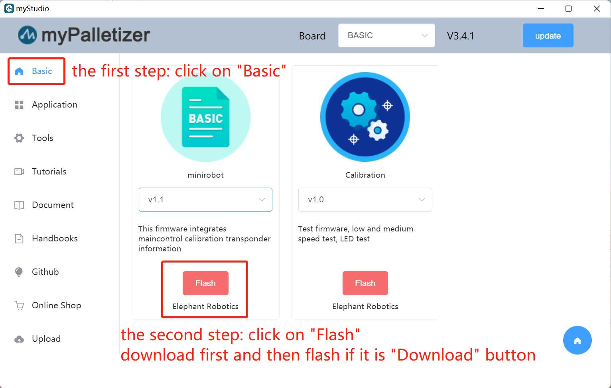
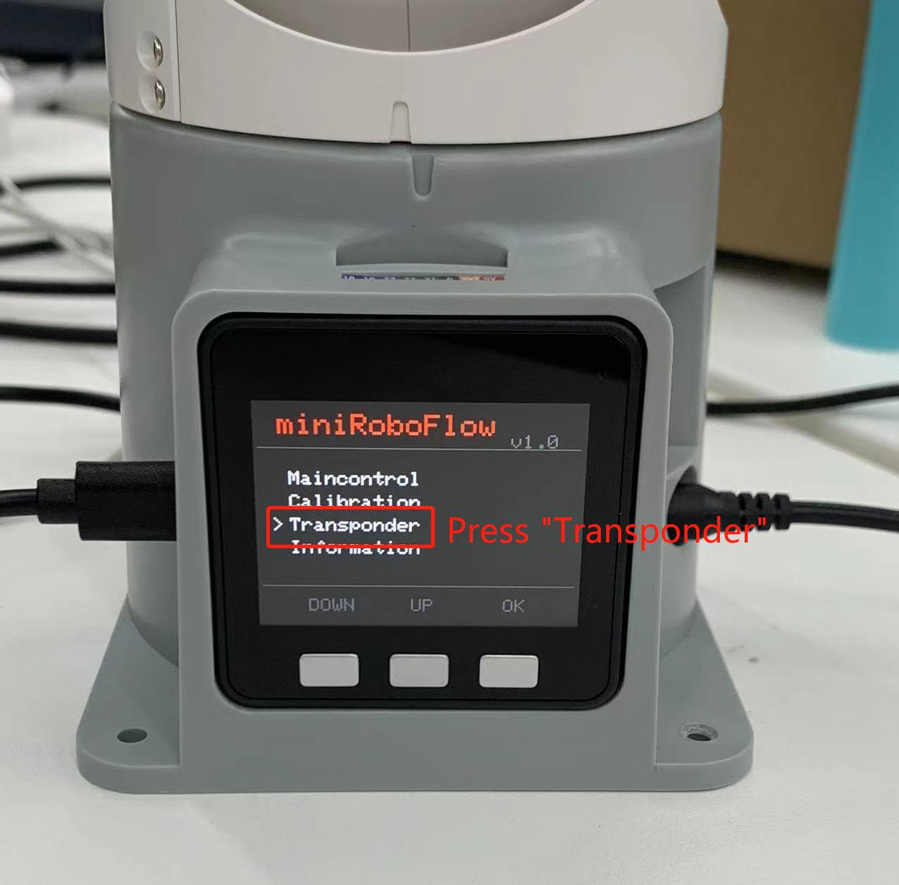
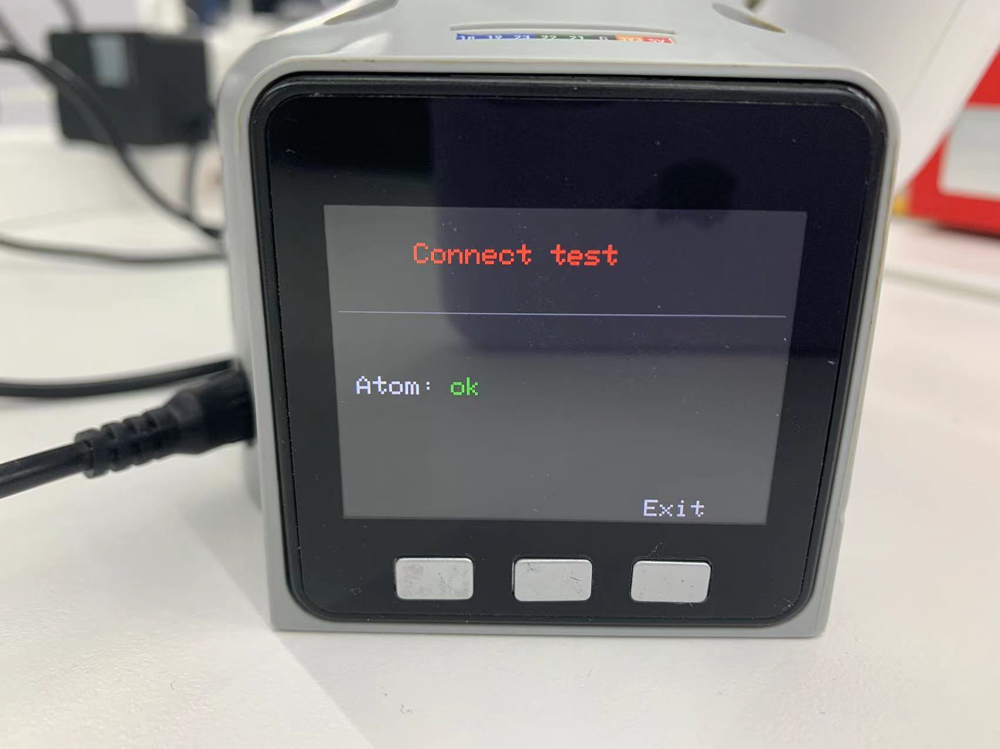
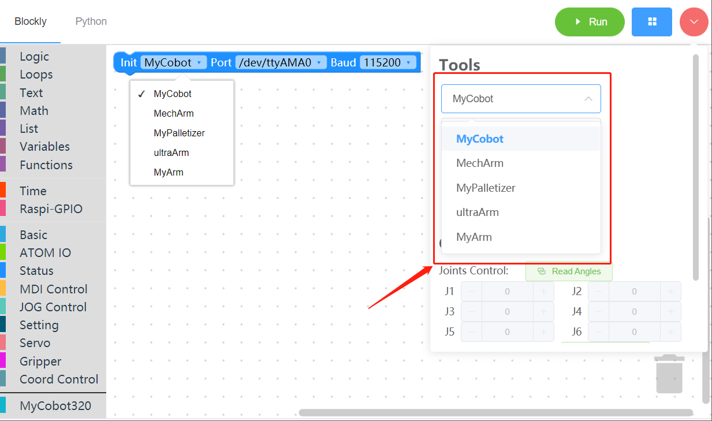
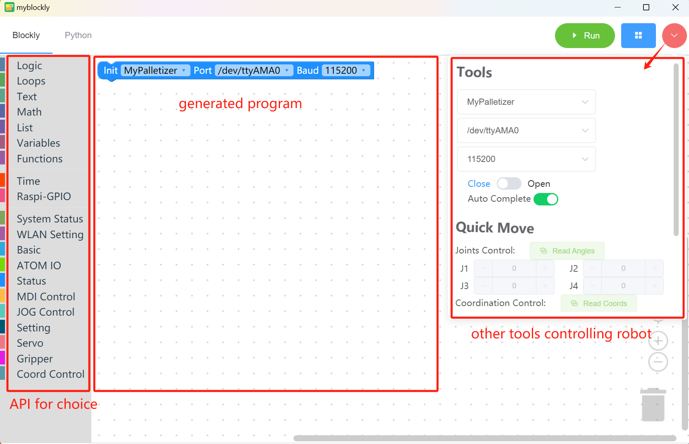
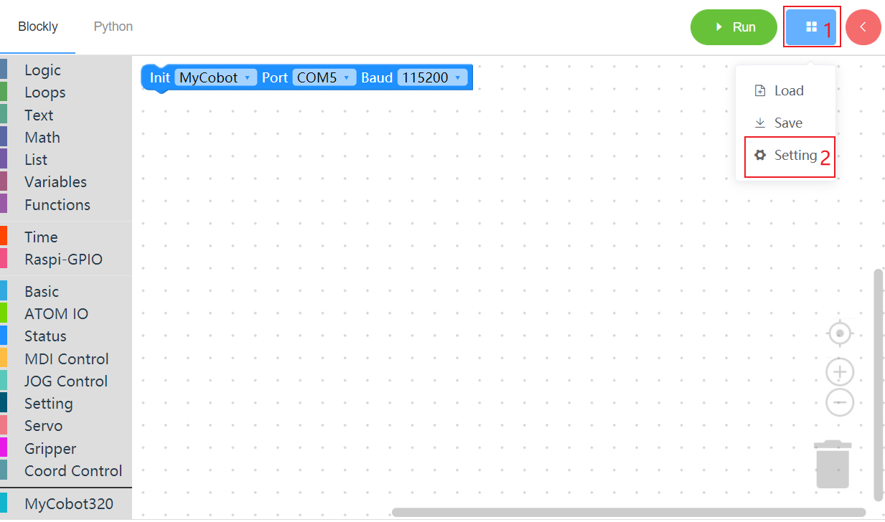

# Initial use of myBlockly

## **Preparation**

Before downloading myBlockly, you need to configure the Python environment and use myStudio to burn the firmware. Please refer to the following operation method for details.

1. Environment configuration. Before using myBlockly, please make sure that the Python environment has been configured on the computer

2. Firmware burning.

* Before using myStudio for burning, you need to download the serial port driver, that is, the CP210X or CP34X driver compression package. There are currently two driver chip versions, CP210X (for CP2104 version)/CP34X (for CH9102 version) driver compression package. If you are not sure about the USB chip used by your device, you can install both drivers at the same time. ( CH9102_VCP_SER_MacOS may report an error during the installation process, but in fact the installation has been completed, just ignore it). Please click the link below to download it according to your computer system (for specific installation steps, please refer to the animated picture in the **[myStudio driver installation](https://docs.elephantrobotics.com/docs/gitbook/4-BasicApplication/4.1-myStudio/4.1.1-myStudio_download_driverinstalled.html)** section).

+ Bottom M5Stack Basic serial port driver + CP210X: **[Windows 10](https://download.elephantrobotics.com/software/drivers/CP210x_VCP_Windows.zip)**, **[MacOS](https://download.elephantrobotics.com/software/drivers/CP210x_VCP_MacOS.zip)**, **[Linux](https://download.elephantrobotics. com/software/drivers/CP210x_VCP_Linux.zip)** + CP34X: **[Windows 10](https://download.elephantrobotics.com/software/drivers/CH9102_VCP_SER_Windows.exe)**, **[MacOS](https://download.elephantrobotics.com/software/drivers/CH9102_VCP_MacOS.zip)** - Terminal Atom Serial Driver
- **[Windows 10](https://download.elephantrobotics.com/software/drivers/CDM21228_Setup.zip)**

**Note**: For MacOS, make sure that the system "Preferences->Security and Privacy->General" is set before installation, and allow downloads from the App Store and approved developers.

* The terminal ATOM needs to burn the latest version of atomMain (it is burned by factory default, no need to burn it yourself).

* The M5Stack series needs to burn the firmware miniRobot required by the bottom M5Stack Basic through myStudio, and the terminal ATOM needs to burn the latest version of atomMain (it is burned by factory default). Burning requires myStudio, a firmware burner. To download and install it, please click **[Basic Application myStudio](https://docs.elephantrobotics.com/docs/gitbook/4-BasicApplication/4.1-myStudio/)**. The following figure shows the specific steps for using myStudio to burn firmware (for specific burning steps, please refer to **[Update Device Firmware](https://docs.elephantrobotics.com/docs/gitbook/4-BasicApplication/4.1-myStudio/4.1.2-myStudio_flash_firmwares.html)**). The following figure shows the specific steps for using myStudio to burn firmware.  

* After burning is completed, select the Transponder function (one of the device's factory firmware functions, please refer to **Factory Firmware Introduction** chapter through the bottom M5Stack Basic, and then click Press A. If the prompt "Atom: ok" appears, it means success. The specific steps are as follows.

 

 

## myBlockly download and install

After the preparation is completed, you can download and install myBlockly. Download address:

- **[Github address](https://github.com/elephantrobotics/myblockly-package/releases)**

- **[Official website address](https://www.elephantrobotics.com/download/)**

**Note**: Please make sure to download the latest version.

When running the myBlockly program, please keep the robot connected and keep the following interface. If you exit the robot connection interface, the myBlockly program will not run correctly.

## Prerequisites for use

- Before you start programming, you must select the corresponding **machine model**, otherwise it is easy to cause hardware damage

- When using the control panel to control the machine, you must select the corresponding **machine model**, otherwise it is easy to cause hardware damage

## **myBlockly interface display**

- Module bar:

* Contains the method modules required for program writing, which can be placed in the program editing area for splicing by mouse

* MyCobot320 module

- Small toolbar:

Click the pink button in the upper right corner to display a small toolbar, where you can select the correct model, serial port number and baud rate. You can also get the real-time joint angle and coordinates of the robot arm by clicking the "Read Angle" or "Read Coordinate" button. Click "+/-" in the joint control or coordinate control bar to control the movement of the robot arm.

- Program editing area:

* Before running the program, you need to select the correct model, port and baud rate in the initialization module or the small toolbar, otherwise the program will not run normally.

* Drag the required module methods to this area and splice them to realize your own program.
* If the baud rate and serial port have been modified in the right toolbar, but it is still /dev/ttyAMA0, it is due to the myBlockly version. You need to update the software version on the official website first (the latest version will change the information in the editing area after selecting the serial port and baud rate in the toolbar).

**Note**:

1. The baud rate of the M5Stack series is generally 115200, and the baud rate of the Raspberry Pi series is generally 1000000.

| Machine model | Serial port number | Baud rate |
|:---------:| :--------:|:--------:|
|**280 M5**| **Win: COM*; Linux: /dev/ttyUSB**; |**115200**|

2. To check the serial port number and baud rate of the machine, please go to **myStudio Driver Installation** section.

3. When the program cannot run, please check whether the small toolbar is disconnected (as shown in the figure below).

 

## **Program run**

Drag the desired method module, edit your own program (as shown above), combine each module structure together (there is a ki sound), and then click "Run" to upload the code to the robot arm to run.

**Note: ** The program that operates the robot arm movement takes time to complete, so after an action, you need to connect a `sleep` module to give the robot arm time to move before the next movement. (Determine the required time according to the situation. The robot arm is set by default to run myBlockly with a minimum sleep time of no less than 0.5s) Otherwise, the robot arm will not be able to achieve the desired movement.

Click the "Python" option in the upper left corner to view the corresponding Python code, as shown below.

## **Program Saving and Loading**

MyBlockly programs are saved in *.json format. Click the blue box in the upper right corner of the interface. Click the "Save" option to save the program.

Similarly, click the blue box and click the "Load" option to import the saved program.

## How to install and update the software
The installation and update of myBlockly need to go to the [official website](https://www.elephantrobotics.com/en/downloads/)  to download the latest version.

Inside the software, you can update the software through the following steps.

1 Mouse move here
2 Click setting
3 This is your current version
4 Click this link to view the latest version and download
And if you need to know the detailed update log of the software, you can go to [github](https://github.com/elephantrobotics/myblockly-package/releases) to view.