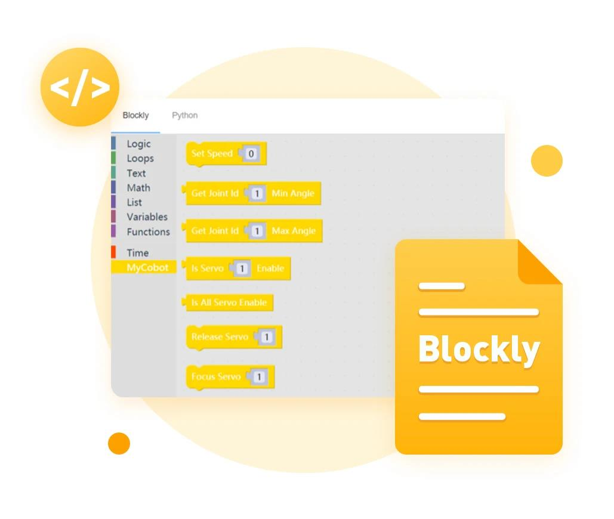

## What is myBlockly?

**myBlockly** is a fully visual modular programming software, a graphical programming language.

**myBlockly** is similar to MIT's children's programming language Scratch in terms of function/design.

When using **myBlockly**, users can drag and drop modules to build code logic, which is very similar to building blocks.

From the user's perspective, **myBlockly** is a simple and easy-to-use visual tool for generating code. From the developer's perspective, **myBlockly** is a text box that contains the code entered by the user.

The process of generating code into the text box is the process of the user dragging in **myBlockly**.

## myBlockly installation

**myBlockly download address:**

- GitHub address: https://github.com/elephantrobotics/myblockly-package/releases
- Official website address: https://www.elephantrobotics.com/download/

**Applicable devices:**
- myCobot 280
- **myCobot 280 M5**
- myCobot 280 PI
- myCobot 280 Jetson Nano
- myCobot 280 for Arduino

**Prerequisites:**

- **M5** series version, **M5Stack-basic** burn **miniRobot** at the bottom, select **Transponder** function, **ATOM** burn the latest version of **atomMain** at the end (factory default burned)

- **Pi \ jetsonnano** series, **ATOM** burn the latest version of **atomMain** (factory default burned)

- Configure **Python environment**, please refer to the [Python ▶](https://docs.elephantrobotics.com/docs/gitbook/7-ApplicationBasePython/7.1_download.html) chapter

## myBlockly Development and Use Guide

You can use myBlockly to develop our robotic arm according to the following guidelines

1.[MyBlockly Initial Use](5.1.1-myBlocklyFirstUse.md)

2.[Control RGB Light Board](5.1.2-ControlRGB.md)

3.[Control the Robotic Arm to Return to Origin](5.1.3-ControlRoboticArmBackZero.md)

4.[Control Single Joint Movement](5.1.4-ControlSingleJoint.md)

5.[Control Multiple Joints](5.1.5-ControlSinglesJoint.md)

6.[Control the robot arm to swing left and right](5.1.6-ControlRoboticSwingLeft&Right.md)

7.[Control the robot arm to dance](5.1.7-ControlRoboticArmDance.md)

8.[Use of gripper](5.1.8-GripperUse.md)

9.[Use of suction pump](5.1.9-PumpUse.md)

10.[Gripper test](5.13-gripperTest.md)

11.[IO test](5.14-ioTest.md)

12.[Q&A](5.1.10Q&A.md)