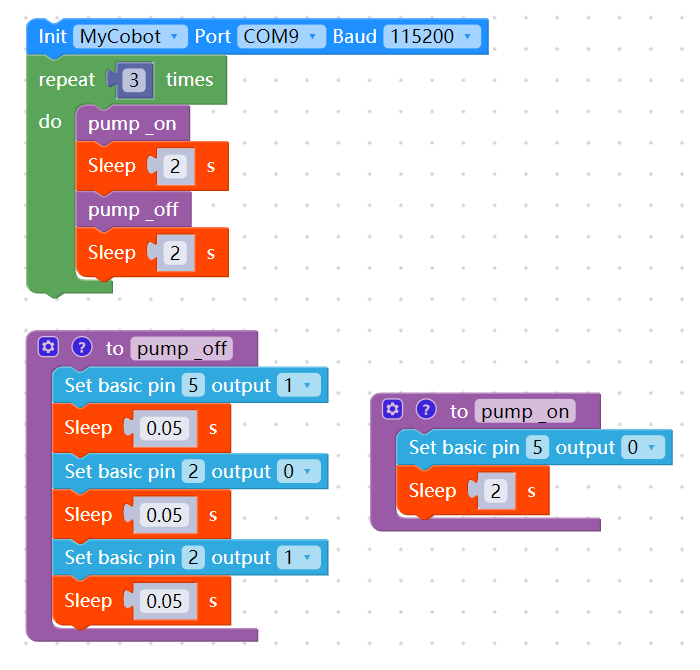

# Accessory related questions

**Q: 280M5 and suction pump 2.0 io connection diagram and quick use source code**

- A: The new version v2.0 version of myblockly source code is as follows:
    

    The G5 pin on the suction pump is the suction pump switch control pin, and the G2 label is the solenoid valve control pin. Both are low level valid.
    The function of the solenoid valve is to make the suction pump more rapid when released. If the solenoid valve is not used, the suction pump can also work normally, but the speed of releasing the object when the suction pump is closed is relatively slow.
    The source code here uses the G5 pin to control the opening and closing of the suction pump, and the G2 pin to control the opening and closing of the solenoid valve. The opening and closing of the solenoid valve mainly works in the stage of closing the suction pump.
    Note that the pins designated for connecting the suction pump and the machine end are not fixed. On the machine end, the G2 and G5 pins are not the only options. They can be replaced with any other two common GPIOs on the machine for control. However, when changing the control pins, you need to pay attention to the G2 and G5 pin function descriptions on the suction pump end - the pin corresponding to the G5 label on the suction pump end is the suction pump switch control pin, and the G2 label is the solenoid valve control pin, both of which are low-level valid.
    As shown in the following source code, GPIO18 and 19 are used to control the suction pump. G19 is selected to connect the suction pump's G5 to control the suction pump opening and closing, and the other G18 is connected to the suction pump's G2 pin to control the solenoid valve.

    

**Q: What is the pin sequence and connection method of mycobot adaptive gripper?**

Please refer to the following figure for the pin introduction of mycobot adaptive gripper:

Gripper connection method:

**Q: Parallel gripper usage source code**

**Q: Is there anything to pay attention to between the gripping object and the movement of the robot arm?**

When the load is > 500g, the speed needs to be less than 50%.
