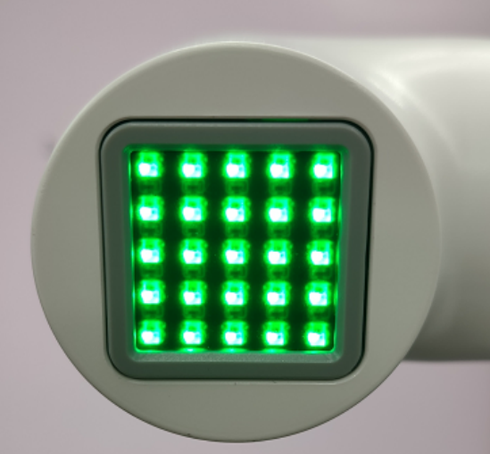

# Hardware Issues

**Q: How to resolve the issue if the M5 screen is not displaying anything？**

1. Check if the power adapter is properly connected to the machine. You can try unplugging and replugging the power adapter.
2. Gently press on the corners of the screen to ensure that the M5stack is making good contact with the internal expansion board.

3. Check the GitBook and download the corresponding MiniRobot firmware.

4. You can remove the base screws to inspect whether any internal cables are disconnected. If so, reconnect them before use.

**Q: How to solve the problem that the robot arm cannot be locked when powered on?**

1. Check whether the original power adapter is connected or whether the adapter is in good contact. You can try to re-plug the power adapter

2. Check whether the joint can rotate normally when the power is off, whether there is too much or too little resistance, and preliminarily determine whether the internal structure is physically broken. If there is no physical break, continue to check.

3. Check the Atom firmware as follows:

Under normal circumstances, the robot arm will self-lock after power is turned on, and the Atom will light up green, as shown in the figure below (note that mechArm has no light display)

After the robot arm is powered on, the Atom does not light up green or the joint cannot self-lock. You can check according to the following points:
① Gently press the Atom screen to make Atom contact well with the internal plate of the robotic arm.

② Check gitbook to get the method of using mystudio. According to the model and version information, use mystudio to download the corresponding Atom firmware. If you encounter any problems during the burning process, please refer to the relevant "Firmware download exception" in this article mystuidio to obtain the troubleshooting steps.

③ When the Atom firmware is successfully burned and the robotic arm is not connected to the power supply, use type-c to connect Atom. If the green light of Atom is on, but the green light of Atom is off after unplugging type-c, it is judged that Atom is normal, but there is a problem of circuit detachment or damage inside the robotic arm, and it is necessary to contact the technician to deal with it.

④ When the Atom firmware is successfully burned and the robotic arm is not connected to the power supply, use type-c to connect Atom but the green light is not on, it is judged that the Atom hardware is damaged and it is necessary to contact the technician to replace it.

**Q: After pressing the emergency stop, the emergency stop cannot be locked after release. How to lock the robotic arm again?**

You need to power on the machine again, for example, power on the machine with myblockly

**Q: How to optimize joint jitter, excessive joint angle deviation or joint weakness?**

1. Refer to the robot parameter introduction section to check whether the actual load is within the effective load range of the robot arm. Excessive load will cause joint jitter. The load of the actual joint can be appropriately reduced.

2. Change the motion mode to refresh mode, so that the running trajectory of the robot arm will be relatively smooth. For specific APIs, please refer to
set_fresh_mode(1)

3. Check the following link to adjust pid: https://drive.google.com/file/d/1UWhaaSTuwLFImuEGY1J2tvgxTQDwWxK_/view?usp=sharing
4. Check the gitbook section and use mystudio to download the corresponding version of Atom firmware. It is recommended to download the latest
5. Check Chapter 5 of the gitbook to calibrate the robot arm at zero position. You can also refer to the calibration steps in the following link: https://drive.google.com/file/d/1XtKH-ykKWPH0q9Z_YHwzkgwNKRhstHhi/view?usp=sharing
6. For machines that have been used for a long time (more than 3 months), joints may age and produce joint gaps. You can follow the following video to manually bend the joints to check if there is any joint gap: https://drive.google.com/file/d/1tXDUALmfw1z0u6lM9uH5hOHivjbRoWxW/view?usp=sharing
7. If there is a joint gap problem due to joint aging, this kind of jitter is inevitable due to the natural aging of the machine.

**Q: What is the joint zero position?**

Take the following figure as an example, there is an arched groove designed between the joint and the edge of the joint shell, which is the joint zero point

Generally, the zero point posture after calibration is as follows:

Pay special attention to the zero position posture of the 270 joint as follows:

**Q: Is there a method for zero point calibration?**

Please refer to Chapter 5 of gitbook or the following link:

https://drive.google.com/file/d/1XtKH-ykKWPH0q9Z_YHwzkgwNKRhstHhi/view?usp=sharing

**Q: Is the IO port of G36 unusable? Why is there no voltage return when measuring with a multimeter?**

- A: 36 on basic can be used and is defined as an input pin. If the customer needs to test whether the IO can be used, the customer can modify the basic firmware code by himself. The firmware is open source. The customer writes a program by himself, single control IO

**Q: What are the limits of myCobot's joints?**

- A: One axis and five axes have limits. One axis is about 165° clockwise and about 165° counterclockwise. The five axes can rotate about 165° clockwise and counterclockwise

**Note: When rotating the robot arm, it should be rotated at a small angle and gently. After reaching the limit, it cannot be rotated forcefully.**

**Q: What is the role of atom in the robot arm?**

- A: Atom is mainly used in the robot arm to control the kinematic algorithm of the robot arm: including forward and inverse kinematics, solution selection, acceleration and deceleration, speed synchronization, multi-square interpolation, coordinate conversion, etc., and requires real-time control and multithreading. The relevant programs of atom are not open source yet.

**Q: What communication interfaces do different versions of the robot arm support?**

- A: The robot arm based on the microprocessor supports socket communication TCP; the robot arm based on the microcontroller can communicate via USB to serial port.

