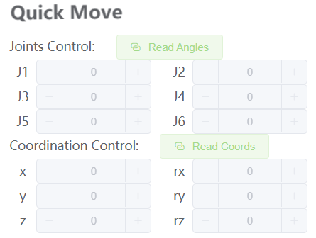

# First-time self-check- Machine Joint Function Verification

>> **Note:** When starting the robot arm, please be careful not to let the robot arm be in a curled-up or touching position between joints. It is recommended that the robot arm posture should be as shown in Figure 1 below when starting. Figures 2 and 3 are both incorrect starting postures:

|  |  |    |
|---------------|---------------|---------------|
| Figure 1 (Correct Posture)     | Figure 2 (Incorrect Posture)     |  Figure 2 (Incorrect Posture)      |

## Joint control method steps

### 1. Make hardware connections

- Hardware connections for M5 series machines:

Make sure the M5 series robot is connected to the power adapter and USB data cable.

### 2. Install and configure the software environment

You need to prepare a computer to use the M5 version of the machine. Install python, pymycobot library and USB serial port driver on the computer. For details, please refer to the environment configuration section of gitbook.

### 3. Choose the correct communication method

Before using each communication method, you need to make sure that the LCD screen of M5 is adjusted to the corresponding mode and maintain this communication state to control the robot arm normally.
When using myblockly, python, ros and other development methods for the M5 robotic arm, you need to ensure that the M5 LCD screen stays on the Atom: ok interface, as shown below:


**Note:** When the screen displays Atom: no, you need to power on the machine again and check according to the self-check steps of the hardware-related "How to solve the problem of the robotic arm not being able to lock when powered on" in this article


### 4.USB communication example

Please use myblockly or python source code examples to verify the joint motion of the robotic arm.

**Pay special attention to the need to select the corresponding serial port and baud rate when using the USB serial port opening method so that the robot arm can communicate with the computer normally and thus control the robot arm normally:**

| Machine model | Serial port number | Baud rate |
| :-----------: | :---------: | :---------: |
| 260 M5 | Win: COM; Linux: /dev/ttyUSB | 115200 |
| 270 M5 | Win: COM; Linux: /dev/ttyUSB | 115200 |
| 280 M5 | Win: COM; Linux: /dev/ttyUSB | 115200 |

**Note:** Regarding the selection of the COM port of the M5 series machine, it is necessary to make a real-time selection based on the port number recognized by the current personal computer, because the COM port number recognized by each person's computer may be different and not fixed. The specific selection scheme can be viewed in this document. "Q: Why is the connection rejected when selecting a certain COM port? Or how to find the corresponding COM port?" Answer

#### 4.1 Robotic arm joint movement myblockly source code


When you see the robot arm joint 1 cycle 3 times from 0 to 90 degrees, it means that the robot arm joint 1 responds normally. You can try to change the joint ID to test other joints and learn other cases in gitbook step by step or use the robot arm to do various interesting things!
It is worth mentioning that if you are not familiar with the code block development method of myblockly, there is also a relatively quick way to verify the joints: use the myblockly fast movement tool to perform simple joint motion control. For specific usage, please refer to: [Myblockly fast movement tool usage](https://drive.google.com/file/d/1pDR-WBjkGrLcRdeshDmAMIWbEpu_jsJW/view?usp=sharing)



#### 4.2 Robotic arm joint motion joint python source code

```python
#The motion effect is that the robot arm moves around the zero position, and the 1-6 joints move one by one ±20 degrees
import time
from pymycobot.mycobot import MyCobot

if __name__ == "__main__":
    cobot = MyCobot('com22',115200)#Select the corresponding port number and baud rate according to the model
    cobot.set_fresh_mode(1)
    cobot.send_angles([0, 0, 0, 0, 0, 0], 20)
    time.sleep(2)
    print("start")
    for i in range(1,7):
        cobot.send_angle(i, (-30), 20)
        time.sleep(2)
        cobot.send_angle(i, (30), 20)
        time.sleep(2)
        cobot.send_angle(i, (0), 20)
        time.sleep(2)

```

When you see the robot arm around the zero-position posture, 1-6 joints move one by one ±20 degrees, indicating that joints 1-6 respond normally, you can gradually learn to use other cases in gitbook or use the robot arm to do various interesting things!

**If you do not see the corresponding effect when executing the case, please refer to the common problem solutions below. In addition, please make sure that you have checked the following 5 points before contacting technical support personnel:**

1. Can the robot arm lock normally after power-on? If it cannot be locked, please refer to FQA hardware-related questions: "Q: How to solve the problem that the robot arm cannot be locked after power-on?" for troubleshooting

2. If you have an M5 series robot arm, is your computer connected to the USB port on the side of the M5stack via type-c?

3. If you have an M5 series robot arm, is your screen LCD now stuck in the Atom: ok interface?

4. If you have an M5 series robot arm, the LCD interface shows Atom: no, please refer to "Q: How to solve the problem that the robot arm cannot be locked after power-on?" for troubleshooting

5. Is there any error message when running the code?

Please describe the usage details as detailed as possible. If convenient, please provide an operation video, which will help to quickly analyze and locate the problem. Thank you in advance!
