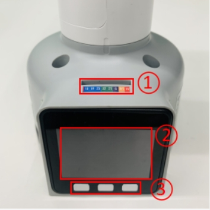
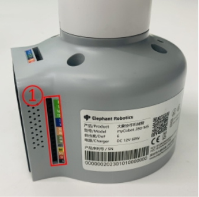
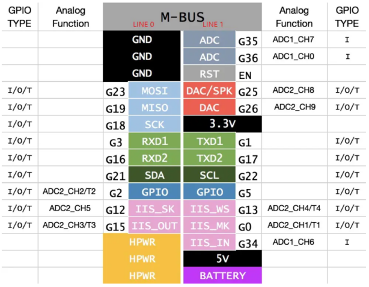
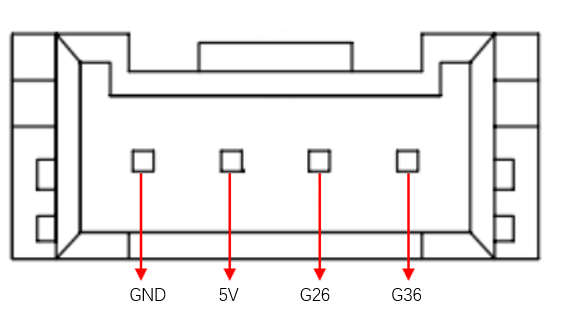
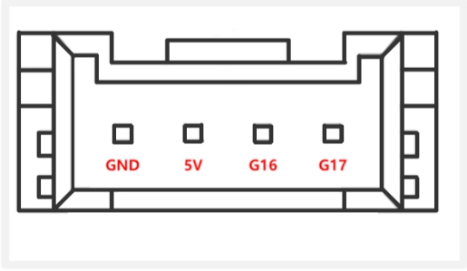

# Robot Parameters

> In the first chapter, we discussed the selling points of the product and its design concept, providing you with a panoramic perspective of the high-level understanding of the product. Now, let's move on to the second chapter - Robot Parameters. This chapter will be the key to your understanding of the product's technical details. A detailed understanding of these technical parameters will not only help you fully realize the advancement and practicality of our products, but also ensure that you can use these technologies more effectively to meet your specific needs.

## 1.Robot Specifications

| Index | Parameters |
| :-----------: | :---------: |
| Name | Little Elephant Collaborative Robot Arm |
| Model | myCobot 280 for M5 |
| Degrees of Freedom | 6 |
| Payload | 250g |
| Working Radius | 280mm |
| Repeatability | ±0.5mm |
| Weight | 800g |
| Power Input | 12V, 5A |
| Operating Temperature | -5-45℃ |
| Communication | Type-C |

## 2.Control Core Parameters

### 2.1Main Controller Specifications

| **Indicators** | **Parameters** |
| :------- | :---------------------------------------------------------------- |
| **Main Controller** | M5Stack-basic |
| **Main Controller Model** | ESP32 |
| **CPU** | 240MHz Dual Core.   600 DMIPS, 520KB SRAM.   Wi-Fi, dual-mode Bluetooth |
| **Bluetooth** | 2.4G/5G |
| **Wireless** | 2.4G 3D Antenna |
| **Input** | 1, 2, 3, 5, 18, 19, 21, 22, 23, 25, 26, 35, 36 |
| **Output** | Shared with input |
| **LCD display** | 2.0" @ 320*240 ILI9342C IPS panel, maximum brightness 853nit |
| **Physical buttons** ||

### 2.2Auxiliary controller specification table

| **Indicators** | **Parameters** |
| :----------------- | :---------------------------------------------- |
| **Auxiliary control** | Atom |
| **Auxiliary control model** | ESP32 |
| **Auxiliary controller core parameters** | 240MHz dual-core.   600 DMIPS, 520KB SRAM.   Wi-Fi, dual-mode Bluetooth |
| **Auxiliary controller flash** | 4MB |
| **LED matrix** | 5*5 LED light matrix |
| **LCD display** | 2.0"@320\*240 ILI9342C IPS panel,   maximum brightness 853nit |
| **C type** | \*1 |
| **Auxiliary control expansion IO** | G19, G21, G22, G23, G25, G33 |

---
## 3.Structural dimension parameters
>! This chapter uses millimeters as distance units and degrees as angle units.

### 3.1Product dimensions and working space

### 3.2Joint range of motion
| Joints | Range |
| :--------: | :---------:|
| J1 | -168 ~ +168 |
| J2 | -135 ~ +135 |
| J3 | -150 ~ +150 |
| J4 | -145 ~ +145 |
| J5 | -165 ~ +165 |
| J6 | -180 ~ +180 |
### 3.3Hole installation
- The robot base is mounted with flanges. The base is compatible with both LEGO technology and M4 screw installation.

- The robot end is equipped with a flange, and the end of the robotic arm is compatible with both LEGO technology holes and screw thread holes.

## 4.Electrical characteristic parameters
###  4.1Electrical interface of the robot base
###  Introduction to the base

* A. The front of the base is shown in the figure below:

- ① Function interface group 1
- ② Basic display screen
- ③ Button 1, Button 2, Button 3

* B. The left side of the base is shown in the figure below:

- ① Grove 1, Grove 2
- ② Power DC interface
- ③ Function interface group 2
- ④ Reset button
- ⑤ Type C interface
- ⑥ Grove 3

* C. The right side of the base is shown in the figure below:

① Functional interface group three

* D. The bottom interface surface of the base is shown in the figure below:

① Functional interface group four

### 4.2Base interface description

> **Note:** The functional interface groups are all 2.54mm DuPont interfaces, and 2.54mm DuPont cables can be used externally.

* A. The definitions of each interface in function interface group 1 and function interface group 4 are consistent. The definition of each interface is shown in the following table:

| Label | Signal name | Type | Function | Remarks |
| :---: | :----: | :--: | :------: | :----: |
| 18 | G18 | I/O | GPIO18 | Not available when using TF card |
| 19 | G19 | I/O | GPIO19 | Not available when using TF card |
| 23 | G23 | I/O | GPIO23 | Not available when using TF card |
| 22 | G22 | I/O | GPIO22 | |
| 21 | G21 | I/O | GPIO21 | |
| G | GND | P | GND | |
| 3V3 | 3V3 | P | DC 3.3V | |
| 5V | 5V | P | DC 5V | |

* B. The definitions of each interface in function interface group 2 and function interface group 3 are consistent. The definition of each interface is shown in the following table:

| Label | Signal name | Type | Function | Remarks |
| :---: | :----: | :--: | :------: | :----: |
| 3 | G3 | I/O | GPIO3 | Not available when using TypeC or Grove 2 |
| 1 | G1 | I/O | GPIO1 | Not available when using TypeC or Grove 2 |
| 16 | G16 | I/O | GPIO16 | Not supported yet |
| 17 | G17 | I/O | GPIO17 | Not supported yet |
| 2 | G2 | I/O | GPIO2 | |
| 5 | G5 | I/O | GPIO5 | |
| 25 | G25 | I/O | GPIO25 | Not supported |
| 26 | G26 | I/O | GPIO26 | Not available when using Grove 1 |
| 35 | G35 | I/O | GPIO35 | Not supported |
| 36 | G36 | I/O | GPIO36 | Not available when using Grove 1 |
| RST | RST | - | Controller reset | Not supported |
| BAT | BAT | - | BTTERY | Not supported |
| 3V3 | 3V3 | P | DC 3.3V | |
| 5V | 5V | P | DC 5V | |
| G | GND | P | GND | |

> **Note:**
> 1. I: Input only.
>
> 2. I/O: This function signal includes input and output combination.
>
> 3. When the tube angle is set as the output end, it will output a voltage of 3.3V.
>
> 4. 1. The pull current of a single tube angle decreases as the number of pins increases, from about 40mA to 29mA.
>
> 5. If a GPIO is set to output mode, it outputs a high-level signal, and the circuit connection is shown in Figure 2.1.1.2-5, and the LED light will light up.
>
> 
>
> 6. The other function tables of the function interface are shown in the figure below. When other functions are used, the IO function is not available.
>
> 
>
>

* C. Power DC interface: Use a DC power socket with an outer diameter of 6.5mm and an inner diameter of 2.0mm; the 8.4V 5A DC power adapter provided by the manufacturer can be used to power myCobot 280.

* D. Grove interface: Grove interface definition as shown in Figure A, Figure B, and Figure C

Figure A Grove 1

Figure B Grove 2

Figure C Grove 3

* E. Type C interface: can be used to connect and communicate with the PC. When this interface is used, the G1 and G3 interfaces are occupied.

* F. Reset button: used to reset the main control system.

* G. Button A, Button B, and Button C: used with the display screen for functional operations.

* H. Display screen: Use a 2-inch IPS screen, which can be used to display myCobot communication status/correct the robot origin with buttons, etc.

## 4.3 Electrical interface of the end of the robot

###  Introduction to the end of the robot

* A. The end of the robot is shown in Figure D and Figure E:

Figure D End of the robot
- ① Servo interface
- ② Atom

Figure E End of the robot
- ① Function interface group 5
- ② Grove 4
- ③ Type C

### End interface description

* A. The definitions of each interface of the function interface group 5 are shown in the following table:

| Label | Signal name | Type | Function | Remarks |
| :---: | :----: | :--: | :------: | :----: |
| 5V | 5V | P | DC 5V | |
| GND | GND | P | GND | |
| 3V3 | 3V3 | P | DC 3.3V | |
| G22 | G22 | I/O | GPIO22 | |
| G19 | G19 | I/O | GPIO19 | |
| G23 | G23 | I/O | GPIO23 | |
| G33 | G33 | I/O | GPIO33 | |

> **Note:**
> 1. I: Input only.
>
> 2. I/O: This function signal contains input and output combination.
>
> 3. When the tube angle is set as output terminal, it will output voltage 3.3V.
>
> 4. 1. The pull current of a single tube angle decreases as the number of pins increases, from about 40mA to 29mA.
>
> 5. If a GPIO is set to output mode, it outputs a high-level signal, and the circuit connection is as shown in the figure below, and the LED light will light up.
>
> 
>

* B. Type C interface: can be used to connect and communicate with the PC and update the firmware.

* C. Grove 4: definition as shown in Figure F

Figure F Grove 4

* D. Servo interface: used for the end extension gripper, currently supports the use of matching adaptive grippers.

* E. Atom: for 5X5 RGB LED (G27) display and key function (G39)

##  5.Cartesian coordinate parameters

---

[← Previous Chapter](../1.ProductIntroduction/1-ProductIntroduction.md) | [Next Chapter→](../../2-BasicSettings/3.UserNotice/3-UserInstructions.md)
