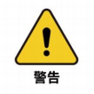

# Chapter 3 User Notice

> Chapter 3 User Notice is a must-read for every user to ensure that the user can achieve the established safety standards and efficiency when using the product. This chapter not only provides basic information on product use, transportation, storage and maintenance to ensure safe operation and maximized efficiency of the product, but also details the liability issues for product failure or damage that may result from failure to comply with these guidelines.

---

##  1.Safety Instructions

### Introduction

This chapter details general safety information for personnel who perform installation, maintenance and repair work on the Elephant Robot. Please fully read and understand the contents and precautions of this chapter before handling, installing and using it.

### Hazard Identification

The safety of collaborative robots is based on the premise of correctly configuring and using the robots. Moreover, even if all safety instructions are followed, injuries or damage to the operator may still occur. Therefore, it is very important to understand the safety hazards of robot use, which is conducive to preventing them before they happen.

Tables 1-1 to 3 below are common safety hazards that may exist when using robots:

**Table 1-1 Dangerous safety hazards**

|  |
| :----------------------------------------------------------------------------------------------------------------------------------------- |
| 1 Personal injury or robot damage caused by incorrect operation during robot handling. |
| 2 Failure to fix the robot as required, such as lack of screws or screws not tightened, insufficient base locking capacity to stably support the robot for high-speed movement, etc., causing the robot to fall over, resulting in personal injury or robot damage. |
| 3 Failure to correctly configure the robot's safety functions, or insufficient installation of safety protection tools, etc., causing the robot's safety functions to fail to function, thus causing danger. |

**Table 1-2 Warning-level safety hazards**

|  |
| :----------------------------------------------------------------------------------------------------------------------------------------------------------- |
| 1 Do not stay in the robot's motion range when debugging the program. Improper safety configuration may not be able to avoid collisions that may cause personal injury. |
| 2 The connection between the robot and other equipment may cause new hazards, and a comprehensive risk assessment needs to be re-performed. |
| 3 Scratches and punctures caused by sharp surfaces such as other equipment or the robot's end effector in the working environment. |
| 4 The robot is a precision machine and trampling may cause damage to the robot. |
| 5 Failure to clamp in place or not removing the clamped object before turning off the robot's power or air source (not confirming whether the end effector is secure and the clamped object falls due to power loss) may cause dangers, such as damage to the end effector and injuries to people. |
| 6 The robot may move unexpectedly. Do not stand under any axis of the robot under any circumstances! |
| 7 The robot is a precision machine. If it is not placed stably during transportation, it may cause vibration, which may cause damage to the robot's internal components. |
| 8 Compared with ordinary mechanical equipment, the robot has more degrees of freedom and a larger range of motion. Failure to meet the range of motion may cause unexpected collisions. |

**Table 1-3 Safety hazards that may cause electric shock**

|  |
| :-------------------------------------------------------------------------------------------------------------------------------------- |
| 1 Using non-original cables may cause unknown dangers. |
| 2 Electrical equipment in contact with liquid may cause leakage. |
| 3 There may be a risk of electric shock when the electrical connection is incorrect. |
| 4 Always turn off the power of the controller and related devices and unplug the power plug before replacing. If the work is carried out in the power-on state, it may cause electric shock or malfunction. |

### Safety Precautions

**The following safety rules should be followed when using the robot arm:**

- The robot arm is a live device. Non-professionals are not allowed to change the circuit at will, otherwise it is easy to cause damage to the equipment or personal injury.
- When operating the robot arm, local laws and regulations should be strictly observed. The safety precautions and "Danger", "Warning" and "Caution" items described in the manual are only used as supplements to local safety regulations.
- Please use the robot arm within the specified environmental range. Exceeding the robot arm specifications and load conditions will shorten the product life or even damage the equipment.
- Personnel responsible for installing, operating and maintaining the myCobot robot arm must first undergo rigorous training, understand various safety precautions, and master the correct operation and maintenance methods before operating and maintaining the robot.
- Do not use this product in a humid environment for a long time. This product is a precision electronic component. Long-term operation in a humid environment will damage the device.
- Do not use this device in a high temperature environment. The outer surface of this device is made of photosensitive resin as raw material. Higher temperatures will damage the outer shell of the device and cause equipment failure.
- Highly corrosive cleaning is not suitable for cleaning the robot arm, and anodized parts are not suitable for immersion cleaning.
- Do not use this product without a base installed to avoid damage to the device or accidents. This product should be used in a fixed environment with no obstacles around.
- Do not use other power adapters for power supply. If the device is damaged due to the use of an adapter that does not meet the standards, it will not be covered by after-sales service.
- Do not disassemble, disassemble, or unscrew the screws or casing of the robot arm. If disassembled, warranty service cannot be provided.
- Personnel who have not received professional training are not allowed to repair faulty products or disassemble the robot arm without authorization. If the product fails, please contact myCobot technical support engineers in time.
- If the product is scrapped, please comply with relevant laws to properly dispose of industrial waste and protect the environment.
- Children must be monitored by someone during use, and the device must be turned off in time when the operation is completed.
- When the robot is in motion, do not put your hand into the range of motion of the robot arm to avoid injury.
- It is strictly forbidden to change or remove and modify the nameplate, instructions, icons and markings of the robot arm and related equipment.
- Please be careful during transportation and installation. Please place the robot gently and correctly in the direction of the arrow according to the instructions on the packaging box, otherwise it is easy to damage the machine.
- **Do not burn other product drivers without authorization, or use unofficial recommended methods to burn firmware. **If the device is damaged due to the user's personal burning of other firmware, it will not be covered by after-sales service.

**If you have any questions or suggestions about the contents of this manual, please log in to the official website of Elephant Robotics to submit relevant information:**

https://www.elephantrobotics.com

**Do not use the robot arm for the following purposes:**

- Medical and life-critical applications.

- In an environment that may cause an explosion.

- Direct use without risk assessment.

- Use with insufficient safety function level.

- Use that does not meet the robot performance parameters.

---
## 2.Transportation and storage

### Packing and packaging

&emsp;&emsp;When packing and packaging the robot product, please make sure to use packaging materials and boxes designed for it. These materials can provide sufficient cushioning and support to prevent impact and vibration during transportation. Be sure to check that all parts are properly fixed to avoid looseness and damage. For fragile or sensitive parts, additional anti-vibration protection materials should be used for reinforcement. Finally, make sure that the outside of the packaging box is marked with clear handling and warning labels to indicate the correct handling method and storage direction.

### Logistics and Transportation

&emsp;&emsp;During transportation, the robot product should be transported in the original packaging. During transportation, it should be ensured that the robot product is stable as a whole in the packaging box and protected by appropriate measures. During transportation and long-term storage, the ambient temperature should be maintained in the range of -20 to +55°C, and the humidity should be ≤95% without condensation.

&emsp;&emsp;Because the robot is a precision machine, the robot product should be handled with care when it is removed from the packaging. During transportation, if it is not placed stably, it may cause vibration and damage the internal parts of the robot.

### Equipment Storage

&emsp;&emsp;After transportation, the original packaging should be properly stored in a dry place, the ambient temperature should be kept within the range of -20 to +55°C, the humidity should be ≤95% and there should be no condensation, in preparation for future repackaging and transportation needs. Do not stack other items on the original packaging box of the robot arm to prevent deformation of the packaging box and damage to the robot arm.

---
## 3.Maintenance and Care

As a robot manufacturer, we value ensuring that our customers can properly and safely maintain and upgrade their robot equipment. To this end, we provide the following detailed maintenance and care guide, including common maintenance items and parts for repairing or upgrading hardware. Please read carefully:

### Common maintenance items and recommended cycles

| **Maintenance items** | **Description** | **Recommended cycle** |
| ------------------ | ---------------------------------------------------------------- | ------------ |
| Visual inspection | Inspect the robot for obvious damage, foreign material accumulation or wear. | Daily |
| Structural cleaning | Clean the robot structural parts with a clean, dry cloth. Avoid moisture and aggressive cleaning agents. | Daily |
| Fastener inspection | Inspect and tighten all bolts and connectors. | Daily |
| Lubrication | Lubricate joints and moving parts with the lubricant recommended by the manufacturer. | Every 3 months |
| Cable and wiring inspection | Inspect the cables and wiring to ensure that there is no damage or wear. | Monthly |
| Electrical connection check | Ensure that all electrical connections are secure and free of corrosion or damage. | Monthly |
| Software update | Check and update the control software and application. | Every update |
| Software data backup | Regularly back up key software configuration and data. | Quarterly |
| Firmware update | Regularly check and update the firmware to obtain the latest features and security patches. | Every update |
| Sensor and device check | Check sensors and other key devices to ensure normal operation. | Monthly |
| Emergency stop function test | Regularly test the emergency stop function to ensure its reliability. | Monthly |
| Environmental condition monitoring | Monitor the temperature, humidity, dust, etc. of the working environment to ensure that it meets the operating specifications of the robot. | Continuous monitoring |
| Safety configuration review | Regularly check and confirm the safety configuration of the robot, such as speed limit and working range settings. | Monthly |
| Preventive maintenance plan execution | Perform regular inspections and maintenance according to the manufacturer's maintenance plan. | By Manufacturer's Guide |

### 4.Guide to Independently Changing Robot Hardware

We understand that customers may have the need to upgrade or repair robot hardware by themselves. Before performing any upgrade operations, please be sure to read the relevant parameters of the product in detail and confirm with our official personnel whether such operations are allowed. Operations without official permission may cause product failure and are not covered by the warranty.

**Material Requirements**

Officially manufactured or recommended materials: All accessories and components required for repairs and upgrades must be officially manufactured or explicitly recommended by us. This includes but is not limited to electronic components, sensors, motors, connectors, and any other replaceable parts.

Material Acquisition: Customers can purchase the required repair and upgrade materials through our official channels. This ensures the quality and compatibility of the accessories.

**Repair or Upgrade Process**

Customer Self-Repair: Customers are responsible for completing the repair work. We will provide detailed repair instructions and manuals to guide customers through the repair steps.

Follow official instructions: Repair operations should strictly follow the official instructions provided by us. Any deviation from the official instructions may cause damage to the equipment.

**Liability and Warranty Policy**

- Division of Responsibilities:
Manufacturer: Provide official instructions for repairs and upgrades, officially manufactured or recommended materials, and handle problems caused by manufacturing defects.
Customer: Responsible for completing repairs in accordance with official instructions and using official accessories.

- Warranty Policy:
Warranty Valid: Warranty is valid only if the repair operation fully follows our instructions and uses official accessories.
Warranty Void: If the customer does not follow the official instructions or uses unofficial accessories for repairs or upgrades, any damage caused will not be covered by the warranty.

**Notes**

- Safety First: Before performing any repair or upgrade operations, please make sure to follow all safety guidelines, including powering off and using appropriate protective equipment.

- Technical Support: If you encounter problems during the repair process, it is recommended to stop the operation and contact our technical support team for assistance.

We strongly recommend that customers strictly follow these guidelines to ensure the safe and effective operation of the robot equipment. Improper repair operations may cause damage to the equipment and affect the warranty status. For further guidance or support, please contact our professional technical team in a timely manner.

If you have read all of this chapter, please continue to the next chapter.  

[← Previous Chapter](../../1-ProductInformation/2.ProductParameter/2-ProductParameters.md)| [Next Chapter →](../4.FirstTimeInstallation/4-FirstTimeInstallation.md)

