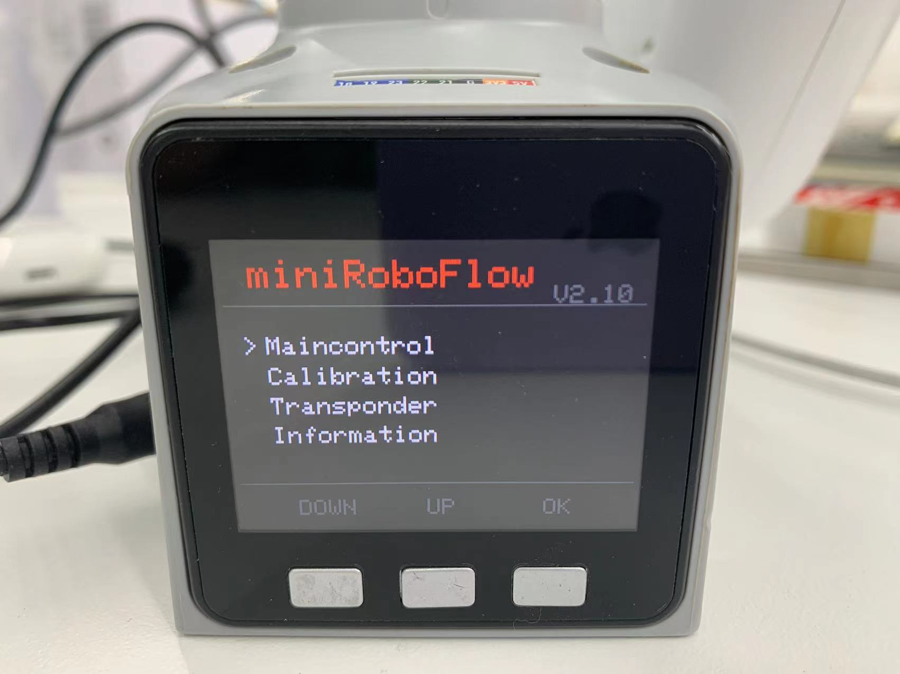
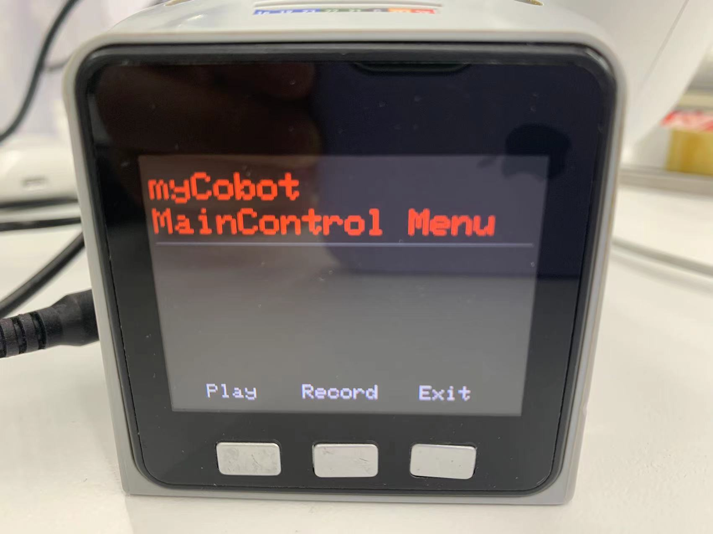
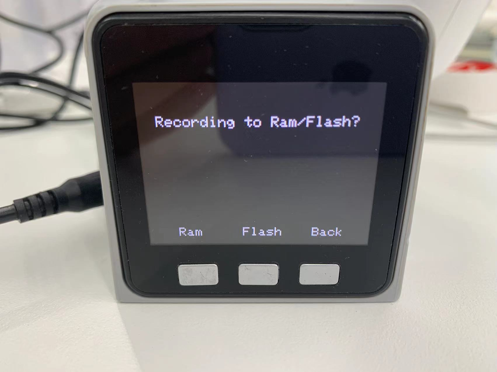

# Implement drag teaching

## Drag teaching

Robot drag teaching means that the operator can directly drag the robot's joints to move to the ideal posture and record it.

Collaborative robots are the earliest systems with this function. This teaching method can avoid the various shortcomings of traditional teaching and is a technology with great application prospects in robots.

**Depending on the device type, the operation method is also different**, the steps are as follows:
- **Atom** burn the latest version of **atomMain**
- **M5Stack-basic** burn **minirobot**, select **Maincontrol** function, microprocessor devices do not need to burn **M5Stack-basic**
- Press the record button/keyboard key
- Select the storage path, microprocessor devices do not have this step
- You can directly drag the joints of the robot arm to the expected position to complete a set of movements
- Press the specified button/keyboard key to save
- Press the play button/keyboard key/keyboard key
- Select the relative storage path, and the robot arm starts to move
- Press the exit button/keyboard key to exit this function

In this section, we will teach you how to get started easily and experience the fun of collaborative robot dragging teaching

## Applicable devices
- myCobot 280 M5
- myCobot 320 M5
- myPalletizer 260 M5
- mechArm 270 M5

## Operation steps

**Step 1:** Burn the latest version of atomMain in Atom.

**Step 2:** Burn minirobot in M5Stack-basic and select the Maincontrol function.

**Step 3:** Press the Record button.

**Step 4:** Select the storage path and press Ram or Flash.

**Step 5:** Drag the joints of the robot arm to the desired position to complete a set of movements.

**Step 6:** Press any key to stop recording and save the record

**Step 7:** Press the Play button Play.

**Step 8:** Click the storage path just selected, press Ram/Flash, and the robot arm starts playing the saved record.

**Step 9:** Press Pause to pause the movement, press Stop to stop the movement, and press Play to resume the movement.

## Video tutorial

Tutorial video address: [https://www.bilibili.com/video/BV16t4y167vw/](https://www.bilibili.com/video/BV16t4y167vw/)