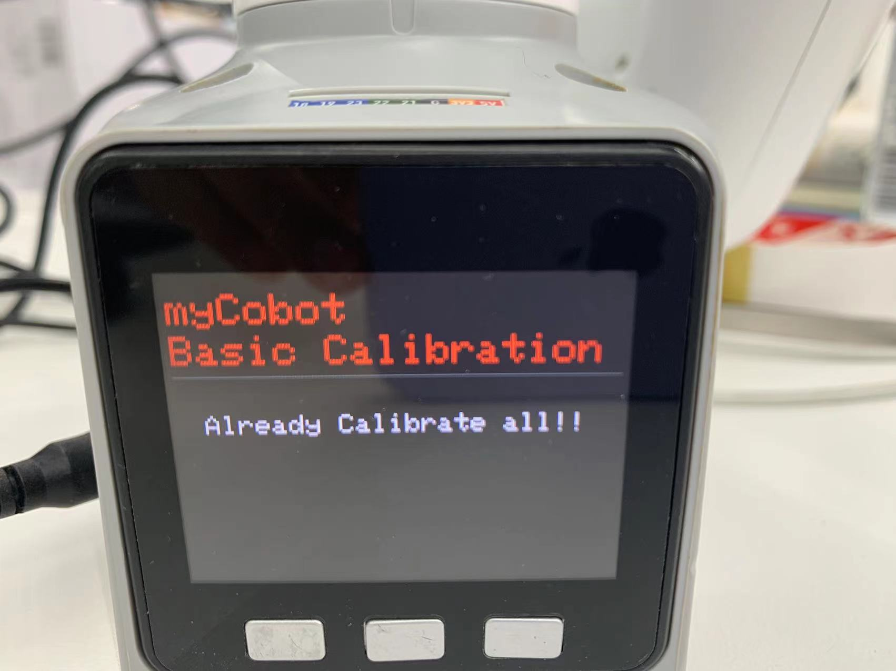
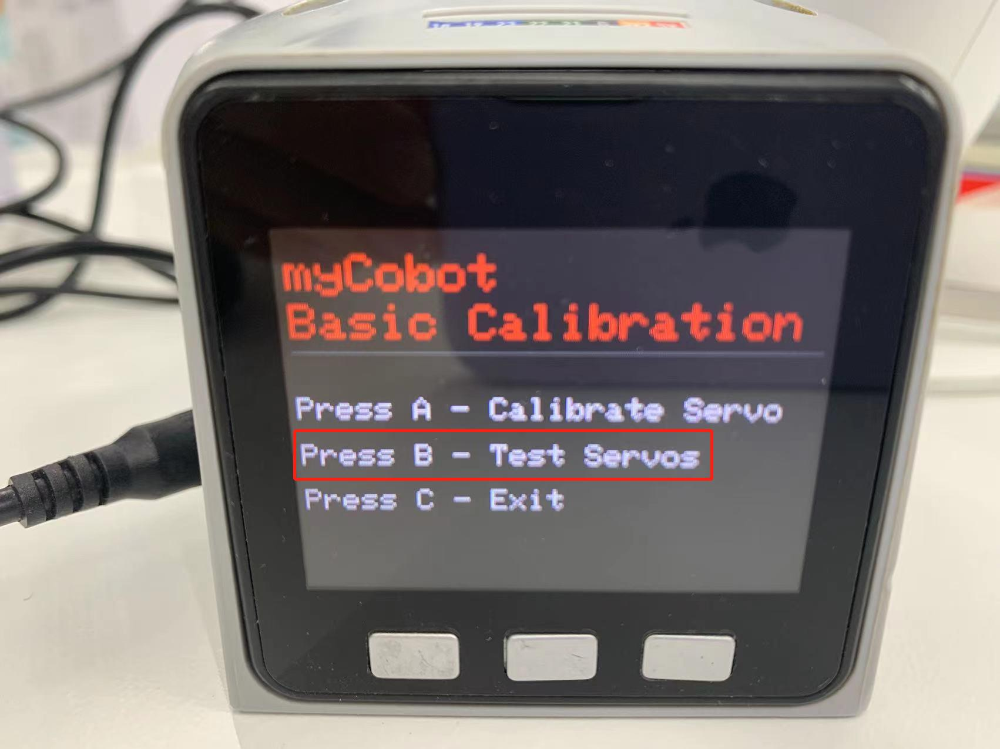

# Implement robot arm calibration

## Calibrate the robot arm

Tip: By default, the robot has already been operated before leaving the factory, so there is no need to repeat the operation. Incorrect use of this function may cause damage to the robot. If your robot works normally, please do not use it. Thank you for your cooperation.

Calibrating the robot arm is the prerequisite for precise control of the robot arm. Setting the joint zero position and initializing the motor potential value are the basis for subsequent advanced development.

**Depending on the device type, the operation method is also different**, the steps are as follows:

- **Atom** burn the latest version of **atomMain**

- **M5Stack-basic** burn **minirobot**, select **Calibration** function, microprocessor devices do not need to burn **Basic**

- Turn each joint of the robot arm to the zero position state (zero position scale line is aligned), press the calibration button to start calibrating the robot arm

- Press the test button to test the zero position of each joint of the robot arm

- Press the exit button to exit this function

In this section, we will teach you how to calibrate the robot arm step by step, and after calibration, test and verify the joints of the robot arm.

## Applicable devices

- myCobot 280 M5
- myCobot 320 M5
- myPalletizer 260 M5
- mechArm 270 M5

## Operation steps

**Step 1:** Atom burns the latest version of atomMain.

**Step 2:** Basic burn minirobot, select Calibration function.

**Step 3:** Press A key to start calibrating the robot arm.

**Step 4:** First drag the robot arm to make joint 1 reach the zero position (zero position scale line is aligned).

**Step 5:** According to the motor number (1~6) indicated on the screen, drag the robot arm to make each joint reach the zero position (align the zero position scale line)

**Step 6:** Press NEXT in sequence to enter the next motor calibration until Already Calibrate all!! appears, and the calibration is completed.

**Step 7:** Press EXIT to exit the calibration.

**Step 8:** Press the B key to test the zero position of each joint of the robot arm.

**Step 9:** Press the C key to exit this function.

##  Video tutorial

Address: [https://www.bilibili.com/video/BV1FT4y1P7BV/](https://www.bilibili.com/video/BV1FT4y1P7BV/)