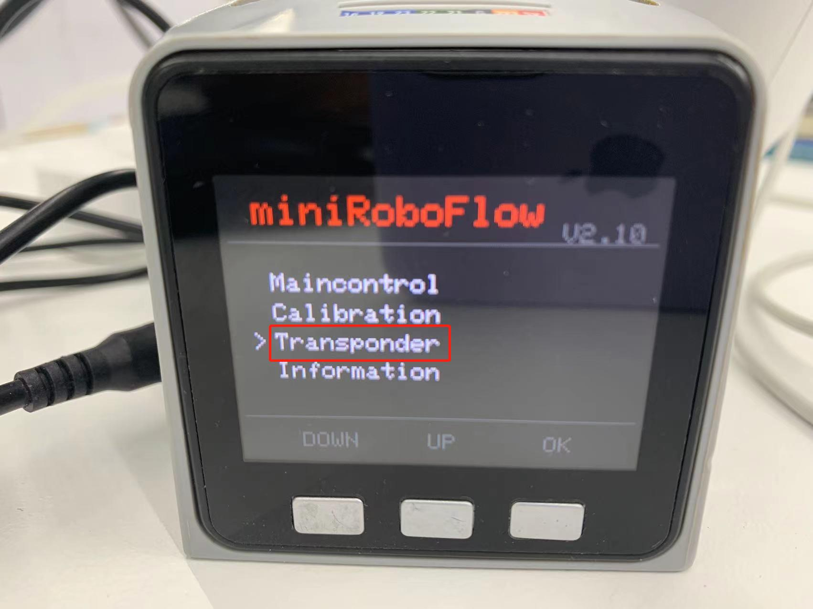
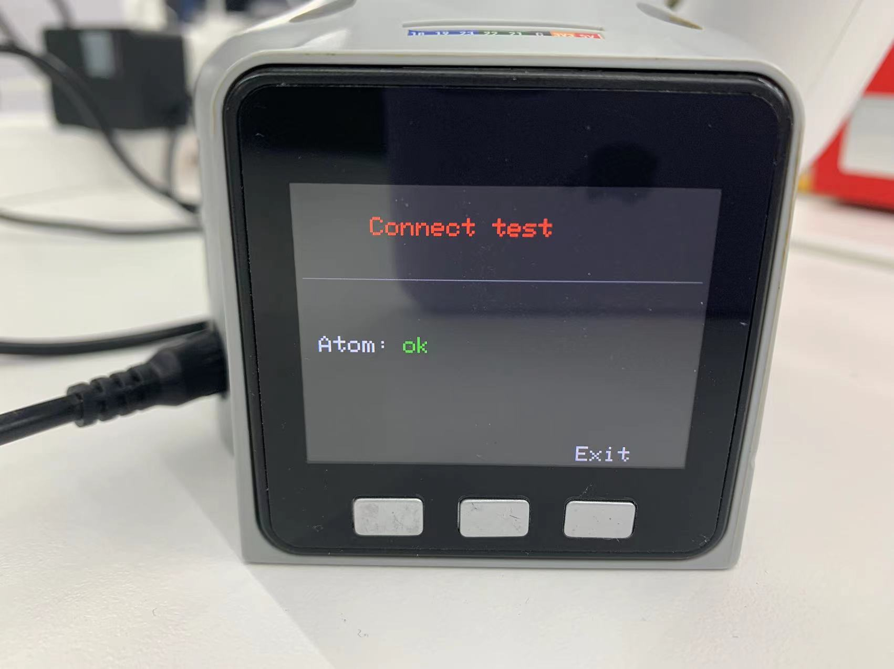
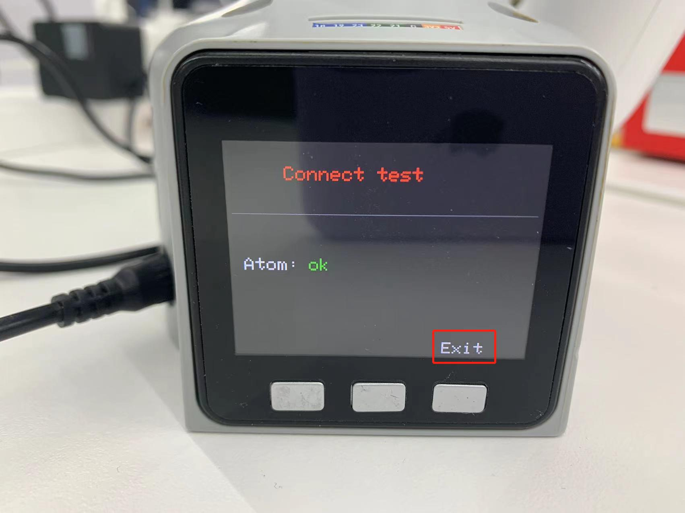

# Computer control

The timeliness of computer control is crucial for microcontroller robotic arms. For microcontroller robotic arms, we usually send control instructions to the Basic of the base, forward them through computer control, and the end effector will parse the instructions and then perform the target action.

This function is currently mainly used by customers to develop robotic arms in different environments.

**Depending on the device type, the operation method is also different**, the steps are as follows:

- **Atom** burns the latest version of **atomMain**

- **M5Stack-basic** burns **minirobot**, selects **Transponder** function, microprocessor devices do not need to burn **M5Stack-basic**

- Press the detection key to detect whether Basic and the end effector Atom are communicating normally

- Press the exit button to exit this function

In this section, we can detect in real time whether Basic and the end effector Atom are communicating normally.

---
## Realize communication forwarding

## Applicable devices
- myCobot 280 M5
- myCobot 320 M5
- myPalletizer 260 M5
- mechArm 270 M5

## Operation steps
**Step 1:** Atom burns the latest version of atomMain.

**Step 2:** M5Stack-basic burns minirobot, selects the Transponder function.

**Step 3:** Check the connection of Atom (ok means the connection is normal, otherwise it will display no).

**Step 4:** Click Exit to exit this function.
