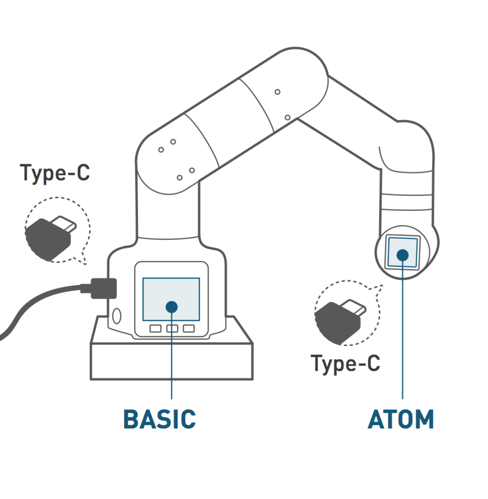
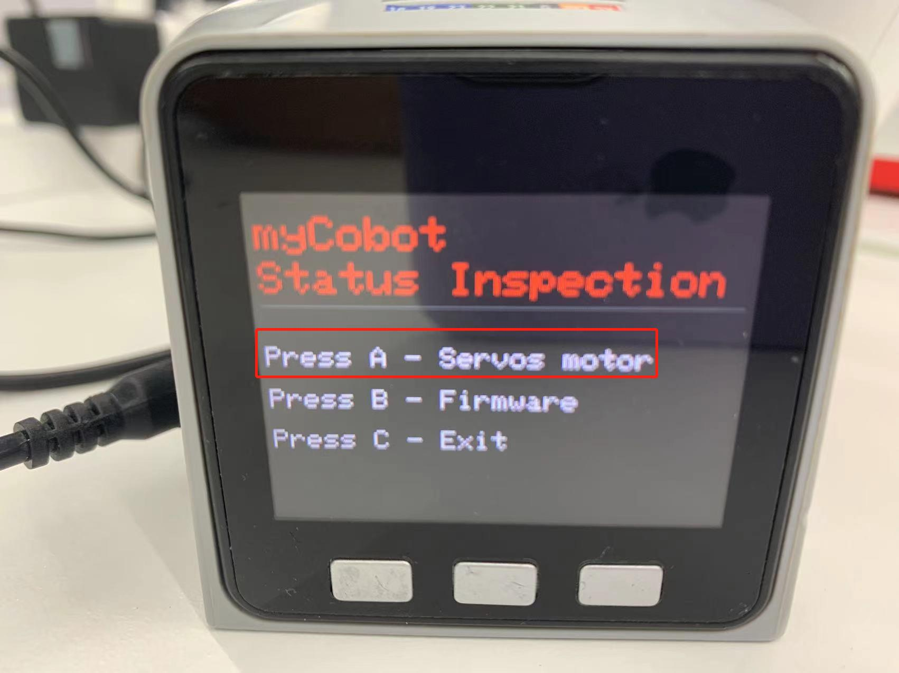
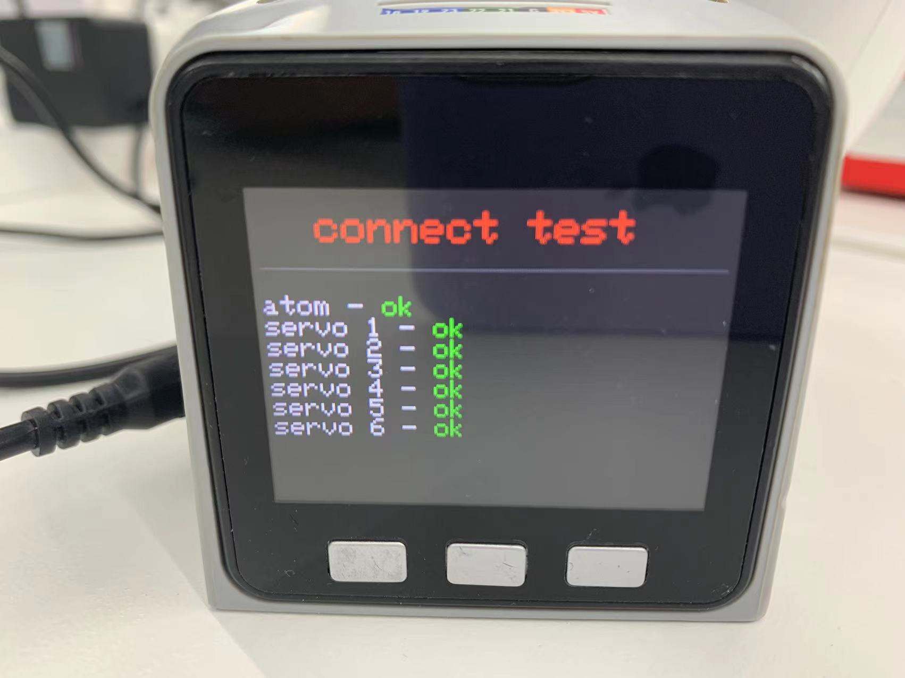
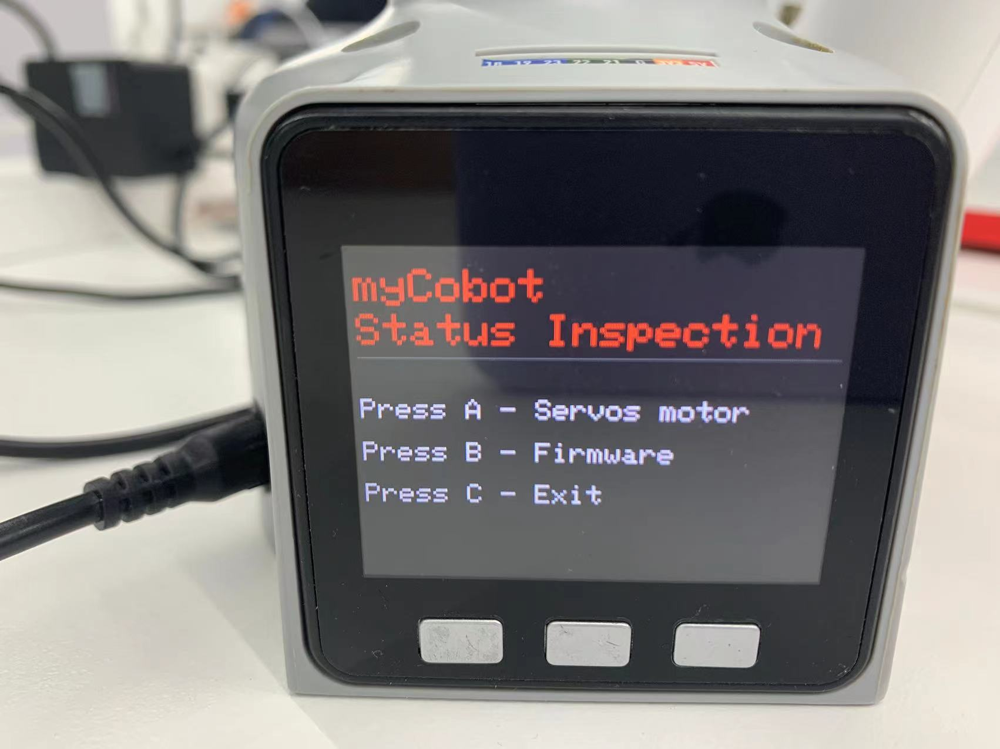

# Connection detection

Connection detection is a function that detects the connection status of the motor and **Atom** in the robot arm. This function is convenient for customers to troubleshoot equipment failures.

In the connection detection, the device connection status of the robot arm is displayed, including **servo connection** and **Atom communication status**. The current firmware version of the device will be displayed on M5Stack-basic in **microcontroller devices**.

**Depending on the device type, the operation method is also different**, the steps are as follows:
- **Atom** burn the latest version of **atomMain**
- **M5Stack-basic** burn **minirobot**, select **Information** function, microprocessor devices do not need to burn **M5Stack-basic**
- Press the detection button to detect the device connection status
- Press the firmware view button to view the current firmware version
- Press the exit button to exit this function

In this section, we can learn how to use the device detection function for different types of devices.

## Applicable devices
- myCobot 280 M5
- myCobot 320 M5
- myPalletizer 260 M5
- mechArm 270 M5

## Operation steps

**Step 1:** **Atom** burn the latest version of **atomMain**.

**Step 2:** **M5Stack-basic** burn **minirobot**, select **Information** function.

**Step 3:** Press the **A** key to start the connection detection. The screen displays **Atom** and the connection status of the six motors.

**Step 4:** Press the **B** key to start the version information detection. The screen displays the robot version and **Basic** firmware version.
  **Step 5:** Press the **C** key to exit this function.
