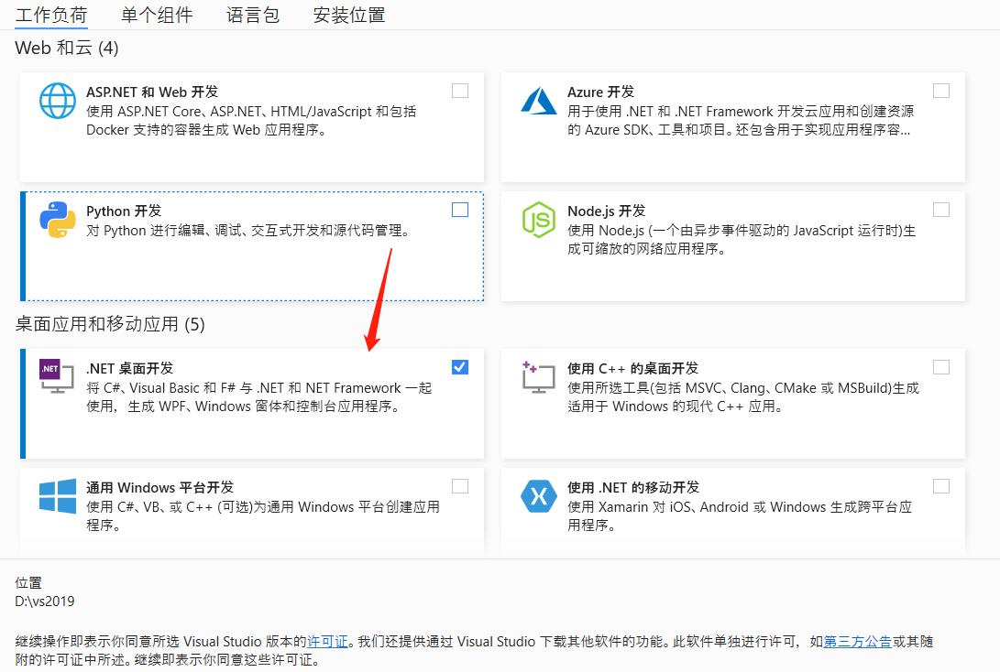

# C# Environment Setup

## Confirm the development goal

**Mycobot.csharp is a program for serial communication with the robot, which contains simple use cases. If you want to use C# for free development and control the robot developed by our company, then it is your choice. ** 
Supported robot models: **myCobot280, 320 and myPalletizer 260**.  

**Recommended software for running Mycobot.csharp: vs2019 (Windows development), MonoDevelop (development on Raspberry Pi robot arm). ** 

## Windows environment configuration

### Install vs2019

Download:  
First, download [vs2019](https://visualstudio.microsoft.com/zh-hans/vs/) from the official website.  
Installation: 
After the installation is complete, the interface shown in the figure below will appear. Just select **.NET Desktop Development** (this is just a suggestion, you can choose according to your needs, vs2019 installation takes a long time).  

## Raspberry Pi Robot Arm Environment Configuration
### Install monodevelop
**Installation** 
**Execute the following commands** in order to install, or check the [official website instructions](https://www.monodevelop.com/download/#fndtn-download-lin): 

* sudo apt install apt-transport-https dirmngr 
* sudo apt-key adv --keyserver hkp://keyserver.ubuntu.com:80 --recv-keys 3FA7E0328081BFF6A14DA29AA6A19B38D3D831EF
echo "deb https://download.mono-project.com/repo/ubuntu vs-bionic main" | sudo tee /etc/apt/sources.list.d/mono-official-vs.list 
* sudo apt update 
* sudo apt-get install monodevelop 

**Test** 
To test whether the installation is successful, please refer to this [document](https://www.monodevelop.com/documentation/creating-a-simple-solution/). 