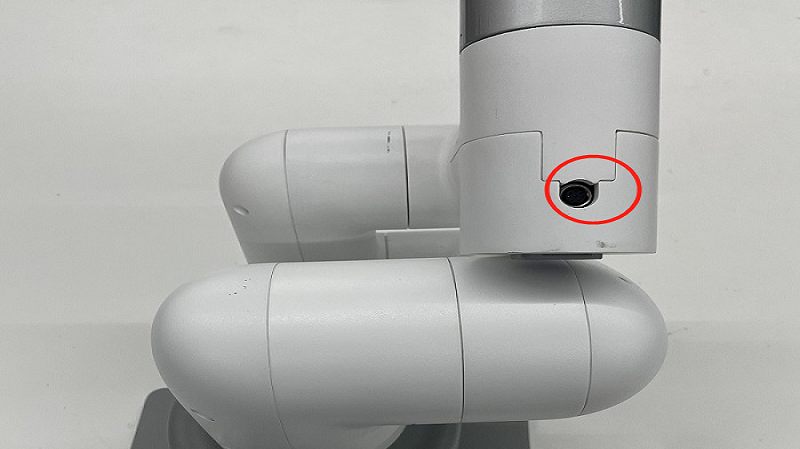

# Gripper control
Gripper installation: 
The adaptive gripper inserts the gripper into the pins on the atom, see the following figure for details: 
	
The electric gripper is plugged into the 485 interface on the top, see the following figure for details: 
Note: **myCobot280 and myPalletizer 260 do not have electric grippers, only myCobot320 has electric grippers**.
	

## Adaptive gripper control
Supported devices: myCobot280, 320 && myPalletizer 260 
1.1 **setGripperValue(byte angle, byte speed)** 
Return value: None 
Parameter description: Parameter 1: Gripper opening and closing angle (0-100, 0--closed, 100-open maximum angle), Parameter 2: Gripper opening and closing speed (0-100) 
Case: 

	mc.setGripperValue(0, 10);
	Thread.Sleep(3000);
	mc.setGripperValue(50, 100);
	Thread.Sleep(3000);
1.2 **getGripperValue()** 
Return value: int type, returns the gripper angle (0--closed, 100-open maximum angle) 
Parameter description: None 
Case: 
	`Console.WriteLine(mc.getGripperValue());`

## Electric Gripper Control
Supported devices: myCobot320 
2.1 **setEletricGripper(int state)** 
Return value: None 
Parameter description: Gripper switch state (0--off, 1--on) 
Example: 
`mc.setEletricGripper(0);`

## Complete use case

	using System;
	using System.Threading;
	
	namespace Mycobot.csharp
	{
	    class Test
	    {
	        static void Main(string[] args)
	        {
	            MyCobot mc = new MyCobot("COM57");//Raspberry Pi robotic arm serial port name: /dev/ttyAMA0
	            mc.Open();
	            Thread.Sleep(5000);//After Windows opens the serial port, you need to wait for 5 seconds, and the basic button at the bottom of Windows will restart when it opens the serial port.
	
	            //set gripper open or close 0--close 100-open max 0-100
	            mc.setGripperValue(0, 10);
	            Thread.Sleep(3000);
	            mc.setGripperValue(50, 100);
	            Thread.Sleep(3000);
	
				//set electric gripper
				mc.setEletricGripper(0);
				Thread.Sleep(100);
				mc.setEletricGripper(1);
				Thread.Sleep(100);
	
	            //get gripper state 0--close 1--open
	            Console.WriteLine(mc.getGripperValue());
	            mc.Close();
	        }
	    }
	}

