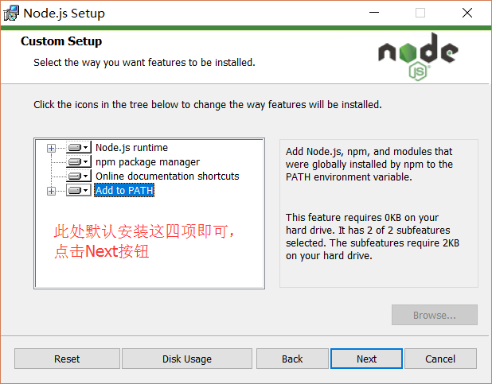
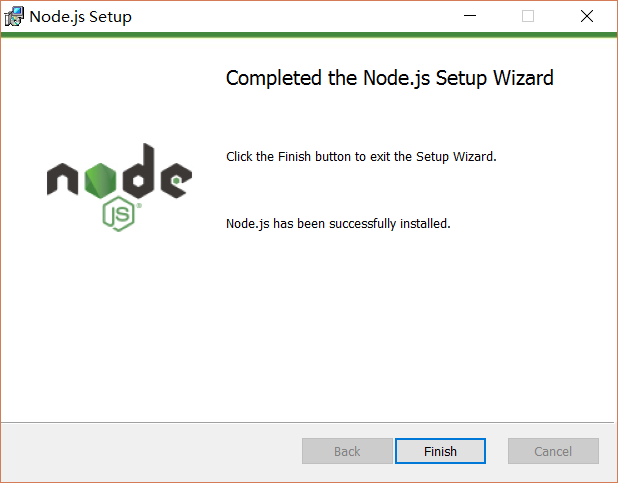
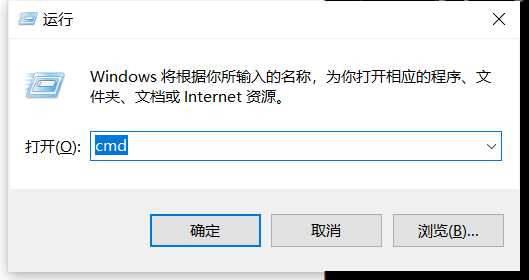
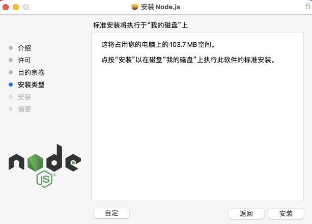
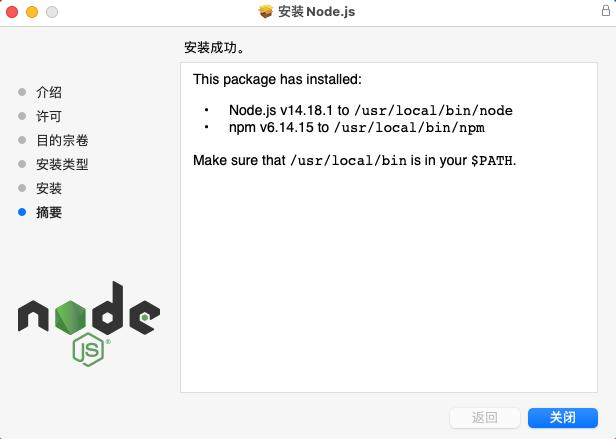
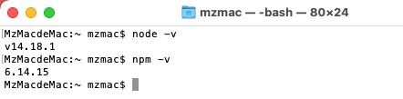

### Preparation before development
> ```Node environment setup```
[Windows 32-bit download address](https://npmmirror.com/mirrors/node/v16.13.2/node-v16.13.2-x86.msi)
[Windows 64-bit download address](https://npmmirror.com/mirrors/node/v16.13.2/node-v16.13.2-x64.msi)
[MacOS download address](https://npmmirror.com/mirrors/node/v16.13.2/node-v16.13.2.pkg)
#### 1 Windows Node environment setup
First step After the download is complete, double-click the downloaded installation package to start installing Node.js, and click the next button

Step 2 Check the option in the red box on the lower left, and then click next

Step 3 Customize the installation directory

Step 4 By default, click the next button to continue to the next step

Step 5 Click install

Step 6 Click finsh to complete the installation

Step 7 Press win+r to open the run command and enter cmd to enter the command prompt

Step 8 Enter node -v gets the node version. If the version is displayed, the installation is successful.


#### 2 MacOs node environment setup
Step 1 After downloading, double-click the downloaded installation package to start installing Node.js, click the next button, and click Continue

Step 2 Click Continue again

Step 3 Click Agree Continue to the next step

Step 4 Click Customize and select the installation address, or click Install to continue the installation and enter your password to install

Step 5 Click Close when prompted that the installation is successful to exit the installation program

Right-click the desktop and select the check-in terminal. Enter the terminal and enter node -v, displaying the node version number indicates successful installation


#### 3 Linux node environment setup
The first step is that the Node official website has changed the Linux download version to a compiled version. We can directly download and decompress it for use:
```
# wget https://nodejs.org/dist/v10.9.0/node-v10.9.0-linux-x64.tar.xz // Download
# tar xf node-v10.9.0-linux-x64.tar.xz // Decompress
# cd node-v10.9.0-linux-x64/ // Enter the decompression directory
# ./bin/node -v // Execute the node command to view the version
v10.9.0
```
The second step is to decompress the bin of the file The directory contains commands such as node and npm. We can use the ln command to set up soft links:
```
ln -s /usr/software/nodejs/bin/npm /usr/local/bin/
ln -s /usr/software/nodejs/bin/node /usr/local/bin/
```
#### 4 Install Node.js from source code in Ubuntu
> Step 1 In the following section, we will introduce how to install Node.js from source code in Ubuntu Linux. Other Linux systems, such as Centos, have similar installation steps as follows. Get the Node.js source code from Github:
```
$ sudo git clone https://github.com/nodejs/node.git
Cloning into 'node'...
```
Step 2 Modify directory permissions
```
$ sudo chmod -R 755 node
```
Step 3 Use ./configure to create a compilation file and enter the instructions in the following order:
```
$ cd node
$ sudo ./configure
$ sudo make
$ sudo make install
```
Step 4 Check the node version:
```
$ node --version
v0.10.25
```