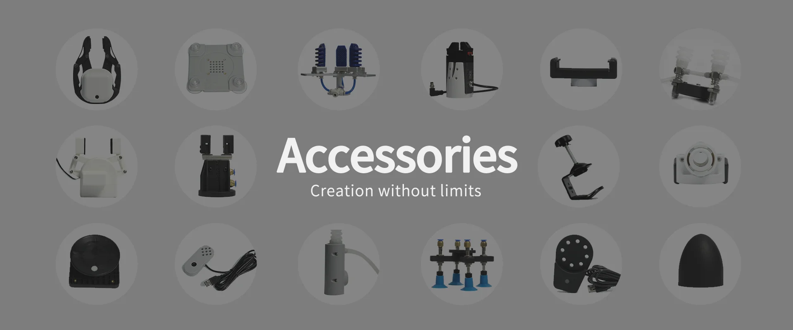

# Product Accessories

In the real world, different accessories can enhance the capabilities of robots in various ways. For example, accessories such as grippers, sensors, and tools can help robots perform various tasks, thereby increasing their versatility and flexibility.

Elephant Robotics is committed to making robots and these accessories easy for everyone to use, freeing users from the complexity of choosing the right accessories and enabling them to quickly start using robots.

## Accessory Types
In order to meet the needs of customers in different scenarios, we have designed various types of accessories, including grippers, suction cups, camera modules, and other gripping devices, so that users can directly choose the right end effector

## Base 

- [Flat Base](Flatbase.md) 

Suitable for fixing the robot arm on a flat and smooth surface.

- [G-Base](Gstands_2.0.md)

Suitable for fixing the robot arm on the edge of a table.

## Gripper 
- [Adaptive Gripper](AdaptiveGripper.md) 

The gripper is a robot component that can achieve functions similar to human hands. It has the advantages of complex structure, firm gripping of objects, not easy to fall, and easy operation. The gripper kit includes gripper accessories and Lego technology parts. The end effector of the robot arm is controlled by a programmable system to achieve functions such as object grasping and multi-point positioning.

- [Parallel Gripper](ParallelGripper.md) 

Driven by a motor, the finger surface of the gripper makes a linear reciprocating motion to achieve the opening or closing action. The acceleration and deceleration of the electric gripper can be controlled, the impact on the workpiece can be minimized, the positioning point can be controlled, and the clamping can be controlled

- [Flexible Gripper-Open Foot Type](flexible_gripper_2.md) 

The fingertips are made of rubber and rely on air pressure deformation to grasp objects. Pneumatic manipulators are widely used and are favored for their softness, adaptability and efficiency. These advantages make them powerful tools in automation and robotic applications, capable of effectively handling a wide range of objects and tasks

## Suction Pumps 
- [Vertical Suction Pumps](pump.md) 

With one suction nozzle and one exhaust nozzle, the suction pump kit is controlled as the end effector of the robot arm to perform the function of sucking objects.

- [Double-head Suction Pumps](doublepump.md) 

Compared with single-head suction pumps, it is more stable, with simple structure, small size, easy to use, low noise, and good self-priming ability.

- [Integrated Suction Pumps](IntegratedPump.md) 

The integrated suction pump has the advantages of simple structure, small size, easy to use, low noise, and good self-priming ability.

## Holder 
- [Pen Holder](penHolder.md) 

The overall solid color design can be used for writing, drawing and other applications.

- [Phone Holder](phoneHolder.md) 

Suitable for devices that require physical clamping, such as photography, and can clamp a variety of mobile phones. It has a simple structure and is easy to install and disassemble.

## Other functional accessories
- [Dexterous Hand](Robothand.md) 

A robot component that can achieve functions similar to human hands. It has the advantages of a complex structure, firm gripping of objects, not easy to fall, and easy operation. The gripper kit includes gripper accessories and Lego technology parts. The end effector of the robot arm is controlled by a programmable system to achieve functions such as object grasping and multi-point positioning.

- [USB Camera](USBcamera.md) 

The USB high-definition camera can be used with suction pumps, adaptive grippers, artificial intelligence kits, etc., and eye in hand can achieve precise positioning and calibration.

- [Bamboo Flange](bamboo.md) 

Suitable for devices with physical travel such as click buttons and keyboards. The overall solid color design, simple structure, and easy installation and disassembly.