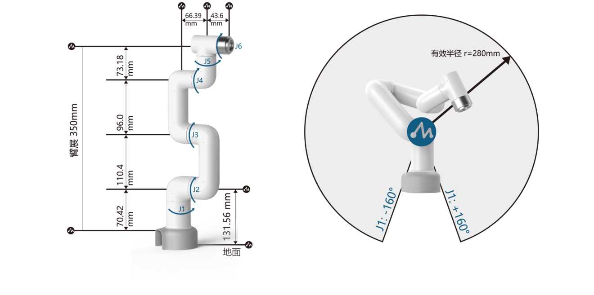
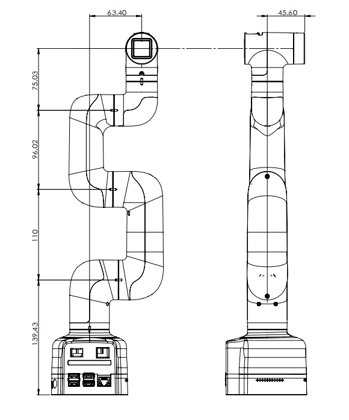
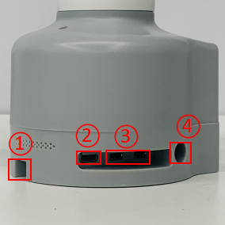

# 机器人参数说明

> 第一章中，我们探讨了产品的卖点及其设计理念，为您提供了对产品高层次理解的全景视角。现在，让我们进入第二章——机器人参数说明。这一章节将是您理解产品技术细节的关键。详细了解这些技术参数，不仅可以帮助您充分认识到我们产品的先进性和实用性，而且还能够确保您能够更有效地利用这些技术来满足您的具体需求。

## 1.结构参数

### 1.1机械臂参数

| 指标    | 参数  |
| :-----------: | :---------: |
| 名称	| 小象协作机械臂 |
| 型号  | myCobot 280 Raspberry Pi 2023  |
| 自由度  | 6          |
| 有效负载  | 250g       |
| 工作半径  | 280mm      |
| 重复定位精度 | ±0.5mm |
| 重量  | 860g       |
| 电源输入    | 12V，5A     |
| 工作温度 | -5-45℃     |
| 通信    | Type-C     |

### 1.2工作空间

### 1.3规格尺寸

### 1.4关节运动范围

| 关节       | 范围 |
| :--------: | :----------:|
| J1        | -168 ~ +168     |
| J2        | -135 ~ +135      |
| J3  | -150 ~ +150                   |
| J4        | -145 ~ +145 |
| J5   | -165 ~ +165                   |
| J6   | -180 ~ +180         |

### 1.5孔位安装

- 机器人底座安装法兰,底座同时兼容乐高科技件安装方式和M4螺丝安装方式。

- 机器人末端安装法兰，机械臂末端同时兼容乐高科技件孔与螺丝螺纹孔。

## 2.电子参数

|  指标      | 参数 |
| :---------: | :--------------:|
| SOC        | Broadcom BCM2711     |
| CPU        | 64位 1.5GHz四核      |
| 蓝牙/无线  | 有                   |
| USB        | USB3.0 x2; USB2.0 x2 |
| 显示屏幕   | 无                |
| HDMI接口   | microHDMI x2         |
| 自定义按键 | 无                  |
| IO接口    | 40                 |

## 3.电气特性参数
### 3.1机械臂底座电气接口
### 底座介绍

* A. 底座的正面如下图所示：
  
  - ① 开关按键
  - ② 功能接口组一
  - ③ USB2.0 , USB3.0
  - ④ 电源DC接口
  - ⑤ 网口
* B. 底座的侧面如下图所示:
  
  - ① SD卡卡槽
  - ② Type C
  - ③ HDMI
  - ④ 音频接口

### 3.2底座接口说明

> **注意:** 功能接口组均为2.54mm杜邦接口，外部可使用2.54mm杜邦线。

* A. 功能接口组一的各个接口定义如下表所示

| 标签 | 信号名 | 类型 | 功能 | 备注 |
| :---: | :----: | :--: | :------: | :----: |
| 5V | 5V | P | DC 5V |  |
| 5V | 5V | P | DC 5V |  |
| GND | GND  | p | GND |  |
| NC | NC | - | - | 暂不支持 |
| NC | NC | - | - | 暂不支持 |
| 18 | GPIO18 | I/O | GPIO18 |  |
| GND | GND  | p | GND |  |
| 23 | GPIO23 | I/O | GPIO23 |  |
| 24  | GPIO24 | I/O | GPIO24 |  |
| GND | GND  | p | GND |  |
| 25 | GPIO25 | I/O | GPIO25 |  |
| 08 | GPIO8 | I/O | GPIO8 |  |
| 07 | GPIO7 | I/O | GPIO7 |  |
| 01 | GPIO1 | I/O | GPIO1 |  |
| GND | GND  | p | GND |  |
| 12 | GPIO12 | I/O | GPIO12 |  |
| GND | GND  | p | GND |  |
| 16 | GPIO16 | I/O | GPIO16 |  |
| 20 | GPIO20 | I/O | GPIO20 |  |
| 21 | GPIO21 | I/O | GPIO21 |  |
|3.3 | 3.3V | P | DC 3.3V |  |
| NC | NC | - | - | 暂不支持 |
| 03 | GPIO3 | I/O | GPIO3 |  |
| 04 | GPIO4 | I/O | GPIO4 |  |
| GND | GND  | p | GND |  |
| 17 | GPIO17 | I/O | GPIO17 |  |
| 27 | GPIO27 | I/O | GPIO27 |  |
| 22 | GPIO22 | I/O | GPIO22 |  |
|3.3 | 3.3V | P | DC 3.3V |  |
| 10 | GPIO10 | I/O | GPIO10 |  |
| 09 | GPIO9 | I/O | GPIO9 |  |
| 11 | GPIO11 | I/O | GPIO11 |  |
| GND | GND  | p | GND |  |
| 00 | GPIO0 | I/O | GPIO0 |  |
| 05 | GPIO5 | I/O | GPIO5 |  |
| 06 | GPIO6 | I/O | GPIO6 |  |
| 13 | GPIO13 | I/O | GPIO13 |  |
| 19 | GPIO19 | I/O | GPIO19 |  |
| 26 | GPIO26 | I/O | GPIO26 |  |
| GND | GND  | p | GND |  |

> **注意:** 
> 1. I: 仅作为输入。
> 
> 2. I/O: 该功能信号包含输入和输出组合。
> 
> 3. 当管角设置为输出端时，它将输出电压3.3V。
> 
> 4. 单个管角的拉电流随管脚数量增加而减小，从约40mA减小到29mA。
> 
> 5. 如果某个GPIO被设置为输出模式时，输出高电平信号，电路连接如图 2.1.5.2-3 所示，LED灯将点亮。
> 
>  
> 
> 图 2.1.5.2-3
> 
> 6. 关于功能接口的其他功能表如图 2.1.5.2-4 所示,使用其他功能的情况下，IO功能不可用。
> 
> 
> 
> 图 2.1.5.2-4

* B. 电源DC接口: 使用DC电源插座，外径6.5mm，内径2.0mm；可使用厂家配备的12V 5A  DC电源适配器给 myCobot280 进行供电。
  
* C. 开关按键：红色为开关，I为开机，O为关机。

* D. USB2.0接口：以串口总线标准2.0进行数据连接的接口；用户可以使用USB接口拷贝程序文件，也可以使用USB接口连接鼠标、键盘等外设。

* E. USB3.0接口（蓝色）：以串口总线标准3.0进行数据连接的接口；用户可以使用USB接口拷贝程序文件，也可以使用USB接口连接鼠标、键盘等外设。

   

  图 2.1.5.2-5

* F. 网口：网络数据连接的端口，用户使用Ethernet接口可以用于PC端与机器人系统的通信交互，也可以用于与其他设备进行以太网通信。

  

  图 2.1.5.2-6

* G. HDMI 接口: 接口为HDMI D型接口，连接显示器。HDMI接口2存在优先级，推荐使用HDMI接口1。

* H. Type C接口：树莓派自身的供电口，仅给树莓派自身供电，无法给整个机器供电，所有电源DC接口可以正常使用的时候无需接此接口。

* I. SD卡卡槽: SD卡可以插入和拔出。SD卡的大小是32mm×24mmx2.1mm

## 4.机械臂末端电气接口

### 4.1机械臂末端介绍

* A. 机械臂末端如图 2.1.5.2-7 和图 2.1.5.2-8 所示:

  

  图 2.1.5.2-7 机械臂末端
  - ① 舵机接口
  - ② Atom

  

  图 2.1.5.2-8 机械臂末端
  - ① 功能接口组二
  - ② Grove
  - ③ Type C

### 4.2末端接口说明

* A. 功能接口组二的各个接口的定义如下表所示:
  
| 标签 | 信号名 | 类型 | 功能 | 备注 |
| :---: | :----: | :--: | :------: | :----: |
| 5V | 5V | P | DC 5V |  |
| GND | GND | P | GND |  |
| 3V3 | 3V3 | P | DC 3.3V |  |
| G22 | G22 | I/O | GPIO22 |  |
| G19 | G19 | I/O | GPIO19 |  |
| G23 | G23 | I/O | GPIO23 |  |
| G33 | G33 | I/O | GPIO33 |  |

> **注意:** 
> 1. I: 仅作为输入。
> 
> 2. I/O: 该功能信号包含输入和输出组合。
> 
> 3. 当管角设置为输出端时，它将输出电压3.3V。
> 
> 4. 单个管角的拉电流随管脚数量增加而减小，从约40mA减小到29mA。
> 
> 5. 如果某个GPIO被设置为输出模式时，输出高电平信号，电路连接如图 2.1.5.2-9 所示，LED灯将点亮。
> 
> 
> 
> 图 2.1.5.2-9

* B. Type C接口：可用于和PC端连接通讯，更新固件使用。

* C. Grove : 定义如图 2.1.5.2-10 所示
  
  
  

  图 2.1.5.2-10 Grove

* D. 舵机接口：用于末端拓展夹爪时使用，当前支持配套的自适应夹爪使用。

* E. Atom：用于 5X5 RGB LED（G27）显示和按键功能（G39）

## 5.笛卡尔坐标参数
  

SDH参数如下图所示

---

[← 上一章](../1.ProductIntroduction/1-ProductIntroduction.md) | [下一章 →](../../2-BasicSettings/3.UserNotice/3-UserInstructions.md)