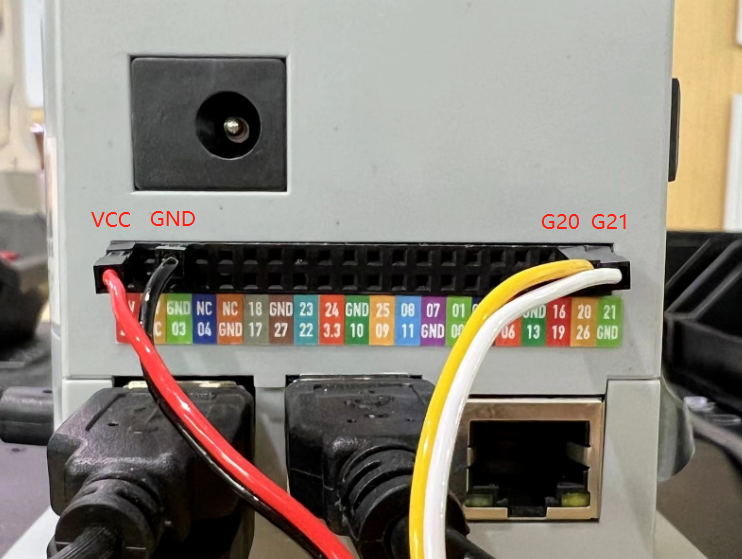
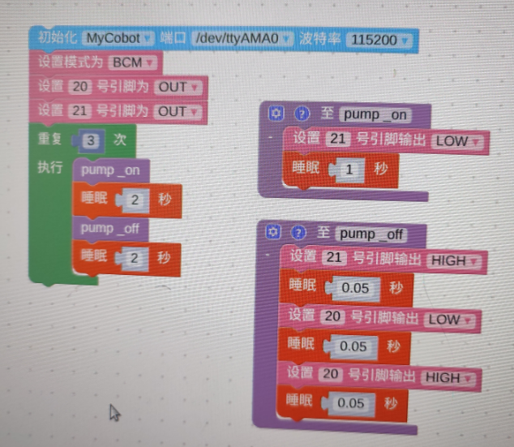
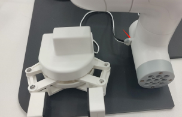
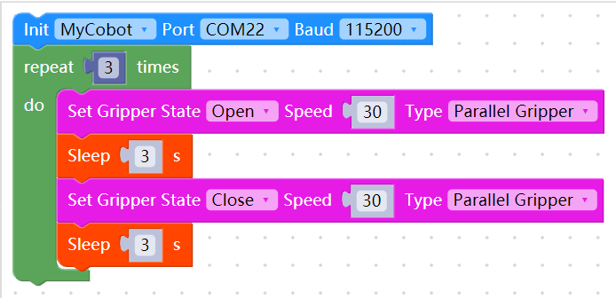

# 配件相关问题

**Q:  280pi与吸泵的io连接示意图及快速使用源码**

新版v2.0版本：

吸泵上的G5引脚为吸泵开关控制引脚，G2标签为电磁阀控制引脚。均为低电平有效。
电磁阀的作用是使吸泵在释放的时候更加迅速，如在未使用电磁阀的情况下，吸泵也是可以正常工作的，只是关闭吸泵时释放物体的速度相对较慢。
源码此处使用21号引脚控制吸泵的开合，使用20号引脚控制电磁阀的开合，电磁阀开合主要工作在关闭吸泵阶段。

旧版V1.0版本代码:

**Q: 280pi使用吸泵的源码**

**Q：mycobot自适应夹爪的引脚线序与连接方式是怎样的？**

mycobot自适应夹爪的引脚介绍参考下图：

夹爪连接方式：

**Q：平行夹爪的使用源码**

**Q：关于夹持物体与机械臂运动之间有什么需要注意的吗？**

当负载 > 500g时，速度需要低于 50%。
