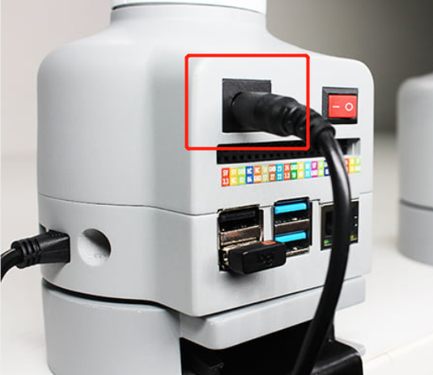

# Product Standard List

## Product List Image
> Thank you for choosing the Elephant Robot myCobot 280 pi Robotic Arm. This chapter is designed to help you easily get started with the Elephant Robotic product and enjoy every wonderful moment brought by the product.

## Product Standard List Comparison Table

| Serial Number | Product |
| :----: | :------------------------------------ |
| 1 | myCobot Robotic Arm (Model myCobot-280 pi) |
| 2 | myCobot Robotic Arm-Product Brochure |
| 3 | myCobot Robotic Arm-Supporting Power Supply |
| 4 | USB-Type C |
| 5 | Jumper |

**Note:** After the packaging box arrives, please confirm that the robot packaging is intact. If there is any damage, please contact the logistics company and the supplier in your area in time. After unpacking, please check the actual items in the box according to the item list.

---
# Product Unpacking Guide

## Product Unpacking Graphic Guide

**Why do you need to disassemble the product according to the steps**

In this section, we strongly recommend disassembling the product according to the specified steps. This will not only help ensure that the product is not damaged during transportation, but also minimize the risk of unexpected failures. Please read the following graphic guide carefully to ensure the safety of your product during the unpacking process.

- **1** Check whether the packaging box is damaged. If there is any damage or missing accessories, please contact the logistics company and the supplier in your area in time.

- **2** Open the box and take out the product brochure, sponge packaging cover, myCobot robot arm, matching power supply and accessory bag.

- **3** Make sure each step is completed before proceeding to the next step to prevent unnecessary damage or omissions.

**Note:** After taking out the product, please carefully check the appearance of each item. Please check the actual items in the box against the item list.

## Product unboxing video guide

<video controls>
<source src="../../resource/2-BasicSettings/4.FirstTimeInstallation/OpenGuide.mp4" type="video/mp4">
Your browser does not support HTML5 video.
</video>

# Power-on inspection guide

## Structural installation and fixation

During the movement of the **robot arm**, if the **bottom surface of myCobot is not connected to the desktop or other bottom surface**, myCobot will still **shake or overturn**.

**There are three common ways to fix the robot arm**:

1) Use the Lego key to fix it on a base with a Lego interface
We sell two types of bases: flat suction cup base and G-type clamp base

​ Flat base Applicable model: myCobot 280

* Install suction cups at the four corners of the base and tighten them.

* Use the included Lego technology parts to connect the flat base and the bottom of the robot arm.

* Fix the four suction cups on a flat and smooth surface before starting to use.

* Tips: You can add a small amount of non-conductive liquid under the suction cup to fill the gap between the suction cup and the desktop to obtain the best adsorption effect.

---

G-type base Applicable models: myCobot 280, myPalletizer 260

- Use the G-shaped clip to fix the base to the edge of the table

- Use the included Lego technology parts to connect the base and the bottom of the robot arm

- Make sure it is stable before starting to use

2 myCobot base screw hole connection

The robot needs to be fixed on a solid base before it can be used normally. Base weight requirements: fixed base, or mobile base.

Please make sure that there are corresponding threaded holes on the fixed base before installation.

Before formal installation, please confirm:

* The installation environment meets the requirements of the above "Working Environment and Conditions" table.

* The installation location is not less than the robot's working range, and there is enough space for installation, use, maintenance, and repair.

* Place the base in a suitable position.

* The installation-related tools are ready, such as screws, wrenches, etc.

**After confirming the above content**, please move the robot to the base installation table, adjust the robot position, and align the robot base fixing holes with the holes on the base installation table. After aligning the holes, align the screws with the holes and tighten them.

* Note: When adjusting the robot position on the base installation table, please try to avoid pushing and pulling the robot directly on the base installation table to avoid scratches. When manually moving the robot, please try to avoid applying external force to the fragile parts of the robot body to avoid unnecessary damage to the robot.

# Power on and preliminary test

## Power on the robot

Before operation, please make sure that you have read and followed the contents of **Chapter 3 Safety Instructions** to ensure safe operation. At the same time, connect the power adapter to the robot arm and fix the base of the robot arm on the table. The connection method is shown in Figure 3-1:

Figure 3-1

myCobot **must be powered by an external power supply** to provide sufficient power:

- Rated voltage: 12V

- Rated current: 3-5A

- Plug Type: DC 5.5mm x 2.1

Note that **cannot be powered by just the TypeC plugged into the M5Stack-basic**. Use the official power adapter to avoid damage to the robot arm.

## Connect external devices

Use the matching HDMI cable to connect the robot arm and the monitor:

- First insert the HDMI cable into the HDMI port of the monitor.

- Then insert the other end into the HDMI port of the robot arm.

- myCobot 280 has 4 USB ports, which can be directly plugged into a mouse, keyboard and other peripherals.

## Power on

After connecting the required external devices, press the red power button to start the machine

[>>> Unboxing video](https://static.elephantrobotics.com/wp-content/uploads/2022/03/Pi%E5%BC%80%E7%AE%B1%E6%B5%8B%E8%AF%84%E6%9C%80%E7%BB%88%E7%89%88.mp4).

## Product first use guide video

<video id="my-video" class="video-js" controls preload="auto" width="100%" poster="" data-setup='{"aspectRatio":"16:9"}'>
  <source src="https://static.elephantrobotics.com/wp-content/uploads/2022/03/Pi%E5%BC%80%E7%AE%B1%E6%B5%8B%E8%AF%84%E6%9C%80%E7%BB%88%E7%89%88.mp4" type="video/mp4">
  Your browser does not support the video tag.
</video>

## Common Problem Solving
This section aims to help users solve common problems encountered during use, covering hardware, software, drivers, and how to ask questions in the forum. If you encounter problems while using the robotic arm, please read the contents of this section first to find solutions. If the listed problems cannot help you solve and you have more after-sales questions to consult, please add the after-sales butler WeChat.

[How to ask questions elegantly](../../4-SupportAndService/9.Troubleshooting/9.0-how_to_ask.md)

[Common driver problems and solutions](../../4-SupportAndService/9.Troubleshooting/9.1-driver.md)

[Common software problems and solutions](../../4-SupportAndService/9.Troubleshooting/9.2-software.md)

[Common hardware problems and solutions](../../4-SupportAndService/9.Troubleshooting/9.3-hardware.md)

---

If you have read all the contents of this chapter, please continue to the next chapter.  
[← Previous Chapter](../3.UserNotice/3-UserInstructions.md) | [Next Chapter →](../../3-FunctionsAndApplications/5.BasicFunction/README.md)