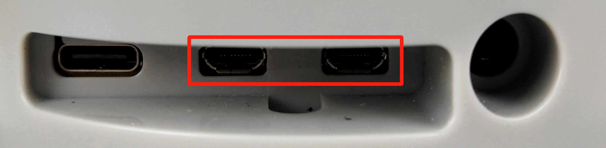
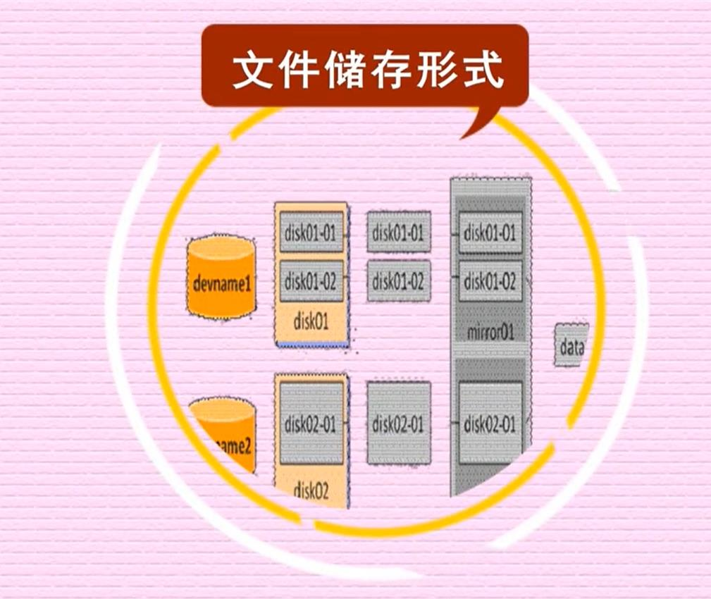

### Getting Started with PI Version Robots

### 1.1 Start Using Your Device

- **Connecting External Devices**

- PI version machines do not need to be paired with PCs, laptops, and other devices. You can develop applications by connecting to a monitor (**Tip⚠: Please use the HDMI cable shipped with the robot to connect to the monitor and use the built-in system for development**)

- First insert the HDMI cable into the HDMI port of the monitor

- Then insert the other end into the HDMI port of the robot arm

- **System card description**

- 32G TF card, built-in Ubuntu20.04 system, **myStudio firmware burning software**, **myBlockly graphical programming software** installed, and **python ROS** development environment adapted

- **Optional items**

- Network (Ethernet) cable to connect the Raspberry Pi to the local network and the Internet

- If you are not using an HDMI display with speakers, you may also need some sound hardware. Audio can be played through speakers or headphones connected to the AV jack (not available on the Raspberry Pi 400). However, the speakers must have their own amplifiers, as the output of the Raspberry Pi is not powerful enough to drive them directly

- **Troubleshooting**

- Make sure you are using a good quality power supply, we recommend using the official power supply

- Before shutting down the robot, make sure the operating system is properly shut down

- You can get help on using the robot on our gitbook, if you need further information please contact official customer service

### 1.2 Operating system update and upgrade

- **What is mirroring**

- Mirroring is a form of file storage. A mirror is a form of file storage where the data on one disk has an identical copy on another disk. Common image file formats include ISO, BIN, IMG, TAO, DAO, CIF, and FCD. The so-called image file is actually similar to a ZIP compression package. It makes a specific series of files into a single file in a certain format to facilitate users to download and use, such as a beta version of an operating system or game. The image file not only has the "synthesis" function of the ZIP compression package, but its most important feature is that it can be recognized by specific software and can be directly burned to a disc. In fact, the image file in the usual sense can be expanded and can contain more information in the image file. For example, system files, boot files, partition table information, etc., so that the image file can contain all the information of a partition or even a hard disk. The classic software that uses this type of image file is Ghost, which also has a burning function, but its burning only saves the image file itself on the disc, while the burning software in the usual sense can directly burn the content contained in the supported image file to the disc.

- **Download system image file**

- Download link

<table>
<tr>
    <td>产品名称</td>
    <td>系统版本</td>
    <td>下载链接</td>
    <td>SHA256 Hash</td>
</tr>
<tr>
    <td>AI Kit 280</td>
    <td>ubuntu 18.04</td>
    <td>
        <a href="https://download-elephantrobotics.oss-cn-shenzhen.aliyuncs.com/Product_software/iMage-ISO/AI_Kit/AI_myCobot_280_ubuntu_V20221030-shrink.zip">click it download</a>
    </td>
    <td>d44439be351a52decdb4470cb623a032047e223ffce73477d29aa973bb9100e1</td>
</tr>
<tr>
    <td rowspan='2'>myCobot 280 PI</td>
    <td>ubuntu 18.04</td>
    <td>
        <a href="https://download-elephantrobotics.oss-cn-shenzhen.aliyuncs.com/Product_software/iMage-ISO/myCobot-280/myCobot_280_ubuntu_V20221030-shrink.zip">click it download</a></td>
    <td>04e40af5b637ec003a8b23ef9012e353361fd336db4e17cf9a65feb75e92927e</td>
</tr>
<tr>
    <td>ubuntu 20.04</td>
    <td> 
        <a href="https://download-elephantrobotics.oss-cn-shenzhen.aliyuncs.com/Product_software/iMage-ISO/myCobot-280/myCobot_280_ubuntu_V20230222_20.04Pi_aarch64_shrunk.img.gz">click it download</a>
    </td>
    <td>ce666e6c1047c512fe6b270336d472e48f231be12808729ed57f743f9d284397</td>
</tr>
<tr>
    <td>myCobot 280 JetsonNano</td>
    <td>ubuntu 18.04</td>
    <td>
        <a href="https://download-elephantrobotics.oss-cn-shenzhen.aliyuncs.com/Product_software/iMage-ISO/myCobot-280JetsonNano/myCobot_280_Jetsonnano_V221101-shrink.zip">click it download</a>
    </td>
    <td>2f1e40c1480b077bcc83abd3b79ac175f25d21e9cc344a014636167ee2eb087c</td>
</tr>
<tr>
    <td rowspan='2'>myCobot 320 PI</td>
    <td>ubuntu 18.04</td>
    <td>
        <a href="https://download-elephantrobotics.oss-cn-shenzhen.aliyuncs.com/Product_software/iMage-ISO/myCobot-320/myCobot_320_ubuntu_V20220805-2.zip">click it download</a>
    </td>
    <td>bc2ed6ef8d51a885f45379392b71e35420638a427d5b4b3a3c9d1803d7e589eb</td>
</tr>
<tr>
    <td>ubuntu 20.04</td>
    <td><a href="https://download-elephantrobotics.oss-cn-shenzhen.aliyuncs.com/Product_software/iMage-ISO/myCobot-320/myCobot_320_ubuntu_V20221101_20.04Pi_aarch64-shrink.zip">click it download</a>
    </td>
    <td>c95633bfd49246254f2be4783c6a91a15212422219157962c93125092aff6b34</td>
</tr>
<tr>
    <td rowspan='2'>mechArm 270</td>
    <td>ubuntu 18.04</td>
    <td><a href="https://download-elephantrobotics.oss-cn-shenzhen.aliyuncs.com/Product_software/iMage-ISO/mechArm-270/mechArm270_V221030-shrink.zip">click it download</a>
    </td>
    <td>9af1fcbf9c608eda269dc395a8d68ea0a270008a88ec8ec3cf97758371a11178<td>
</tr>
<tr>
​	<td>镜像已知问题</td>
​	<td>无法使用moveit</td>
​	<td>
    解决方法：
  执行moveit会出现以下提示，说明没有赋予权限:
 
  进入如图所示路径，赋予该py文件可执行权限即可
 
  执行moveit会出现以下提示，说明代码内编码格式错误: 
 
  进入如图所示路径，打开该py文件在顶部输入：#coding=utf8 保存即可
 
   </td>
</tr>
<tr>
​	<td rowspan='2'>myPalletizer 260</td>
​	<td>ubuntu 18.04</td>
​	<td><a href="https://download-elephantrobotics.oss-cn-shenzhen.aliyuncs.com/Product_software/iMage-ISO/myCobot-280/myCobot_280_ubuntu_V20221030-shrink.zip">click it download</a>
​    </td>
​	<td>f6fe999519146428e4c60960b242f647ae5c73c704852d686b28580b3a3f695d</td>
</tr>
<tr>
​	<td>ubuntu 20.04</td>
​	<td>-</td>
​	<td>-</td>
</tr>
<tr>
​    <td>myCobot Pro 600</td>
​    <td>Raspberry Debian</td>
​    <td>
​        <a href="https://download-elephantrobotics.oss-cn-shenzhen.aliyuncs.com/Product_software/iMage-ISO/myCobot-Pro-600/myCobot_Pro_600_bebian_V20221021.zip">click it download</a>
​    </td>
​    <td>2e73aaa153bddbf0a49d18669a254b27403f17f8e989c05d13836d7c1f8bd4d9</td>
</tr>
<tr>
​    <td>myBuddy 280</td>
​    <td>ubuntu 20.04</td>
​    <td>
​        <a href="https://download-elephantrobotics.oss-cn-shenzhen.aliyuncs.com/Product_software/iMage-ISO/myBuddy-280/myBuddy_280_ubuntu_V20221028_20.04Pi_aarch64_shrunk.img.gz">click it download</a>
​    </td>
​    <td>2b5452f665bcb999faf1727b2103dc1e5745705f5706728e140d62906b099920</td>
</tr>
<tr>
​    <td>myAGV</td>
​    <td>ubuntu 18.04</td>
​    <td>
​        <a href="https://download-elephantrobotics.oss-cn-shenzhen.aliyuncs.com/Product_software/iMage-ISO/myAGV/myAGV_ubuntu18.04_20221028-shrink.zip">click it download</a>
​     </td>
<td>bedad7d9769cb69380c6a4b9742ba7aefc21db41ab239172b7a5a7b632453baa</td>
</tr>
<tr>
​    <td>marsCat</td>
​    <td>-</td>
​    <td>-</td>
​    <td>-</td>
</tr>
</table>

**Step 1:** Unzip the file after downloading. You can see a CD image file.

**Step 2:** Download Win32DiskImager software.

Download address: [Win32DiskImager](https://sourceforge.net/projects/win32diskimager/)

**Step 3:** Remove the SD card at the bottom of the robot arm and insert the SD card into the computer using a card reader.

**Step 4:** Open Win32DiskImager burning software.

**Step 5:** Select the E drive and the CD image file, then click "Write" to start writing.

**Step 6:** There will be a prompt after the write is successful.

