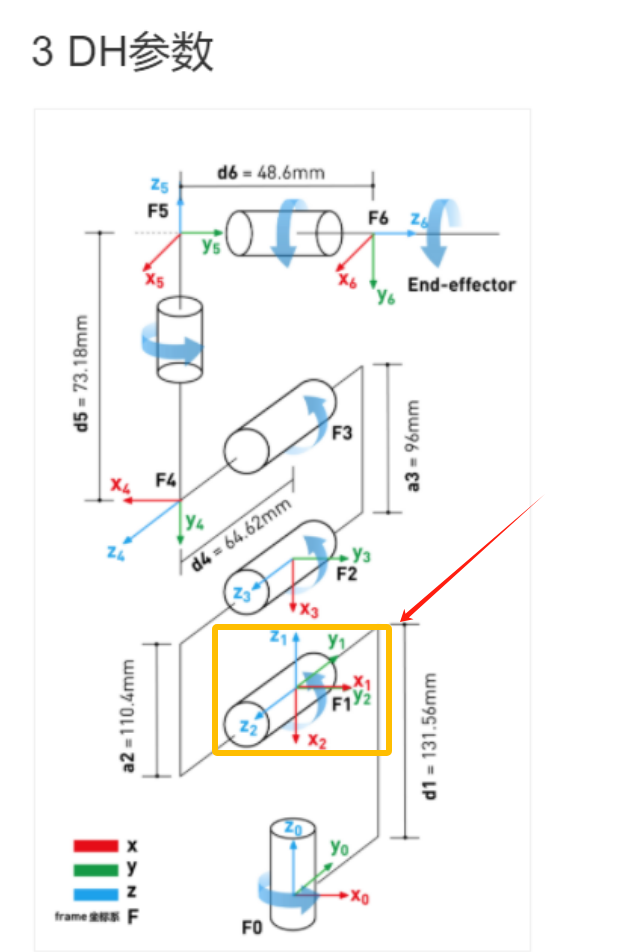
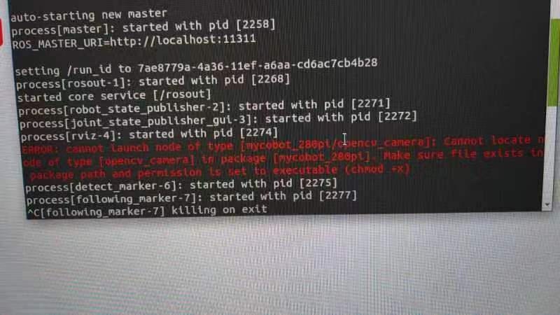

# Other Issue

**Q: How to completely turn off the hotspot auto-start function?**

- A: If you want to completely turn off the hotspot auto-start function, you can move the hotspot_on.desktop folder in the ~/.config/autostart/ folder to another folder directory and restart the machine.

**Q: Raspberry Pi or jetson nano mentions that a password is required. What is this password?**

- A: You can try the following passwords:
  ```bash
  Elephant
  elephant
  aibot1234
  123
  123456
  123321
  aaa
  ```
If the above passwords are invalid, then the password should not be the password we set. You need to try to reset the system to reset the password. Please refer to Section 5 of the gitbook for the reset method.

**Q：How to use the mycobot test tool？**

A：The "mycobot test tool" is intended for factory use only, and we do not recommend users to use it. Using this tool may lead to abnormalities in the zero position or PID, resulting in damage to the robot. Please delete this tool directly. 
If you have already used this tool and it has caused abnormal movement of the robot, please refer to the following instructions to readjust the PID and zero position. Furthermore, refrain from continuing to use this factory test tool in future operations.
Resetting PID method reference link:
https://drive.google.com/file/d/1UWhaaSTuwLFImuEGY1J2tvgxTQDwWxK_/view?usp=sharing
Zero position calibration method reference link:
https://drive.google.com/file/d/1XtKH-ykKWPH0q9Z_YHwzkgwNKRhstHhi/view?usp=sharing


**Q: How to reset to factory settings when the machine is abnormal?**

Restoring to factory settings mainly depends on resetting the firmware, image, pid and zero position. The following is the reset solution:
- **About resetting the firmware**: It is recommended to ensure that mystudio is updated to the latest version, and then download the corresponding latest Atom version firmware, minirobot firmware (only available in M5 series machines) and pico firmware (only available in 320 series models). For the method of resetting the firmware, please refer to the mystudio chapter of gitbook

- **About resetting the image**: When resetting the image, all contents in the original system will be cleared. If there are important files, please save them in advance. For the method of resetting the image, please refer to the system usage chapter of gitbook

- **About resetting pid**: Generally, when the machine has severe joint shaking, abnormal joint movement speed, and joints curled up, the pid can be reset. For the reset method, refer to: https://drive.google.com/file/d/1UWhaaSTuwLFImuEGY1J2tvgxTQDwWxK_/view?usp=sharing

- **About resetting zero position**: Generally, when the machine has an incorrect zero position or the joint limit is abnormal, the zero position can be recalibrated. For the reset method, refer to: https://drive.google.com/file/d/1XtKH-ykKWPH0q9Z_YHwzkgwNKRhstHhi/view?usp=sharing

**Q: Why can't I see the corresponding Raspberry Pi or Jetson Nano system interface when I connect the Raspberry Pi or Jetson Nano to my PC using an HDMI cable or USB?**

- A: Since the Raspberry Pi series machines are devices with their own factory systems, which are equivalent to a microcomputer, when two computers are connected via HDMI or USB, only the system interface of the current computer will be displayed, and the Raspberry Pi system interface will not be displayed. This is normal.
Regarding how to correctly enter the Raspberry Pi system, you need to prepare an HDMI screen and connect the HDMI screen to the HDMI interface of the Raspberry Pi via an HDMI cable so that you can see the Raspberry Pi system interface.
If you want to remotely control the Raspberry Pi on your computer later, this is also feasible. You can check the VNC remote tool. For specific usage methods, please refer to the gitbook system usage information.

**Q: Where is the download path for the urdf file?**

- A: Please refer to the following path. The urdf of all mycobot models is in this path: https://github.com/elephantrobotics/mycobot_ros/tree/noetic/mycobot_description/urdf

**Q: What should I do if the Raspberry Pi cannot boot into the system?**

- A: Please follow the steps below to check:

1. Check whether the HDMI interface cable is loose. It is recommended to straighten the HDMI cable. The bending state will affect the signal transmission.


2. Try to replace an HDMI cable or HDMI interface test (there are two HDMI ports on the Raspberry Pi 4b, HDMI0 and HDMI1.


3. Confirm whether it is an HDMI screen (1080p is recommended). The VGA screen will be incompatible and sometimes cannot display the Raspberry Pi screen. It is recommended to try to replace an HDMI screen to test whether there is a screen display.
4. Complete the HDMI wiring first, and then restart the machine several times. The restart interval and boot waiting time are recommended to be 3-5 minutes
5. Check Chapter 5 of gitbook and re-flash the corresponding image file.
6. If the robot still cannot boot after burning the image, if you have an Ethernet cable and a router, please connect the Ethernet cable to the network port of the Raspberry Pi while the robot is turned on, log in to the router to see if there is a Raspberry Pi device IP. If there is no Raspberry Pi IP, then the Raspberry Pi is damaged.


**Q: How long is the command transmission delay when controlling the motor through the robot's controller via serial port or socket communication? Is there a communication timing diagram? How about real-time performance?**

There is no delay test data for serial or socket communication. According to the feedback from our development and use, the real-time performance is still quite high and there will be no lag.

**Q: What is the base coordinate system of the 280M5 robot?**


**Q: Are the joints of 280 controlled by the serial bus?**

A: Yes

**Q: Is there more explanation about the understanding of coordinates?**

A: The API for controlling coordinate movement is send_coords([x,y,z,rx,ry,rz], speed)
**x, y, z coordinates:** Control the position of the end effector of the robot in space. Changing these coordinate values ​​will move the robot to different spatial positions, thereby achieving positioning in three-dimensional space.
**rx, ry, rz attitude angles:** Control the attitude or orientation of the end effector of the robot. These values ​​are usually given in the form of Euler angles, describing the rotation of the end effector of the robot relative to the base coordinate system, and the order of Euler angles is zyx. Changing these values ​​will rotate the end effector of the robot to different angles or directions.
For example:
When you adjust +X, this means that the position of the end effector of the current robot arm moves a certain distance along the positive direction of the X axis of the current end effector. This action will cause the robot to move in a certain direction as a whole. And when you adjust RX, this means that the attitude of the end effector of the current robot arm rotates a certain angle around the X axis of the current end effector. This action will cause the robot to rotate as a whole and the direction of the end effector will change.
In general, the adjustment of +X and RX will directly affect the motion state of the robot arm. +X controls the movement of the position, while RX controls the change of attitude.
If you want to see the changes more intuitively, we recommend that you use myblockly's serial control tool to adjust a parameter at a time and observe its changes in the coordinate system. Please note that when observing rx, ry, and rz, if you want to be more intuitive, please pay attention to adjusting x and ry when the J1 joint is 0, and adjusting y and rx when the joint is 90. You can refer to the coordinate system diagram below:


**Q: Which group or urdf does the 280JN-aikit have with the trash bin?**

- A: Currently, only the PI version has the urdf with the package content, and other machines do not. For the path of the PI version, please refer to the figure below


**Q: How to solve the problem of using vscode on the Raspberry Pi?**

- A: Reference link: https://blog.csdn.net/u011296285/article/details/121121118
Reference link (En): https://ratticon.com/how-to-fix-slow-visual-studio-code-on-raspberry-pi-4/

**Q: How to use the serial port protocol of the PI/JN series robot arm?**

- A: In the python code, you can directly send serial port commands to control the joints, without external devices

```python
from pymycobot import MyCobot280
import serial
import time

ser=serial.Serial("/dev/ttyTHS1", 1000000)

command1=bytes.fromhex('FE FE 06 21 01 23 28 14 FA')#J1:90
command2=bytes.fromhex('FE FE 06 21 01 00 00 14 FA')#J1:0

ser.write(command1)
time.sleep(3)
ser.write(command2)
ser.close()
```

**Q: Is there more explanation about the Offset of the DH parameter? Is the Offset rotated around z?**

A: The DH parameter describes the geometric and kinematic relationship between adjacent links in the robot arm.
In the DH parameter table, the Offset parameter indicates the effect of the previous link rotating around its z-axis on the position of the next link, that is, the offset when connecting two links. For the Offset parameter in the robot arm, it generally indicates the effect of the previous link rotating around its own z-axis on the position of the next link, rather than rotating around the z-axis of the next link. Therefore, Offset is not a rotation around z, but a displacement when connecting two links.

**Q: Can the system add other languages, such as Korean?**

A: Yes, just download the language installation package and apply it


**Q: Can mind+ be used to control the robot arm?**

A: No, mind+ is not currently compatible, so it cannot be used to control the robot arm. The currently recommended methods for controlling the robot arm are myblockly, python and ros. If you want to use graphical programming, myblockly can meet your needs

**Q: What is the voltage range of the 280 robot arm power supply? How much is the instantaneous current?**
A: 12V plus or minus 10%, 5A

**Q: What is the inner diameter of the J1 joint of the 280M5?**
A: 70mm

**Q: Why are two coordinate systems defined at F1 in this DH model of the 280m5?**



**Q: Following the above question, why are the physical distances of axis 1-2 different, but the origin settings are overlapping?**

A: Because the rotation axes intersect, DH modeling has regulations. If the rotation axes of adjacent joints intersect, the origin must be set at the intersection

**Q: If the servos of each axis are controlled and feedback is obtained, what is the shortest communication cycle?**

A: This needs to be determined according to the speed. The minimum response time is 50ms

**Q: Does the mycobot series machine have collision detection?**

A: 280 has algorithmic collision self-interference, which has been integrated into the API for setting joint angles and coordinates

**Q: What are the input parameters of Atom's USB interface?**

A: 5V @ 500mA

**Q: How to deal with the 270 j3 joint not being able to display joint values ​​in real time?**

A: Reference link: https://drive.google.com/drive/folders/1BrvMxJltcLsr8T8-4kKOB7SH0D_qZkIP?usp=sharing
The corresponding firmware has been replaced, and the corresponding python file can be run directly

**Q: How to deal with the VNC dragging jam?**

A: If the jam is caused by dragging any window in VNC, you can make some configurations according to the picture below. The options need to be consistent with the picture below. After successful setting, the problem of VNC disconnection caused by dragging the window will be solved.


**Q: When replacing the second joint of 280, I found that 4 screws were stripped. How to remove them?**

Regarding the replacement of joints, the 4 screws do not need to be removed. Please remove the large screw in the middle, then fix the J2 joint body back, and then use force to pull out the entire coupling. I recorded a video for you to refer to for specific operations

**Q: Is the joint torque information provided?**

A: Our machines only provide the overall information of the entire joint, and do not provide the internal torque, voltage and current of the servo and motor actuator. The overall parameters of the robot arm are disclosed, such as repeatability, power supply voltage, etc.


**Q: How do you understand the relationship between the two coordinates in the following figure?**


A: If you want to view the transformation relationship between the coordinate system named "turtle1" and the coordinate system named "turtle2", you can use this command. In layman's terms, when you run this command, it will tell you the position and direction information of an object ("turtle1") relative to another object ("turtle2"). Just like you can know the position of a city relative to another city on a map

**Q: The environment of ROS2 has been accidentally changed. Can I just delete the 280pi ROS and reinstall it myself?**
A: Regarding the issue of reinstalling ROS, we do not recommend users to reinstall it themselves, because the construction of the ROS environment is relatively complex and prone to errors. If you need to reset the ROS environment, we recommend users to re-write the system image. For specific methods, please refer to [Development and Use Based on ROS](https://docs.elephantrobotics.com/docs/mycobot-ar-cn/12-ApplicationBaseROS/)

**Q: How to solve the problem of excessive repeated positioning deviation after the robot arm is in place at the same position?**

Both new and old machines can adjust pid to reduce deviation as much as possible.

Appendix: https://docs.qq.com/doc/DU0VhT2JNVUdNUEJS, https://drive.google.com/file/d/1UWhaaSTuwLFImuEGY1J2tvgxTQDwWxK_/view?usp=sharing
However, the old version of the machine has gear gaps in the 2nd and 4th joints of the robot arm, which is easy to produce joint deviations under the action of gravity, which ultimately affects the end precision. The forces of the 2nd and 4th joints in these four sets of joint values ​​are inconsistent, so the precision is also different. It is currently recommended to adjust through the program. When the machine reaches the point, you can read the point again at this point to check if there is a deviation. On this basis, adjust the specific deviation value of the single joint to achieve the effect of reaching the specified point.

**Q: What is the difference between API and serial port instructions to directly control joints?**

A:
1. Serial port instructions:
   - a. Serial port instructions are sent to the robot controller in the form of raw binary data.
   - b. It is usually necessary to manually encode the parameters such as the angle, speed, acceleration, etc. of each joint, and then convert them into hexadecimal form for sending.
   - c. It is necessary to understand the format and meaning of each instruction and ensure that it is sent to the controller correctly.
   - d. Sending serial port instructions directly is more flexible, but also more complicated, and requires a deep understanding of the communication protocol of the robot controller.
2. API control:
   - a. API provides an advanced function interface that can more conveniently control the movement of the robot.
   - b. There is no need to manually encode binary instructions, but to call the API function and pass the required parameters to the function.
   - c. API usually hides the underlying communication details, provides a simpler and easier-to-use interface, and reduces the complexity of use.
   - d. Usually provides a variety of convenient functions, such as path planning, motion interpolation, etc., making control more flexible and efficient.
In general:
Using serial port commands to directly control the robot arm is more flexible, but also more complex, requiring a deep understanding of the communication protocol; while using API control is simpler and more convenient, but may be limited by the functions and performance provided by the API.

**Q: When I click to open a program or application, a password is prompted. What is this password?**


A: Password: aibot1234

**Q: How to fix the IP of the pi robot?**

A: Fix the IP: Use the terminal to input: sudo nano /etc/dhcpcd.conf


Then you can configure the network information yourself.

**Q: What is the difference between MDI and JOG?**

A: MDI (Manual Data Input) is called the set value direct given operation mode. That is, after the upper controller directly sets the target position, speed, acceleration and deceleration, the axis automatically moves to the target position. MDI is also the most commonly used positioning function in practical applications.
JOG moves continuously in a certain direction.

**Q: What is the latest supported version of pymycobot for each model?**


**Q: How to distinguish between standard and improved DH tables**

sdh, std, standard mdh, modify, improved
We provide standard DH tables. Customers can convert them by themselves if necessary. They are just two different description methods.


**Q: How to deal with the error of missing opencv_camera?**



A: The error message shows that the executable permission is missing. You may need to add the permission.


Change to using mycobot_280 instead of pi itself, because the m5 side has occupied the file. Both sides cannot occupy it at the same time, otherwise it will cause the subsequent compilation to fail.


**Q: The indicator light of the adapter is not on**

A: It is possible that the adapter is powered off for self-protection after a short circuit. Disconnect the adapter for a few minutes before using it. If it does not work after a few minutes, wait a little longer. After 15 minutes, power on the adapter separately to see if it lights up.

**Q: End zero position abnormality**

A: After using the adaptive gripper to grip objects for a long time, the gripper and end zero position abnormality will occur, and the gripper needs to be stationary.

**Q: What is forward kinematics and inverse kinematics?**

A: Forward kinematics refers to solving the position and posture of the robot's end effector (such as the gripper of the robot arm) in Cartesian space when the angles (or displacements) of each joint of the robot are known. It is implemented in the get_coords() API, but the specific algorithm is not public.
Inverse kinematics is the opposite of forward kinematics. It refers to solving the angles (or displacements) of each joint of the robot when the position and posture of the robot's end effector in Cartesian space are known. write_coords(), send_coords()
