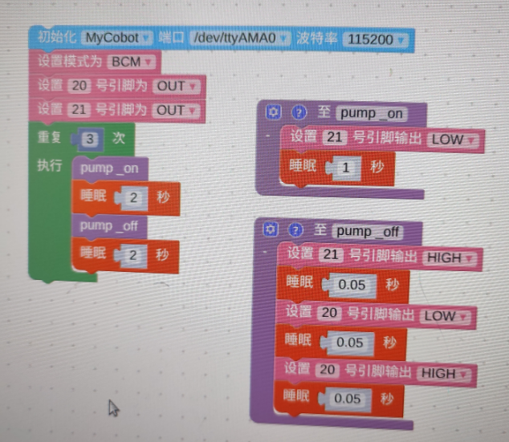
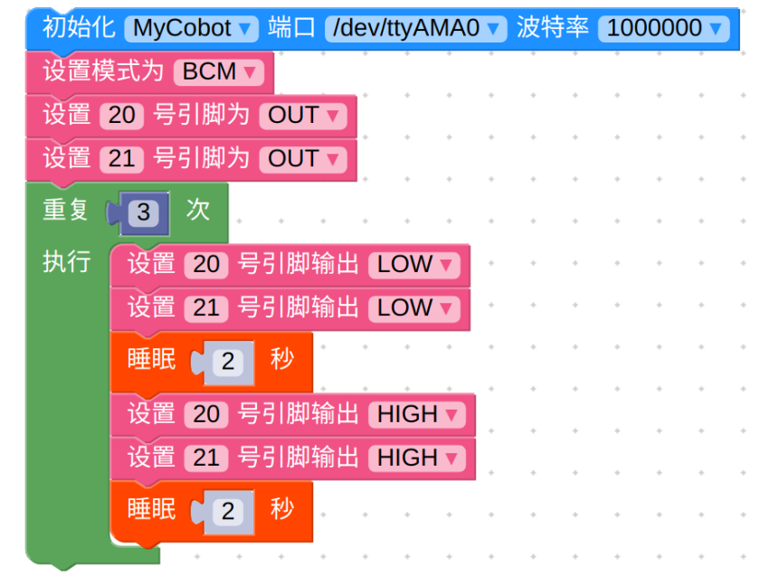
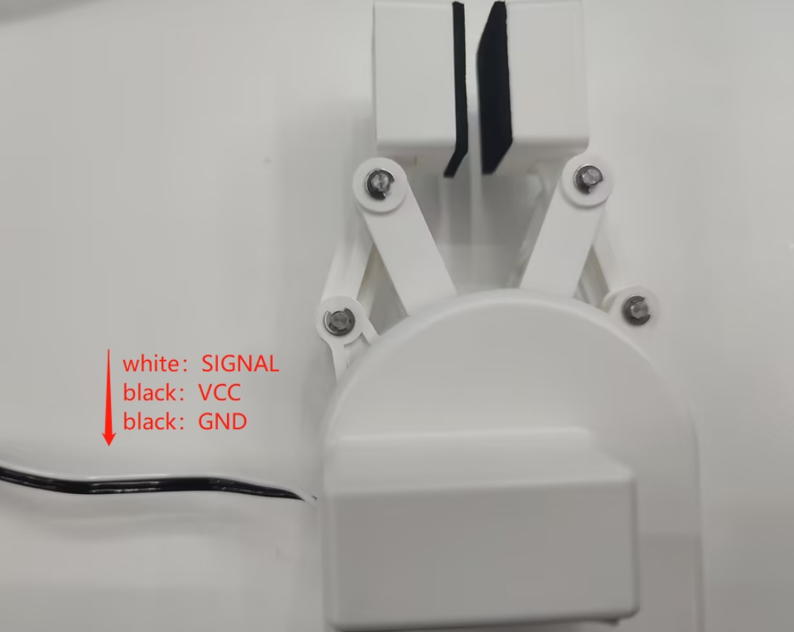

# Accessory related questions

**Q: 280pi and suction pump io connection diagram and quick use source code**

New version v2.0:

The G5 pin on the suction pump is the suction pump switch control pin, and the G2 label is the solenoid valve control pin. Both are low level valid.
The function of the solenoid valve is to make the suction pump more rapid when released. If the solenoid valve is not used, the suction pump can also work normally, but the speed of releasing the object when the suction pump is closed is relatively slow.
The source code here uses pin 21 to control the opening and closing of the suction pump, and pin 20 to control the opening and closing of the solenoid valve. The opening and closing of the solenoid valve mainly works in the stage of closing the suction pump.

Old version V1.0 version code:

**Q: Source code for 280pi using suction pump**

**Q: What is the pin sequence and connection method of mycobot adaptive gripper?**

Please refer to the following figure for the pin introduction of mycobot adaptive gripper:

Gripper connection method:

**Q: Parallel gripper usage source code**

**Q: Is there anything to pay attention to between the gripping object and the movement of the robot arm?**

When the load is > 500g, the speed needs to be less than 50%.
