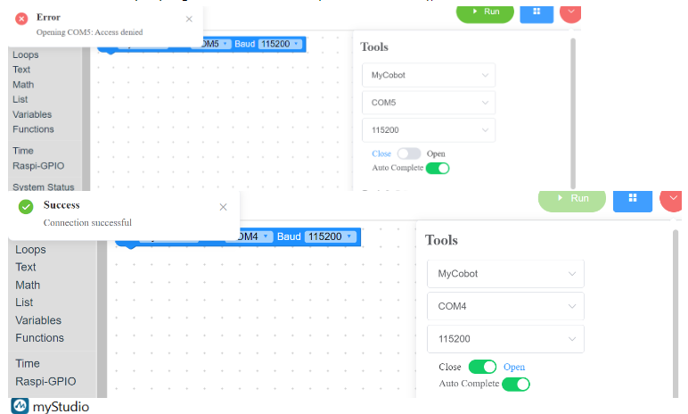

# Software Issues

## 1 myStudio related

**Q: What is myStudio?**
- A: It is our company's self-developed software. It is a tool for burning or modifying the firmware of the existing robot arm launched by our company.

**Q: What is the method to troubleshoot the abnormal download of minirobot, Atom, and PICO firmware?**

1. Check if the network connection is normal. You need to connect to the network before downloading the firmware.

2. Check if the line has been connected. The details are as follows:
In the PI/JN series machines, when burning Atom, you need to use a USB cable to connect the Atom interface at the end to the Raspberry Pi USB port;

For example:
Video of burning Atom on 280pi: https://drive.google.com/file/d/1ErsdxNe-VT9_n34Gf-5yLK1DDQvCWgbq/view?usp=sharing

3. Select the firmware of the corresponding model, and don't choose the wrong model.

4. Download and install the driver. If it still cannot be recognized after downloading the driver, try to replace the latest [ch340 driver](https://www.wch.cn/download/CH341SER_EXE.html). If the port number still cannot be displayed after installing the driver and the system is a win11 model, try [How to install the CH340 driver in Win11 system](https://blog.csdn.net/m0_52242552/article/details/126219464).

5. Try to change a USB cable, USB port or computer to download it to avoid abnormal firmware download caused by the cable not having data transmission function.

6. Uninstall mystudio and reinstall mystudio in a non-C drive location, such as installing mystudio in the D drive. When mystudio is installed in the C drive, the file permissions are relatively strict, and the firmware may not be burned.

**Q: Why does the device not work properly after I burn the firmware to the ATOM terminal?**

- A: The firmware of the ATOM terminal needs to use our factory firmware. Other unofficial firmware cannot be changed during use. If the device accidentally burns other firmware, you can use "myCobot firmware burner" to select ATOM terminal-select serial port-select ATOMMAIN firmware to burn the ATOM terminal.

**Q: Can the drag teaching in the firmware record the gripper action?**
- A: It is temporarily impossible to use drag teaching to record the gripper action, because the gripper belongs to joint number 7, and our drag teaching can only record and play the movement of joints numbered 1-6.

**Q: Why can't drag teaching be performed after burning the minirobot firmware?**
- A: First check whether the M5Stack-basic firmware and atom firmware are burned, whether the burned firmware corresponds to the requirements to be implemented, and whether the burned firmware is the latest version of the firmware.
- It is recommended to burn the minirobot firmware to version v2.1 and the top atommain firmware to version v4.1 and above (need to support mystudio version v4.3.1 and above).

**Q: What should I do if mycobot's serial port cannot be recognized on mystudio?**
- A: If your computer device does not prompt for the connected robot arm, please install the serial port driver first.
- In addition, it should be noted that the Raspberry Pi, Arduino and Jetson nano series robot arms are **cannot be connected to a laptop using a data cable**, and you need to use mystudio in the built-in system to burn the firmware.

**Q: Can the trajectory recorded by dragging teaching be saved to the card?**

- A: It cannot be saved to the memory card at present. And dragging teaching can only save one path at a time, and the next recording will overwrite the previous action.

## 2 myblockly related

**Q: How to deal with the error message: ModuleNotFoundError: No module named "pymycobot"?**


- A: The error message prompts that the pymycobot file is missing, including the reasons and solutions, refer to the following 3 points:
①If pymycobot is not installed or pymycobot has an error, the corresponding solution is to reinstall pymycobot, the command is pip3 install pymycobot --upgrade --user

**Q: How to deal with the fact that myblockly's express delivery mobile tool cannot display the real-time angle?**

- A: This is generally caused by incorrect selection of device serial port information and pymycobot exception. It is recommended to check according to the "First Use Self-Check" solution in this article. If the robot arm cannot be controlled normally, please try to update pymycobot. The corresponding update solution is to enter the command `pip install pymycobot --upgrade --user` in cmd or terminal.
Finally, if it still cannot be controlled normally, please try to update the myblockly software. Please refer to the following link for the update method:
https://drive.google.com/file/d/1yBWzhbSBUYsZPBl7PBdZKRwk3al71Dc7/view?usp=sharing

**Q: The result of running the program shows child process exited with code 1. Is it normal?**

- A: This is not an error. All programs have finished running and returned the binary number 1. It means that all have been successfully run.

**Q: Why does the myblockly program not take effect or cannot find the file when saved in PI or JN?**

①You need to add ".json" to the file extension when saving, for example: "pump.json"

②You need to confirm the path to save and find the saved file in the saved path

You can refer to the video: https://drive.google.com/file/d/1g_dd933TK1tptnisUad4PBfwSRsWWFeQ/view?usp=sharing


**Q: How to preset the code block content in myblockly, including the model, baud rate and other information after entering the system, which are all corresponding to the connected model?**

A: At present, the default model for the first startup in myblockly is mycobot and the baud rate is 115200. There is no way to change the initial baud rate for the time being, but you can save an initialization json file yourself. Load this file after entering myblockly next time to get the preset code block.
Please refer to the following for the method of making and saving json files: https://drive.google.com/file/d/1g_dd933TK1tptnisUad4PBfwSRsWWFeQ/view?usp=sharing

**Q: Why is the connection rejected when selecting a certain com port? Or how to find the corresponding com port?**



The reason for the connection rejection is due to the wrong com port selection. When you have multiple devices connected to the computer USB, multiple serial ports will be displayed in myblockly, such as com4 and com5 in the above picture, but only one of them is the robot arm. You need to select the serial port of the robot arm to connect and use the robot arm normally. Obviously, the com4 that can be connected normally is the serial port number corresponding to the current robot arm.
Regarding how to find the serial port corresponding to the robot arm among multiple serial ports, the corresponding method is: try to unplug the serial port cable connected to the robot arm, and check which serial port number disappears in the serial port number option of myblockly after disconnecting the USB connection between the robot arm and the computer. When the USB is used again to connect the robot arm to the computer, this serial port number appears in the serial port number option of myblockly. The serial port number that disappears and reappears in myblockly with the disconnection and connection of the robot arm and the computer is the serial port number corresponding to the robot arm.
Note that the option of the robot arm com port number is not always fixed. It may change when connected to the USB port of different computers or different USB ports of the same computer. It is recommended to view the real-time com port number using the above method.

**Q: Error MyCobot._int_() takes 2 positional arguments but 3 were given.**

This error will appear in the old version of myblockly. The reason is that the versions of myblockly and pymycobot do not match.
It can be solved by updating the versions of myblockly and pymycobot driver libraries.
For M5 version machines, please download the latest myblockly from the official software download page; for pi and jn version machines, please refer to the link: https://drive.google.com/file/d/1yBWzhbSBUYsZPBl7PBdZKRwk3al71Dc7/view?usp=sharing
The command to update pymycobo is `pip3 install pymycobot --upgrade --user`

## 3 Roboflow Related

**Q: What should I do if I cannot download the Roboflow software or if Roboflow fails to properly control the robot?**

- A: Currently, the Roboflow software only supports the  600 Pro  and  630 Pro  (two professional collaborative robot models). It no longer supports the  Mycobot  collaborative series or other robot models.
For Mycobot-series robots, it is recommended to use  MyBlockly,  Python, or  ROS  for control. Notably,  MyBlockly  is a software with a graphical interface similar to Roboflow. If you prefer visual, block-based programming,  MyBlockly  is the preferred choice.
    ​				
## 4 Python related

**Q: The running prompt is missing library filesQ: The error message: ModuleNotFoundError: No module named "pymycobot", how to deal with it?**

- A1: Pymycobot is not installed. The corresponding solution is to reinstall pymycobot. The command is `pip3 install pymycobot --upgrade --user`

**Q: Is there a more popular explanation for the mode in send_coords(coords, speed, mode)?**

- A: Linear 1 means that the end of the robot reaches the target position in a straight line. If it cannot go in a straight line due to limitations, structure, etc., the command will not be fully executed;
Linear 0 means that the end reaches the target position in an arbitrary posture. Since there is no straight line restriction, it is not easy for the command to not be executed.

**Q: What is the difference between the interpolation and refresh modes of set_fresh_mode(mode)?**

- A: Interpolation 0 means that many dense points are planned between the starting point and the end point, so as to achieve the effect of controlling the trajectory of the middle segment.
How to achieve the effect of program parallelism: Non-interpolation 1 means that there is no planning of the middle segment, and the trajectory cannot be controlled, but the movement will be relatively smooth.

**Q：Is it normal for the trajectory not to be straight up and down when only the Z-axis is changed, but the final landing point is adjusted only in the Z-axis? How can the middle trajectory be ensured to be straight？**


- Turn on interpolation and walk in a straight line to ensure the trajectory

```python
set_fresh_mode(0) # Turn on interpolation
send_coords(coords, speed, mode=1) # Walk in a straight line
```

Note that the intelligent planning route set in send_coords will only be useful after turning on interpolation.
Interpolation means that many dense points are planned between the starting point and the end point, so as to achieve the effect of controlling the trajectory of the middle section.
Non-interpolation means that there is no planning of the middle section, and the trajectory cannot be controlled.

**Q: What does the return value of get_error_information() being -1 mean?**

- A: The return value of `get_error_information()` is -1, indicating that communication is not possible. You need to check whether the power adapter and USB cable are connected, and whether the LCD screen stays on the Atom: ok interface. If the line is not connected successfully and does not display ok, communication abnormalities will occur. You need to reconnect and test again.

**Q: What should I do if the drag teaching function cannot be used on 280JN?**

1. Please download the latest source code from github, do not use the source code file that comes with the system directly

2. You need to update pymycobot to 3.9.7, pip install pymycobot==3.9.7

3. Please note that you must press f to release the joint and then press r to record. Pressing r directly in a locked state will not allow dragging


**Q: In the case of drawing with a 280 machine, it is found that the shape trajectory is not very straight. Can it be optimized?**


- A1: It is normal to get a deviation in the trajectory when using a signature pen or hard stationery to draw this case. There are two main reasons for this deviation. First, mycobot uses a servo motor, which has a certain accuracy deviation (if it is a machine that has been used for a long time, the deviation of its joints will be greater due to aging of the joints). Second, when using a hard pen to draw, the contact distance with the desktop is relatively demanding. If the distance is too high, the trajectory is prone to interruption. If the distance is too low, the pen tip resistance will be too large and the drawing effect is not ideal. It is currently recommended to use soft stationery for drawing, such as brushes and other tools, which will help improve the drawing effect.

- A2: In addition, you can change the motion mode of the robot arm to interpolation mode, so that the motion trajectory will be relatively straight.

```python
set_fresh_mode(0) # Enable interpolation
send_coords(coords, speed, mode=1) # Go straight
```

Note that the intelligent planning route set in send_coords will only be useful after interpolation is turned on.
Interpolation means that many dense points are planned between the starting point and the end point to achieve the effect of controlling the trajectory of the middle section.

**Q: What to do if you encounter an error when updating pandas?**

A: If you encounter a "no suitable distribution found" error when trying to install pandas to Python, there are several steps you can take to try to resolve this issue:
Update pip: Make sure you have the latest version of pip installed, run
```bash
pip install --upgrade pip
```
Use the latest version of Pandas, as they often contain the latest features and fix known bugs.
```bash
pip install pandas --upgrade
```
Use a specific version: Instead of installing the latest version, try installing a specific version of pandas that is known to be compatible with your version of Python. For example
```bash
pip install pandas==1.1.5
```
Use a virtual environment: Create a virtual environment for your project and try to install pandas in that environment. This helps isolate dependencies and avoid conflicts with other packages.
```bash
python -m venv myenv
source myenv/bin/activate # Activate virtual environment on Unix/Linux
myenv\Scripts\activate # Activate virtual environment on Windows
pip install pandas
```

Please note that you should check your network connection and repository: Make sure you have a stable network connection and can access the Python Package Index (PyPI) repository where pandas is located.

**Q: The target position is identified, but the end cannot reach it. How to determine whether this coordinate can be reached and then process it?**

- A: Use solve inv kinematics(target coords, current_angles) to see if there is a solution.
solve_inv_kinematics(target_coords, current_angles)
- Function: Convert coordinates to angles.
- Parameters:
- target_coords: list A floating point list of all coordinates.
- current_angles: list A floating point list of all angles, the current angle of the robot
- Return value: list A floating point list of all angles.

**Q: 280jn uses socket to create a client script in the robot arm operating system, and the script reports an error: This module can only be run on a Raspberry Pi**

A: All instructions related to the Raspberry Pi need to be commented out. The underlying driver library is different, and all GPIO instructions are commented out.

## 5 ROS related

**Q: How to re-download the ROS source code package?**

- A: Use the command to pull:

```bash
git clone https://github.com/elephantrobotics/mycobot_ros.git
```

Or download manually. The download method is to enter the ROS source code package address and follow the steps below. The source code package address is: https://github.com/elephantrobotics/mycobot_ros


**Q: What should I do if I run the ROS moveit case and get an error ImprotError: No module named yaml?**


- A: In the first line of this script, change the Python interpreter to python3

**Q: Using a mujoco-based environment for simulation training, the robot's xml file is required**

- A: Currently, there is only the 280JN xml file on GitHub: [280JN](https://github.com/elephantrobotics/mycobot_mujoco)
- Provide customers with methods on how to convert dae and urdf files into xml files, and let customers use [meshlab to convert by themselves](https://blog.csdn.net/qq_43309940/article/details/128292151?spm=1001.2101.3001.6650.1&utm_medium=distribute.pc_relevant.none-task-blog-2defaultCTRLISTRate-1-128292151-blog-131092562.235^v38^pc_relevant_yljh&depth_1-utm_source=distribute.pc_relevant.none-task-blog-2defaultCTRLISTRate-1-128292151-blog-131092562.235^v38^pc_relevant_yljh&utm_relevant_index=2).

**Q: When the terminal switches to ~/catkin_ws/src and uses git to install and update mycobot_ros, the target path "mycobot_ros" already exists. What is the reason?**
- A: This means that there is already a `mycobot_ros` package in `~/catkin_ws/src`. You need to delete it in advance and then re-execute the git operation.

**Q: After the compilation is completed, why does the following error appear when the launch command is run in a new terminal?**


- A1: The system does not add ros environment variables, so you need to source each time you open a new terminal:

```bash
cd ~/catkin_ws/
source devel/setup.bash
```

- A2: The system adds ros environment variables, and you do not need to execute source each time you open a new terminal:

```bash
# noetic is Ubuntu20.04 system
echo "source /opt/ros/noetic/setup.bash" >> ~/.bashrc
source ~/.bashrc
```

- A3: The file name in the command may be inconsistent with the actual file name in the mycobot_ros package. Please check the command carefully for errors.

## 6 C++ related

**Q: What should I do if I can't find various dll files?**

- A1: If myCobotCpp.dll is missing, put myCobotCpp.dl in the lib directory to the directory where mycobotcppexample.exe is located.

- A2: If QT5Core.dll is missing, open qt command (search QT in the menu bar), select msvc2017 64-bit, and execute windeployqt--release to the directory where myCobotCppExample.exe is located (such as: windeployqt --release D:lvs2019myCobotCpploutlbuildlx64-Releaselbin). If the vs installation path cannot be found after executing the command here, please check the settings of the vs environment variables.

After executing the above steps, if the qt5serialport.dll file is missing, move this file in the gt installation directory (path such as: D:lgt5.12.1015.12.10msvc2017 64bin), copy it to the directory where myCobotCppExample.exe is located

**Q: Generate the myCobotCppExample.exe executable file, what could be the problem?**
Select the start

