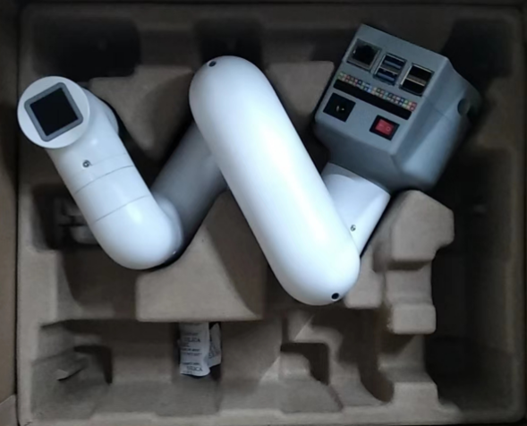
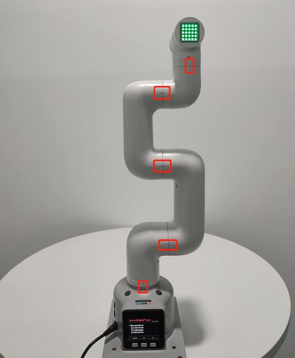

# Hardware Issues

**Q: How to put 280PI into the package?**

A: Refer to the picture below, put it into a W shape manually

**Q: How to input audio into the Raspberry Pi system?**

A: Raspberry Pi cannot use the 3.5 interface for audio input. The 3.5mm headphone jack does not support audio input. It cannot detect headphones and microphones. If you want to use the input and output audio method, you need to use a USB interface microphone or headphones

**Q: How to optimize joint jitter, excessive joint angle deviation or joint weakness?**

1. Refer to the robot parameter introduction section to check whether the actual load is within the effective load range of the robot arm. Excessive load will cause joint jitter. The load of the actual joint can be appropriately reduced.

2. Change the motion mode to refresh mode, so that the running trajectory of the robot arm will be relatively smooth. For specific APIs, please refer to
set_fresh_mode(1)

3. Check the following link to adjust pid: https://drive.google.com/file/d/1UWhaaSTuwLFImuEGY1J2tvgxTQDwWxK_/view?usp=sharing
4. Check the gitbook section and use mystudio to download the corresponding version of Atom firmware. It is recommended to download the latest
5. Check Chapter 5 of the gitbook to calibrate the robot arm at zero position. You can also refer to the calibration steps in the following link: https://drive.google.com/file/d/1XtKH-ykKWPH0q9Z_YHwzkgwNKRhstHhi/view?usp=sharing
6. For machines that have been used for a long time (more than 3 months), joints may age and produce joint gaps. You can follow the following video to manually bend the joints to check if there is any joint gap: https://drive.google.com/file/d/1tXDUALmfw1z0u6lM9uH5hOHivjbRoWxW/view?usp=sharing
7. If there is a joint gap problem due to joint aging, this kind of jitter is inevitable due to the natural aging of the machine.

**Q: What is the joint zero position?**

Take the following figure as an example, there is an arched groove designed between the joint and the edge of the joint shell, which is the joint zero point

Generally, the zero point posture after calibration is as follows:

Pay special attention to the zero position posture of the 270 joint as follows:

**Q: Is there a method for zero point calibration?**

Please refer to Chapter 5 of gitbook or the following link:

https://drive.google.com/file/d/1XtKH-ykKWPH0q9Z_YHwzkgwNKRhstHhi/view?usp=sharing

**Q: How to use the GPIO of mycobot260/270/280 series PI/JN machines?**

A: Take 280JN as an example, please refer to the source code in the figure below. For other models, please change the device serial port information.

And be careful not to use occupied pins. For example, the occupied pins of 280JN are GPIO0, 1, 3, etc. For details, please refer to the GPIO description of the corresponding robot arm gitbook material

**Note: When turning the robot arm, it should be turned at a small angle and gently. After reaching the limit, it cannot be turned forcefully.**

**Q: What is the role of atom in the robot arm?**

- A: Atom is mainly used in the robot arm to control the kinematic algorithm of the robot arm: including forward and inverse kinematics, solution selection, acceleration and deceleration, speed synchronization, multi-square interpolation, coordinate conversion, etc., and requires real-time control and multithreading. The relevant programs of atom are not open source yet.

**Q: What communication interfaces do different versions of the robot arm support?**

- A: The robot arm based on the microprocessor supports socket communication TCP; the robot arm based on the microcontroller can communicate via USB to serial port.

