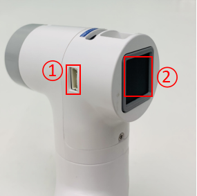

# Robot Parameters

> In the first chapter, we discussed the selling points of the product and its design concept, providing you with a panoramic perspective of the high-level understanding of the product. Now, let's move on to the second chapter - Robot Parameters. This chapter will be the key to your understanding of the product's technical details. A detailed understanding of these technical parameters will not only help you fully realize the advancement and practicality of our products, but also ensure that you can use these technologies more effectively to meet your specific needs.

## 1 Structural parameters

### 1.1 Robotic arm parameters

| Index | Parameters |
| :-----------: | :---------: |
| Name | Little Elephant Collaborative Robotic Arm |
| Model | myCobot 280 Raspberry Pi 2023 |
| Degrees of freedom | 6 |
| Payload | 250g |
| Working radius | 280mm |
| Repeatability | ±0.5mm |
| Weight | 860g |
| Power input | 12V, 5A |
| Working temperature | -5-45℃ |
| Communication | Type-C |

### 1.2 Workspace

### 1.3 Specifications and dimensions

### 1.4 Joint range of motion

| Joint | Range |
| :--------: | :----------:|
| J1 | -168 ~ +168 |
| J2 | -135 ~ +135 |
| J3 | -150 ~ +150 |
| J4 | -145 ~ +145 |
| J5 | -165 ~ +165 |
| J6 | -180 ~ +180 |

### 1.5 Hole installation

- The robot base is mounted with flanges. The base is compatible with both LEGO technology and M4 screw installation.

- The end of the robot is equipped with a flange, and the end of the robot arm is compatible with both Lego technology holes and screw threaded holes.

## 2 Electronic parameters

| Indicators | Parameters |
| :---------: | :--------------:|
| SOC | Broadcom BCM2711 |
| CPU | 64-bit 1.5GHz quad-core |
| Bluetooth/wireless | Yes |
| USB | USB3.0 x2; USB2.0 x2 |
| Display screen | No |
| HDMI interface | microHDMI x2 |
| Custom buttons | No |
| IO interface | 40 |

## 4. Electrical characteristic parameters
### 1 Electrical interface of the robotic arm base
### 1.1 Base introduction

* A. The front of the base is shown in the figure below:

- ① Switch button
- ② Function interface group 1
- ③ USB2.0, USB3.0
- ④ Power DC interface
- ⑤ Network port
* B. The side of the base is shown below:

- ① SD card slot
- ② Type C
- ③ HDMI
- ④ Audio interface

### 1.2 Base interface description

> **Note:** The function interface groups are all 2.54mm DuPont interfaces, and 2.54mm DuPont cables can be used externally.

* A. The definitions of each interface of functional interface group 1 are shown in the following table

| Label | Signal name | Type | Function |      Remarks      |
| :---: | :---------: | :--: | :------: | :---------------: |
|  5V   |     5V      |  P   |  DC 5V   |                   |
|  5V   |     5V      |  P   |  DC 5V   |                   |
|  GND  |     GND     |  p   |   GND    |                   |
|  NC   |     NC      |  -   |    -     | Not supported yet |
|  NC   |     NC      |  -   |    -     | Not supported yet |
|  18   |   GPIO18    | I/O  |  GPIO18  |                   |
|  GND  |     GND     |  p   |   GND    |                   |
|  23   |   GPIO23    | I/O  |  GPIO23  |                   |
|  24   |   GPIO24    | I/O  |  GPIO24  |                   |
|  GND  |     GND     |  p   |   GND    |                   |
|  05   |    GPIO5    | I/O  |  GPIO5   |                   |
|  06   |    GPIO6    | I/O  |  GPIO6   |                   |
|  13   |   GPIO13    | I/O  |  GPIO13  |                   |
|  19   |   GPIO19    | I/O  |  GPIO19  |                   |
|  26   |   GPIO26    | I/O  |  GPIO26  |                   |
|  GND  |     GND     |  p   |   GND    |                   |

> **Note:**
> 1. I: Input only.
>
> 2. I/O: This function signal contains input and output combination.
>
> 3. When the tube corner is set as the output terminal, it will output a voltage of 3.3V.
>
> 4. The source current of a single tube corner decreases as the number of pins increases, from about 40mA to 29mA.
>
> 5. If a GPIO is set to output mode, it outputs a high-level signal, and the circuit connection is shown in Figure 2.1.5.2-3, and the LED light will light up.
>
> 
>
> Figure 2.1.5.2-3
>
> 6. The other function tables of the function interface are shown in Figure 2.1.5.2-4. When other functions are used, the IO function is not available.
>
> 
>
> Figure 2.1.5.2-4

* B. Power DC interface: Use a DC power socket with an outer diameter of 6.5mm and an inner diameter of 2.0mm; the 12V 5A DC power adapter provided by the manufacturer can be used to power myCobot280.

* C. Switch button: Red is the switch, I is for power on, and O is for power off.

* D. USB2.0 interface: An interface that uses the serial bus standard 2.0 for data connection; users can use the USB interface to copy program files, or use the USB interface to connect peripherals such as a mouse and keyboard.

* E. USB3.0 interface (blue): An interface that uses the serial bus standard 3.0 for data connection; users can use the USB interface to copy program files, or use the USB interface to connect peripherals such as a mouse and keyboard.

Figure 2.1.5.2-5

* F. Network port: The port for network data connection. Users can use the Ethernet interface for communication and interaction between the PC and the robot system, or for Ethernet communication with other devices.

Figure 2.1.5.2-6

* G. HDMI interface: The interface is an HDMI D-type interface, which is used to connect to the display. HDMI interface 2 has priority, and HDMI interface 1 is recommended.

* H. Type C interface: The power supply port of the Raspberry Pi itself, which only powers the Raspberry Pi itself, and cannot power the entire machine. When all power DC interfaces can be used normally, there is no need to connect this interface.

* I. SD card slot: SD card can be inserted and removed. The size of the SD card is 32mm×24mmx2.1mm

## 2 Electrical interface of the end of the robot

### 2.1 Introduction to the end of the robot

* A. The end of the robot is shown in Figure 2.1.5.2-7 and Figure 2.1.5.2-8:

Figure 2.1.5.2-7 End of the robot
- ① Servo interface
- ② Atom

Figure 2.1.5.2-8 End of the robot
- ① Function interface group 2
- ② Grove
- ③ Type C

### 2.2 Terminal Interface Description

* A. The definitions of each interface of Function Interface Group 2 are shown in the following table:

| Label | Signal Name | Type | Function | ReserveNote |
| :---: | :----: | :--: | :------: | :----: |
| 5V | 5V | P | DC 5V | |
| GND | GND | P | GND | |
| 3V3 | 3V3 | P | DC 3.3V | |
| G22 | G22 | I/O | GPIO22 | |
| G19 | G19 | I/O | GPIO19 | |
| G23 | G23 | I/O | GPIO23 | |
| G33 | G33 | I/O | GPIO33 | |

> **Note:**
> 1. I: Input only.
>
> 2. I/O: This function signal contains input and output combination.
>
> 3. When the tube angle is set as output terminal, it will output voltage 3.3V.
>
> 4. The pull current of a single pin decreases as the number of pins increases, from about 40mA to 29mA.
>
> 5. If a GPIO is set to output mode, it outputs a high-level signal, and the circuit connection is shown in Figure 2.1.5.2-9, and the LED light will light up.
>
> 
>
> Figure 2.1.5.2-9

* B. Type C interface: can be used to connect and communicate with the PC and update the firmware.

* C. Grove: The definition is shown in Figure 2.1.5.2-10

Figure 2.1.5.2-10 Grove

* D. Servo interface: used for the end extension gripper, currently supports the use of matching adaptive grippers.

* E. Atom: for 5X5 RGB LED (G27) display and key function (G39)

## 5. Cartesian coordinate parameters

SDH parameters are shown in the figure below

---

[← Previous chapter](../1.ProductIntroduction/1-ProductIntroduction.md) | [Next chapter →](../../2-BasicSettings/3.UserNotice/3-UserInstructions.md)