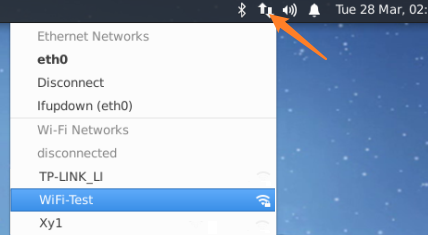
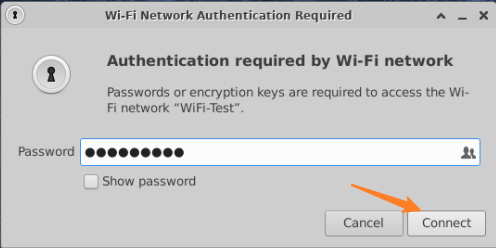
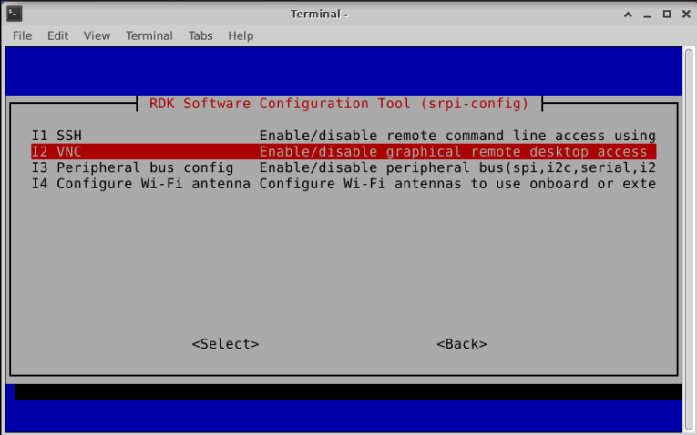
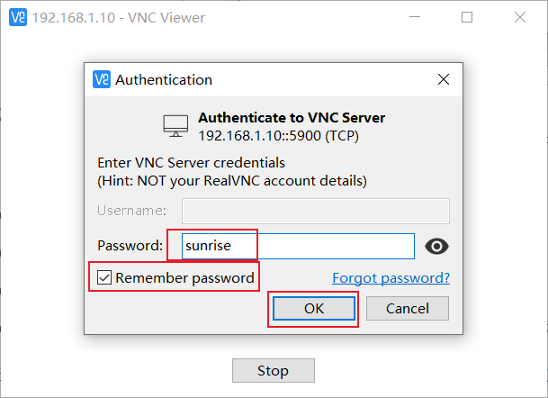
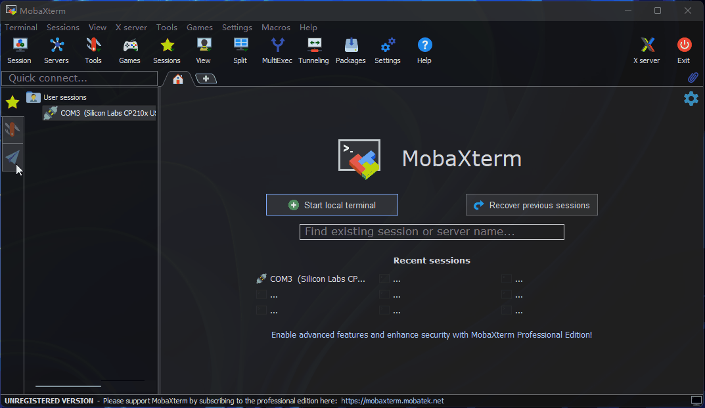

# 系统基础功能说明  

## 连接Wi-Fi

<Tabs groupId="rdk-type">
<TabItem value="desktop" label="Desktop">

使用菜单栏右上角的Wi-Fi管理工具连接Wi-Fi，如下图所示，点击需要连接的Wi-Fi名，然后在弹出的对话框中输入Wi-Fi密码。

</TabItem>

<!-- <TabItem value="server" label="Server">

使用srpi-config工具连接Wi-Fi。

执行 `sudo srpi-config` 命令，选择 System Options -> Wireless LAN ，根据提示依次输入Wi-Fi名（`SSID`） 和 密码（`passwd`）。

</TabItem> -->
</Tabs>

## 开启SSH服务

当前系统版本默认开启 SSH 登录服务，用户可以使用本方法开、关 SSH 服务。

<Tabs groupId="rdk-type">
<TabItem value="desktop" label="Desktop">

通过菜单栏找到`RDK Configuration` 项，点击打开。

选择 Interface Options -> SSH 项，根据提示选择使能或者关闭 `SSH` 服务。

</TabItem>

<!-- <TabItem value="server" label="Server">

执行 `sudo srpi-config`命令进入配置菜单。选择 Interface Options -> SSH 项，根据提示选择使能或者关闭 `SSH` 服务。

</TabItem> -->

</Tabs>

## 开启VNC服务

<Tabs groupId="rdk-type">
<TabItem value="desktop" label="Desktop">

通过菜单栏找到`RDK Configuration` 项，点击打开。

选择 Interface Options -> VNC 项，根据提示选择使能或者关闭`VNC` 服务。选择使能 `VNC` 时需要设置登录密码，密码必须是一个8位长度的由字符组成的字符串。

</TabItem>
</Tabs>
  
##  远程登录

本章节旨在向需要通过个人电脑(PC)远程访问开发板的用户介绍如何通过串口、网络(VNC、SSH)方式进行远程登录。

通过网络方式远程登录前，开发板需要通过有线以太网或者无线WiFi方式接入网络，配置好开发板IP地址。对于两种连接方式下的IP地址信息可参考如下描述：

- 有线以太网：开发板默认采用静态IP模式，IP地址为`192.168.127.10`，掩码`255.255.255.0`，网关 `192.168.127.1`
- 无线WiFi：开发板IP地址一般由路由器分配，可在设备命令行中通过`ifconfig`命令查看wlan0网络的IP地址

### VNC登录

Video: https://www.bilibili.com/video/BV1rm4y1E73q/?p=4

本章节面向使用Ubuntu Desktop系统版本的用户，介绍如何通过`VNC Viewer`实现远程桌面登录功能。`VNC Viewer`是一个图形桌面共享软件，可在电脑上实现设备远程登录和控制桌面。该软件可以通过电脑显示器预览开发板系统桌面，并使用电脑的鼠标、键盘进行远程操作。用户通过VNC Viewer操作，可以获得跟开发板本地操作相同的效果，下载链接[VNC Viewer](https://www.realvnc.com/en/connect/download/viewer/)。

**连接开发板**  
目前VNC支持直接、云端两种连接方式，用户可以根据自身情况选择。本文推荐使用直接连接方式，连接步骤如下：

- 输入设备ip地址，例如：192.168.127.10  

- 输入IP地址后回车，弹出链接未加密的提示，点击 `Continue`  

- 输入密码 `sunrise`，勾选 `Remember password`, 点击 `OK`连接  

### SSH登录{#ssh}
除了VNC登录远程桌面外，还可以通过SSH连接登录开发板。下面分别介绍终端软件、终端命令行两种方法的创建步骤。

#### 终端软件
目前常用终端工具有`Putty`、`MobaXterm`等，用户可根据自身使用习惯来选择。不同工具的端口配置流程基本类似，下面以`MobaXterm`为例，介绍新建SSH连接过程：

1. 打开`MobaXterm`工具，点击`Session`，然后选择`SSH`
2. 输入开发板IP地址，例如`192.168.127.10`
3. 选中`specify username`，输入`sunrise`
4. 点击OK后，输入用户名（sunrise）、密码（sunrise）即可完成登录

