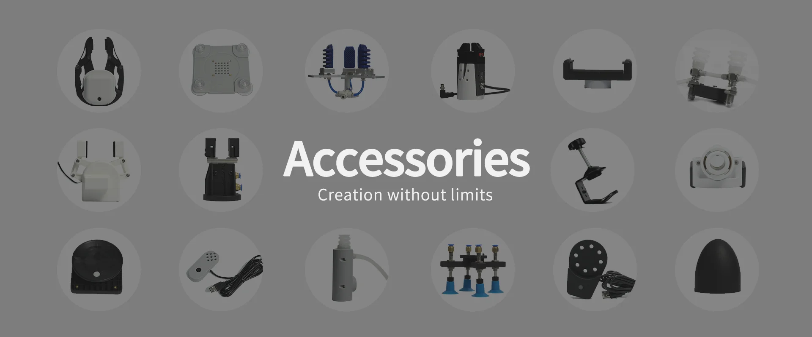

# 产品配件

在现实世界中，不同的配件能以各种方式增强机器人的能力。例如，夹爪、传感器和工具等配件可以帮助机器人执行各种任务，从而提高其多功能性和灵活性。

大象机器人致力于让每个人都能轻松使用机器人和这些配件，将用户从选择合适配件的复杂性中解放出来，使其能够迅速开始使用机器人。

## 配件类型
为了满足客户在不同场景下的需求，我们设计了各种类型的配件，包括夹爪、吸盘、摄像头模块和其他抓取装置，以便用户直接选择合适的末端执行器

## 底座 

- [平面底座](Flatbase.md) 

  适用于在平整光滑表面固定机械臂。

- [G型底座](Gstands_2.0.md)

  适用于在桌子边沿固定机械臂。

## 夹爪 
- [自适应夹爪](AdaptiveGripper.md) 

  夹爪是一种可以实现类似人手功能的机器人部件。其结构较复杂、抓取物体牢固、不易掉落、易操作的优点。夹爪套件包括夹爪配件和乐高科技件，通过可编程系统控制机械臂的末端执行器，实现物件的抓取、多点定位等功能。

- [平行夹爪](ParallelGripper.md) 

  由电机驱动，夹爪的指面作直线往复运动来实现张开或闭合动作的，电动夹爪的加减速可控，对工件的冲击可以减至最小，定位点位可控，夹持可控

- [柔性夹爪-张脚式](flexible_gripper_2.md) 

  指尖由橡胶制成，依靠气压变形来抓取物体。气动机械手应用广泛，因其柔软性、适应性和高效性而备受青睐。这些优点使它们成为自动化和机器人应用中的强大工具，能够有效地处理各种类型的物体和任务

## 吸泵 
- [垂直吸泵](pump.md) 

  具备一进一出的抽气嘴、排气嘴各一个，通过控制吸泵套件作为机械臂的末端执行器，执行吸附物体的功能。

- [双头吸泵](doublepump.md) 

  相对于单头吸泵更为稳定，它结构简单、体积小巧、使用方便、噪音较低、并有良好的自吸能力等优点。

- [一体式吸泵](IntegratedPump.md) 

  一体式吸泵结构简单、体积小巧、使用方便、噪音较低、并有良好的自吸能力等优点。

## 夹持器 
- [笔夹持器](penHolder.md) 

  整体纯色设计，可以用于写字、画画等应用。

- [手机夹持器](phoneHolder.md) 

  适用于拍摄等需要物理夹持的设备，可夹持多种手机，结构简单，易于安装拆卸。

## 其余功能类配件
- [灵巧手](Robothand.md) 

  一种可以实现类似人手功能的机器人部件。其结构较复杂、抓取物体牢固、不易掉落、易操作的优点。夹爪套件包括夹爪配件和乐高科技件，通过可编程系统控制机械臂的末端执行器，实现物件的抓取、多点定位等功能。

- [USB相机](USBcamera.md) 

  USB 高清摄像头可搭配吸泵、自适应夹爪、人工智能套装等，eye in hand 实现精确定位与标定。

- [春笋法兰](bamboo.md) 

  适用于点击按钮、键盘等拥有物理行程的设备，整体纯色设计，结构简单，易于安装拆卸。