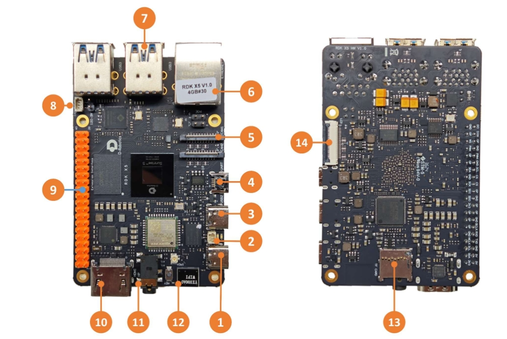
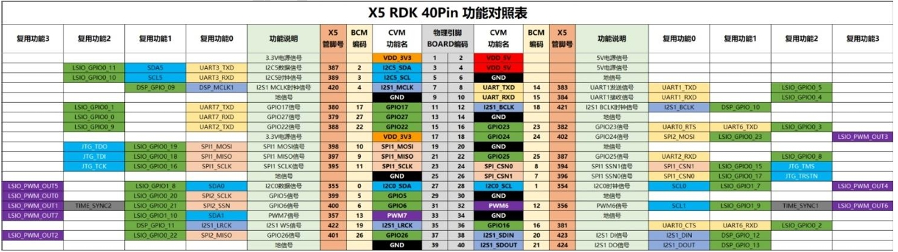

# RDK X5用户使用指南

## **产品简介**  

**RDK X5** 是一款全功能开发板，具有 10Tops 端侧推理算力与 8 核 ARM A55 处理能力，支持 2 路 MIPI Camera 接入，4 路 USB3.0 接口。通过搭配丰富的传感器和扩展组件，为开发者提供了灵活的硬件扩展和连接选项。

RDK X5 机器人开发者套件的主要特性包括：八核 Cortex®A55 处理器、10Tops 
BPU 算力、32GFlops GPU算力，最高LPDDR4 8GB内存。套件主要接口包括：
HDMI、以太网、USB3.0、USB2.0、4-lane MIPI CSI、4-lane MIPI DSI、3.5mm音频接口、CAN接口、TF卡槽等。 

RDK X5 搭载双频2.4/5GHz 无线局域网，支持Wi-Fi 6协议和蓝牙5.4协议。模
组本身搭载高性能的板载天线，且支持搭配外部天线套件使用，从而实现极速可
靠的无线连接，降低用户开发和测试成本。 

## **产品规格**

| **处理器**   | 8核 Cortex®A55 处理器, 10Tops BPU 算力、32GFlops GPU算力        |
| :----------- | :----------------------------------------------------------- |
| **尺寸**    |  85mm x 56mm x 20mm     |
| **显示**     | 1 x 4-lane MIPI DSI 接口, 支持 MIPI V1.2 协议, 1 x HDMI Type-A 接口，最高支持1080P/60fps |
| **内存**     | 选配4GB/8GB容量                |
| **存储** | 板载1G-bit NAND, 提供TF Card Socket, 支持UHS-I模式                             |
| **无线通讯** | 支持Wi-Fi6＆BT5.4                                            |
| **有线网络** | 1 x RJ45 接口，支持1000M以太网和POE, 提供高性能板载天线和IPEX接口     |
| **音频接口** | 3.5mm标准音频接口，支持输入输出           |
| **USB接口**  | 4路USB3.0                      |
| **调试接口** | 1 x USB 2.0 Device Type-C 接口，USB 2.0 UART Micro-B 接口，1 x CAN FD接口，28 GPIOs，3.3V 逻辑，支持SPI、I2C、I2S、PWM、UART等协议 |
| **MIPI接口**| 4-lane MIPI CSI、4-lane MIPI DSI               |
| **相机** | 2 x 4-lane MIPI CSI 接口, 支持 MIPI V2.1 协议         |
| **操作系统** | 预装RDK X5 OS，支持 Ubuntu22.04操作系统            |
| **电源输入** | 5V/5A DC电源输入，Type-C接口；提供5V、3.3V外供电能力   |
| **工作温度**   | -20℃ ~ 60℃                       |

## **原理图**

[RDK X5 原理图](https://archive.d-robotics.cc/downloads/hardware/rdk_x5/RDK_X5_IO_CONN_PUBLIC_V1.0.pdf)

## **接口总览**

RDK X5提供了网口、USB、摄像头、LCD、HDMI、CANFD、40PIN等功能接口，方便用户进行图像多媒体、深度学习算法等应用的开发和测试。开发板接口布局如下：

 

| **序号**   | **功能**                             |
| :----------- | :-------------------------------- |
| **1**  | 供电接口 （USB Type C）     |
| **2**  | RTC 电池接口 |
| **3**  | 易连接口 （USB Type C）     |
| **4** | 调试串口（Micro USB）         |
| **5** | 2 路 MIPI Camera 接口         |
| **6** | 千兆以太网口，支持 POE    |
| **7** | 4 路 USB 3.0 Type A 接口       |
| **8**  | CAN FD 高速接口         |
| **9**  | 40PIN 接口        |
| **10**  | HDMI 显示接口         |
| **11**  | 多标准兼容耳机接口         |
| **12**  | 板载 Wi-Fi 天线         |
| **13**  | TF卡接口（底面）         |
| **14**  | LCD 显示接口（MIPI DSI）         |

## **电源接口**

开发板提供一路 USB Type C 接口(接口1)，作为供电接口，需要使用支持5V/5A的电源适配器为开发板供电。将电源适配器接入开发板后，绿色 电源指示灯 亮起，说明开发板供电正常，3.1.0版本后，橙色 状态指示灯 闪烁，说明系统运行正常。

**注意：** **请不要使用电脑USB接口为开发板供电，否则会因供电不足造成开发板异常断电、反复重启等情况。！！！！！！**

## **调试串口**

开发板提供一路调试串口(接口4)，以实现串口登录、调试功能。电脑串口工具的参数配置如下：

- 波特率（Baud rate）：115200
- 数据位（Data bits）：8
- 奇偶校验（Parity）：None
- 停止位（Stop bits）：1
- 流控（Flow Control）：无

串口连接时，需要将通过 Micro-USB 线，连接开发板接口 4 与 PC。

通常情况下，用户第一次使用该接口时需要在电脑上安装 CH340 驱动，用户可搜索CH340串口驱动关键字进行下载、安装。

## **有线网口**

开发板提供一路千兆以太网接口(接口6)，支持1000BASE-T、100BASE-T标准，默认采用静态IP模式，IP地址为 `192.168.127.10` 。如需确认开发板IP地址，可通过串口登录设备，并用ifconfig命令进行查看 `eth0`网口的配置.

此外，该接口支持 PoE（Power over Ethernet，以太网供电）功能，无需额外的电源线即可通过网线同时传输数据和电力，使设备的安装更加简便灵活。

## **HDMI 显示接口**

开发板提供一路HDMI(接口10)显示接口，最高支持 1080P 分辨率。开发板通过HDMI接口在显示器输出Ubuntu系统桌面(Ubuntu Server版本显示logo图标)。此外，HDMI接口还支持实时显示摄像头、网络流画面功能。

USB 显示接口
开发板通过硬件电路实现了多路USB接口扩展，满足用户对多路USB设备接入的需求，接口描述如下：

| **接口类型**   | **接口序号**   | **接口数量**  | **接口描述**  |
| :----------- | :---------- | :---------- | :-------------|
| USB 2.0 Type C |	接口3| 1路	| USB Device模式，用于连接主机实现ADB、Fastboot、系统烧录等功能  |
| USB 3.0 Type A	 |	接口7| 4路	| USB Host模式，通过 HUB 扩展出 4 个 USB 端口，用于接入USB 3.0外设   |

### 接入U盘

开发板 USB Type A 接口(接口7)，支持U盘功能，可自动检测U盘接入并挂载，默认挂载目录为/media/sda1。

### 接入 USB 串口转接板

开发板USB Type A接口(接口7)，支持USB串口转接板功能，可自动检测USB串口转接板接入并创建设备节点/dev/ttyUSB* 或者 /dev/ttyACM*（星号代表0开始的数字）。用户可参考 使用串口 章节对串口进行使用。

### USB 摄像头

开发板 USB Type A 接口，支持 USB 摄像头功能，可自动检测USB摄像头接入并创建设备节点/dev/video0。

## **LCD 显示接口**

RDK X5 提供一路 MIPI DSI 的 LCD 显示接口（接口14），可以用于 LCD 显示屏等接入。接口为22pin，可使用DSI-Cable-12cm线材直接接入树莓派多款 LCD 显示屏。

## **Micro SD 接口**

开发板提供1路Micro SD存储卡接口(接口13)。推荐使用至少16GB容量的存储卡，以便满足Ubuntu操作系统及相关功能包的安装要求。

**注意：** 开发板使用中禁止热插拔TF存储卡，否则会造成系统运行异常，甚至造成存储卡文件系统损坏。

## **Wi-Fi 天线接口**

开发板的无线网络支持板载和外置天线两种配置，通常情况下板载天线可以满足使用需求。当开发板安装金属材质外壳后，需要连接外置天线到（接口12旁的天线接口），以增强信号强度。

## **CANFD 接口**

RDK X5开发板提供 CANFD 接口，可用于CAN及CAN FD通信，具体信息请参考 [CAN使用](https://developer.d-robotics.cc/rdk_doc/Advanced_development/hardware_development/rdk_x5/can) 章节

## **40PIN 接口**

RDK X5开发板提供 40PIN 接口，IO 信号采用 3.3 V电平设计。

## **注意事项**

RDK X5 适用于实验室或者工程环境，开始操作前，请先阅读以下注意事项：

1. 任何情况下不可对屏幕接口、CSI接口及扩展板进行热插拔操作。
2. 拆封开发板包装和安装前，为避免静电释放（ESD）对开发板硬件造成损伤，请采取必要防静电措施。
3. 持开发板时请拿开发板边沿，不要触碰到开发板上的外露金属部分，以免静电对开发板元器件造成损坏。
4. 请将开发板放置于干燥的平面上，以保证它们远离热源、电磁干扰源与辐射源、电磁辐射敏感设备（如：医疗设备)等。