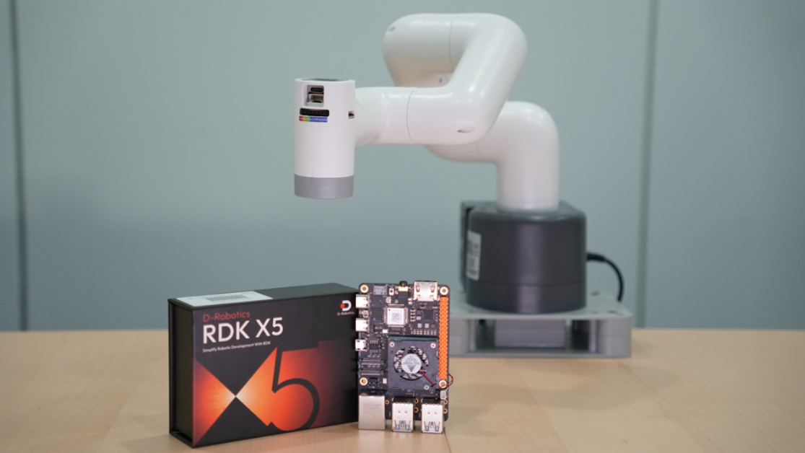
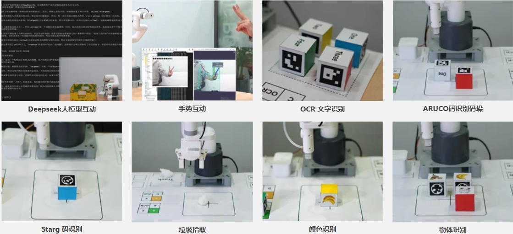

## Product Overview

##### myCobot 280 RDK X5

##### Desktop-level six-axis collaborative robot

### 1.Product Introduction

The myCobot 280 RDK X5 six-axis collaborative robot is a **multi-functional lightweight intelligent robotic arm** carefully developed by Elephant Robotics. It belongs to the "myCobot series" products. It is one of the core products of Elephant Robotics for **robots and artificial intelligence education ecosystems**.

The myCobot 280 RDK X5 six-axis collaborative robot weighs **860g**, has a payload of **250g**, and an arm span of **280mm**. It is compact but powerful, has a rich software and hardware interaction mode and a variety of compatible expansion interfaces, supports secondary development on multiple platforms, and meets the needs of scientific research, education, smart home, commercial exploration, etc.

### Design concept

The myCobot 280 RDK X5 robotic arm is a six-degree-of-freedom collaborative robot developed by Elephant Robotics for scenarios such as scientific research and education, maker applications, and commercial displays. The appearance and structure of the robotic arm are compact and exquisite, with an integrated fully enclosed body design without any external cables. It is equipped with the robot motion control algorithm independently developed by Elephant Robotics, and supports multiple control modes such as angle, coordinate, potential value, and radian value, which makes it easier for users to understand the complex working principles of robots and the application principles of robots. It has a built-in RDK OS operating system. It does not require a PC master control and can be used by connecting a monitor, keyboard, and mouse. It is the preferred assistant for quickly building robotic arm programming education, control logic development, robot applications, and ROS simulation experiment classrooms, helping users quickly start learning and applying six-axis robotic arms.

### Design goals

| Design goals | Description | Application scenarios and features |
| ---------------------- | ------------------------------------------------------------ | ------------------------------------------------------------ |
| **General multi-functional platform** | myCobot 280 RDK X5 is suitable for a variety of application scenarios such as education, research and commercial display, maker development, etc. | Its six degrees of freedom and 280mm arm span support complex motion control in various working environments. It can be equipped with a variety of end accessories such as grippers and suction pumps to meet various scene applications. |
| **Education support** | myCobot 280 RDK X5 supports drag-and-drop programming language, interactive drag teaching with buttons, and intuitive display of the working mode of the robotic arm. | The product supports the myblocky graphical programming tool. Programming by dragging and combining different modules helps beginners to intuitively experience the application of robots. |
| **Programmability and scalability** | The high programmability of myCobot 280 RDK X5 allows users to customize and program according to emerging technologies to adapt to the needs of future technologies. | Through user-defined programming, the device can achieve optimized operation and experimental results to meet the ever-changing research and development. |
| **Technology innovation and knowledge dissemination** | myCobot 280 RDK X5 can be used as a platform to showcase the latest scientific and technological achievements in commercial exhibitions, aiming to enhance the public's understanding and interest in science and technology, and promote the transformation of scientific and technological innovation into commercialization. | By displaying and demonstrating the latest scientific and technological achievements, increase public participation, promote the popularization of scientific and technological knowledge and the market acceptance of scientific and technological products. |

### Product Features

| | |
| ------------------------------------------------- | ------------------------------------------------------------ |
| **Built-in RDK OS operating system, specially developed for robots** | Built-in a variety of development software, such as myStudio, myBlockly, etc.   Built-in a variety of development environments, such as: ROS, Python, etc. Built-in a large number of extended applications, supporting visual development, front-end interface development, etc.   Open the underlying operating permissions of the system to support user customized development. |
| **Supports ROS2 and graphical programming** | Supports ROS2 version applications, so that development is no longer restricted.  Supports graphical programming software, making robot programming applications within reach. |
| **Image recognition, rich accessories, and wide application** | Comes with image recognition algorithm, and can be equipped with any camera. Independently match different accessories such as display, gripper suction pump, etc. to achieve more application scenarios.   Supports the expansion of artificial intelligence kits for robot education and teaching. |
| **Unique industrial design, extremely compact** | Integrated design, the overall body structure is compact, the net weight is only 860g, and it is very easy to carry.   Modular design, few spare parts, low maintenance cost, can be quickly disassembled and replaced, and plug-and-play is realized. |
| **High-configuration joint module, support LEGO interface** | Contains 6 high-performance servo motors, fast response, small inertia, and smooth rotation.  The base and the end are equipped with LEGO technology parts interface, which is suitable for the development of various micro embedded devices. |

## 2.Product Application

### User Group

| | |
| ---------------------------- | ------------------------------------------------------------ |
| **Educational Institutions** | myCobot 280 RDK X5 can be used as a teaching and research tool designed for robot experiments and technical demonstrations. It does not need to be paired with a PC master control, and can be used by connecting a monitor, keyboard, and mouse. It provides image drag-and-drop programming software specifically for entry-level teaching, making it easy to understand the principles of the robotic arm. |
| **Technical Developers and Engineers** | Built-in RDK X5 operating system. Supports RDK X5 native hardware interfaces, dozens of official actuators, and the terminal Lego interface can be connected to various sensors to achieve color recognition and tracking, QR code and gesture recognition, voice broadcast and other functions. |
| **Commercial Display and Public Exhibition Organizers** | myCobot 280 RDK X5 has become the preferred device for technology display and product demonstration with its precision operation display advantages. Dynamic demonstrations not only attract audiences, but also enhance their sense of participation, effectively promoting technological innovation and products. |
| **Geek development enthusiasts** | myCobot 280 RDK X5 supports the Arduino + ROS open source system. Dozens of accessories such as adaptive grippers, camera flanges, suction pumps, etc. help you give full play to myCobot's creative ideas to meet the various creative ideas of enthusiasts. |

### 3.Application scenarios
| Applicable groups | **Application scenarios** | **Advantage targets** |
| -------------------------- | ------------------------------------------------------------ | ------------------------------------------------------------ |
| **Teachers and students in the field of education** | - STEM education - Robotics projects - Interdisciplinary research projects - Education and research | - Improve students' interest in science and technology - Enhance hands-on skills and problem-solving skills - Promote innovative thinking and teamwork - Provide a practical platform for data collection and robotics |
| **Makers and technical developers** | - Prototype development - Experimental research - Robot trial teaching | - Rich accessories - Connect theory and practice - Promote technological innovation |
| **Business presentations and marketing professionals** | - Exhibitions - Technology demonstrations - Brand promotion | - Attract potential customers and investors - Show the company's technical strength and innovative products - Enhance brand influence |

---

## Supported extended development

The mycobot series of robotic arms are extremely valuable in the fields of education and scientific research, especially in Python and ROS (Robot Operating System), two widely used development environments. These environments provide strong support, allowing the mycobot series of products to be widely used in machine learning, artificial intelligence research, complex motion control, and visual processing tasks. At the same time, with dozens of accessories such as adaptive grippers, camera flanges, suction pumps, etc., you can give full play to myCobot's creative ideas.

| | |
| ------------------------------------------------------------ | ------------------------------------------------------------ |
| **Python** | The robot supports Python and has a complete Python API library. The robot's joint angles, coordinates, grippers, etc. can be controlled through Python. |
| **ROS2** | Supports ROS2 version, and provides RVIZ2 simulation environment support.   Allows users to display the robot arm in real time and collect robot arm status information, making mycobot 280 RDK X5 suitable for ROS beginners and educational purposes. |
| **Hardware interface** | Including IO, USB, etc., convenient for connecting various sensors and actuators. |
| **Software library** | Provides a wealth of open source libraries andAPI to simplify the development process. |
| **myBlockly** | It is both a graphical programming software and a visualization tool. Users can drag and drop modules to create programs. This process is very similar to building blocks, which is convenient, fast and easy to use. |

---

## 4.Where to buy

If you are interested in purchasing the device, please click on the link below:
Taobao: [https://shop504055678.taobao.com](https://shop504055678.taobao.com) 
Shopify: [https://shop.elephantrobotics.com/](https://shop.elephantrobotics.com/) 
AliExpress: [https://elephantrobotics.aliexpress.com/store/1101941423] (https://elephantrobotics.aliexpress.com/store/1101941423)

---

[Next Chapter →](../2.ProductParameter/2-ProductParameters.md)