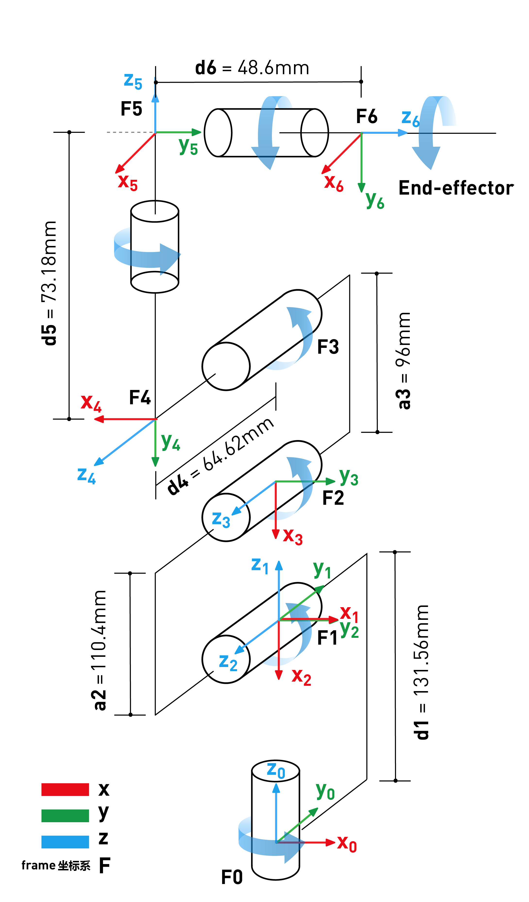

# Robot Parameters

> In the first chapter, we discussed the selling points of the product and its design concept, providing you with a panoramic perspective of the high-level understanding of the product. Now, let's move on to the second chapter - Robot Parameters. This chapter will be the key to your understanding of the product's technical details. A detailed understanding of these technical parameters will not only help you fully realize the advancement and practicality of our products, but also ensure that you can use these technologies more effectively to meet your specific needs.

## 1. Structural parameters

### 1.1 Robotic arm parameters

| Index | Parameters |
| :-----------: | :---------: |
| Name | Little Elephant Collaborative Robotic Arm |
| Model | myCobot 280 RDK X5 |
| Degrees of freedom | 6 |
| Payload | 250g |
| Working radius | 280mm |
| Repeatability | ±0.5mm |
| Weight | 860g |
| Power input | 12V, 5A |
| Working temperature | -5-45℃ |
| Communication | Type-C |

### 1.2 Workspace

### 1.3 Specifications and dimensions

### 1.4 Joint range of motion

| Joint | Range |
| :--------: | :----------:|
| J1 | -168 ~ +168 |
| J2 | -135 ~ +135 |
| J3 | -150 ~ +150 |
| J4 | -145 ~ +145 |
| J5 | -165 ~ +165 |
| J6 | -180 ~ +180 |

### 1.5 Hole installation

- The robot base is mounted with flanges. The base is compatible with both LEGO technology and M4 screw installation.

- The end of the robot is equipped with a flange, and the end of the robot arm is compatible with both Lego technology holes and screw threaded holes.

## 2.Electronic parameters

| Indicators | Parameters |
| :---------: | :--------------:|
| CPU | 8x A55@1.5GHz |
| Bluetooth/wireless | Yes |
| USB | USB3.0 x2; USB2.0 x2 |
| Display screen | No |
| HDMI interface | microHDMI x2 |
| Custom buttons | No |
| IO interface | 40 |

## 3.Electrical characteristic parameters
### 3.1Electrical interface of the robotic arm base
### Base introduction

* A. The left side of the base is shown below:
  
  - ① Power button
  - ② Headphone jack
  - ③ SD card slot
  - ④ DC12V power port
  - ⑤ HDMI
* B. The right side of the base is shown below:
  
  - ① Network port
  - ② USB3.0 port
  - ③ IO port

* C. The top view of the base is shown below:
  
  - ① Power supply Type-C interface
  - ② Type-C interface
  - ③ Micro USB interface
  

### 3.2 Bottom IO interface description

> **Note:** The functional interface groups are all 2.54mm DuPont interfaces, and 2.54mm DuPont wires can be used externally.

The definitions of each interface are shown in the following table

<!-- | 标签 | 信号名 | 类型 | 功能 | 备注 |
| :---: | :----: | :--: | :------: | :----: |
| 5V | 5V | P | DC 5V |  |
| 5V | 5V | P | DC 5V |  |
| GND | GND  | p | GND |  |
| NC | NC | - | - | 暂不支持 |
| NC | NC | - | - | 暂不支持 |
| 18 | GPIO18 | I/O | GPIO18 |  |
| GND | GND  | p | GND |  |
| 23 | GPIO23 | I/O | GPIO23 |  |
| 24  | GPIO24 | I/O | GPIO24 |  |
| GND | GND  | p | GND |  |
| 25 | GPIO25 | I/O | GPIO25 |  |
| 08 | GPIO8 | I/O | GPIO8 |  |
| 07 | GPIO7 | I/O | GPIO7 |  |
| 01 | GPIO1 | I/O | GPIO1 |  |
| GND | GND  | p | GND |  |
| 12 | GPIO12 | I/O | GPIO12 |  |
| GND | GND  | p | GND |  |
| 16 | GPIO16 | I/O | GPIO16 |  |
| 20 | GPIO20 | I/O | GPIO20 |  |
| 21 | GPIO21 | I/O | GPIO21 |  |
|3.3 | 3.3V | P | DC 3.3V |  |
| NC | NC | - | - | 暂不支持 |
| 03 | GPIO3 | I/O | GPIO3 |  |
| 04 | GPIO4 | I/O | GPIO4 |  |
| GND | GND  | p | GND |  |
| 17 | GPIO17 | I/O | GPIO17 |  |
| 27 | GPIO27 | I/O | GPIO27 |  |
| 22 | GPIO22 | I/O | GPIO22 |  |
|3.3 | 3.3V | P | DC 3.3V |  |
| 10 | GPIO10 | I/O | GPIO10 |  |
| 09 | GPIO9 | I/O | GPIO9 |  |
| 11 | GPIO11 | I/O | GPIO11 |  |
| GND | GND  | p | GND |  |
| 00 | GPIO0 | I/O | GPIO0 |  |
| 05 | GPIO5 | I/O | GPIO5 |  |
| 06 | GPIO6 | I/O | GPIO6 |  |
| 13 | GPIO13 | I/O | GPIO13 |  |
| 19 | GPIO19 | I/O | GPIO19 |  |
| 26 | GPIO26 | I/O | GPIO26 |  |
| GND | GND  | p | GND |  | -->

<!-- > **注意:** 
> 1. I: 仅作为输入。
> 
> 2. I/O: 该功能信号包含输入和输出组合。
> 
> 3. 当管角设置为输出端时，它将输出电压3.3V。
> 
> 4. 单个管角的拉电流随管脚数量增加而减小，从约40mA减小到29mA。
> 
> 5. 如果某个GPIO被设置为输出模式时，输出高电平信号，电路连接如图 2.1.5.2-3 所示，LED灯将点亮。
> 
>  
> 
> 图 2.1.5.2-3
> 
> 6. 关于功能接口的其他功能表如图 2.1.5.2-4 所示,使用其他功能的情况下，IO功能不可用。
> 
> 
> 
> 图 2.1.5.2-4

* B. 电源DC接口: 使用DC电源插座，外径6.5mm，内径2.0mm；可使用厂家配备的12V 5A  DC电源适配器给 myCobot280 进行供电。
  
* C. 开关按键：红色为开关，I为开机，O为关机。

* D. USB2.0接口：以串口总线标准2.0进行数据连接的接口；用户可以使用USB接口拷贝程序文件，也可以使用USB接口连接鼠标、键盘等外设。

* E. USB3.0接口（蓝色）：以串口总线标准3.0进行数据连接的接口；用户可以使用USB接口拷贝程序文件，也可以使用USB接口连接鼠标、键盘等外设。

   

  图 2.1.5.2-5

* F. 网口：网络数据连接的端口，用户使用Ethernet接口可以用于PC端与机器人系统的通信交互，也可以用于与其他设备进行以太网通信。

  

  图 2.1.5.2-6

* G. HDMI 接口: 接口为HDMI D型接口，连接显示器。HDMI接口2存在优先级，推荐使用HDMI接口1。

* H. Type C接口：树莓派自身的供电口，仅给树莓派自身供电，无法给整个机器供电，所有电源DC接口可以正常使用的时候无需接此接口。

* I. SD卡卡槽: SD卡可以插入和拔出。SD卡的大小是32mm×24mmx2.1mm -->

## 4. Electrical interface of the end of the robotic arm

### 4.1 Introduction to the end of the robotic arm

* A. The end of the robotic arm is shown in Figure 2.1.5.2-7 and Figure 2.1.5.2-8:

  

    Figure 2.1.5.2-7 End of the robotic arm
    - ① Servo interface
    - ② Atom

  

    Figure 2.1.5.2-8 End of the robot arm
    - ① Functional interface group 2
    - ② Grove
    - ③ Type C

### 4.2 Terminal interface description

* A. The definitions of each interface of functional interface group 2 are shown in the following table:

| Label | Signal name | Type | Function | Remarks |
| :---: | :----: | :--: | :------: | :----: |
| 5V | 5V | P | DC 5V |  |
| GND | GND | P | GND |  |
| 3V3 | 3V3 | P | DC 3.3V |  |
| G22 | G22 | I/O | GPIO22 |  |
| G19 | G19 | I/O | GPIO19 |  |
| G23 | G23 | I/O | GPIO23 |  |
| G33 | G33 | I/O | GPIO33 |  |

> **Note:**
> 1. I: Input only.
>
> 2. I/O: This function signal includes input and output combination.
>
> 3. When the tube corner is set as output, it will output voltage 3.3V.
>
> 4. The source current of a single tube corner decreases with the increase of the number of pins, from about 40mA to 29mA.
>
> 5. If a GPIO is set to output mode, it outputs a high level signal, the circuit connection is shown in Figure 2.1.5.2-9, and the LED light will light up.
> 
> 
> 
> Figure 2.1.5.2-9

* B. Type C interface: can be used to connect to the PC for communication and update firmware.

* C. Grove: defined as shown in Figure 2.1.5.2-10
  
  
  

    Figure 2.1.5.2-10 Grove

* D. Servo interface: used for the end extension gripper, currently supports the matching adaptive gripper.

* E. Atom: used for 5X5 RGB LED (G27) display and button function (G39)

## 5. Cartesian coordinate parameters
  

The SDH parameters are shown in the figure below

---

[← Previous Chapter](../1.ProductIntroduction/1-ProductIntroduction.md) | [Next Chapter →](../../2-BasicSettings/3.UserNotice/3-UserInstructions.md)