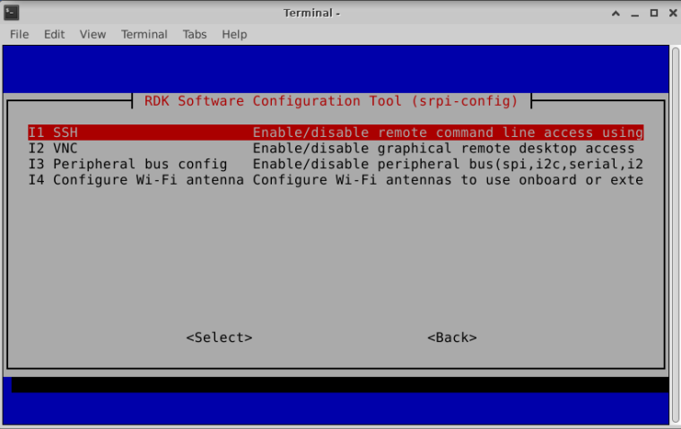
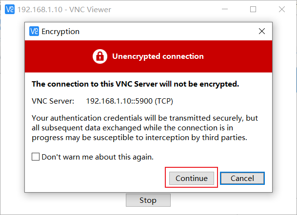

# System Basic Function Description

## Connect to Wi-Fi

<Tabs groupId="rdk-type">
<TabItem value="desktop" label="Desktop">

Use the Wi-Fi management tool in the upper right corner of the menu bar to connect to Wi-Fi, as shown in the figure below, click the Wi-Fi name you want to connect to, and then enter the Wi-Fi password in the pop-up dialog box.  

 

 

</TabItem>

<!-- <TabItem value="server" label="Server">

使用srpi-config工具连接Wi-Fi。

执行 `sudo srpi-config` 命令，选择 System Options -> Wireless LAN ，根据提示依次输入Wi-Fi名（`SSID`） 和 密码（`passwd`）。

</TabItem> -->
</Tabs>

## Enable SSH service

The current system version enables SSH login service by default. Users can use this method to enable or disable SSH service.

<Tabs groupId="rdk-type">
<TabItem value="desktop" label="Desktop">

Find the `RDK Configuration` item in the menu bar and click to open it.

Select Interface Options -> SSH and follow the prompts to enable or disable the `SSH` service.

</TabItem>

<!-- <TabItem value="server" label="Server">

执行 `sudo srpi-config`命令进入配置菜单。选择 Interface Options -> SSH 项，根据提示选择使能或者关闭 `SSH` 服务。

</TabItem> -->

</Tabs>

## Enable VNC service

<Tabs groupId="rdk-type">
<TabItem value="desktop" label="Desktop">

Find the `RDK Configuration` item in the menu bar and click to open it.

Select Interface Options -> VNC and enable or disable the `VNC` service according to the prompts. When you choose to enable `VNC`, you need to set a login password. The password must be an 8-bit character string.

</TabItem>
</Tabs>
  
## Remote Login

This section aims to introduce how to log in remotely via serial port or network (VNC, SSH) to users who need to access the development board remotely via a personal computer (PC).

Before logging in remotely via the network, the development board needs to be connected to the network via wired Ethernet or wireless WiFi, and the IP address of the development board needs to be configured. For the IP address information under the two connection methods, please refer to the following description:

- Wired Ethernet: The development board uses static IP mode by default, with an IP address of `192.168.127.10`, mask `255.255.255.0`, and gateway `192.168.127.1`
- Wireless WiFi: The IP address of the development board is generally assigned by the router. The IP address of the wlan0 network can be viewed through the `ifconfig` command in the device command line

### VNC login

Video: https://www.bilibili.com/video/BV1rm4y1E73q/?p=4

This chapter is for users using the Ubuntu Desktop system version, and introduces how to use `VNC Viewer` to implement remote desktop login. `VNC Viewer` is a graphical desktop sharing software that can realize remote device login and desktop control on a computer. The software can preview the development board system desktop through the computer monitor and use the computer's mouse and keyboard for remote operation. Users can get the same effect as local operation on the development board by operating VNC Viewer. Download link [VNC Viewer](https://www.realvnc.com/en/connect/download/viewer/).

**Connect to the development board**
Currently VNC supports two connection methods: direct and cloud. Users can choose according to their own situation. This article recommends the direct connection method. The connection steps are as follows:

- Enter the device IP address, for example: 192.168.127.10

- After entering the IP address, press Enter, and a prompt pops up that the link is not encrypted. Click `Continue`

- Enter the password `sunrise`, check `Remember password`, and click `OK` to connect

### SSH login{#ssh}
In addition to logging in to the remote desktop via VNC, you can also log in to the development board through SSH connection. The following are the steps to create two methods: terminal software and terminal command line.

#### Terminal software
Currently, commonly used terminal tools include `Putty`, `MobaXterm`, etc. Users can choose according to their own usage habits. The port configuration process of different tools is basically similar. The following takes `MobaXterm` as an example to introduce the process of creating a new SSH connection:

1. Open the `MobaXterm` tool, click `Session`, and then select `SSH`
2. Enter the IP address of the development board, for example, `192.168.127.10`
3. Select `specify username` and enter `sunrise`
4. After clicking OK, enter the username (sunrise) and password (sunrise) to complete the login

