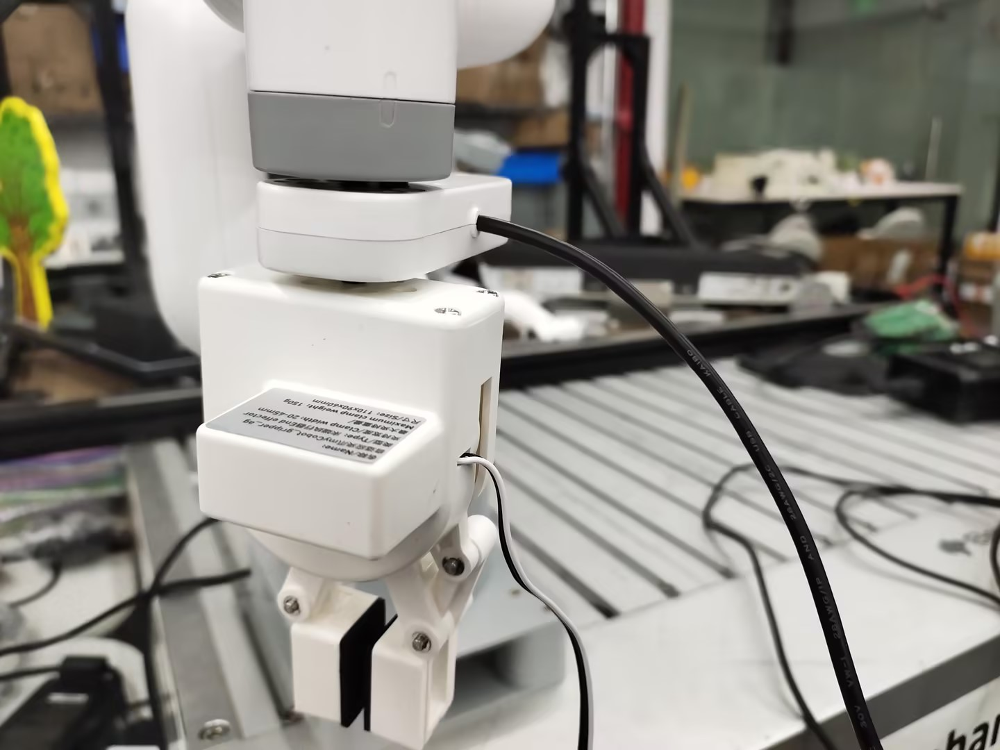
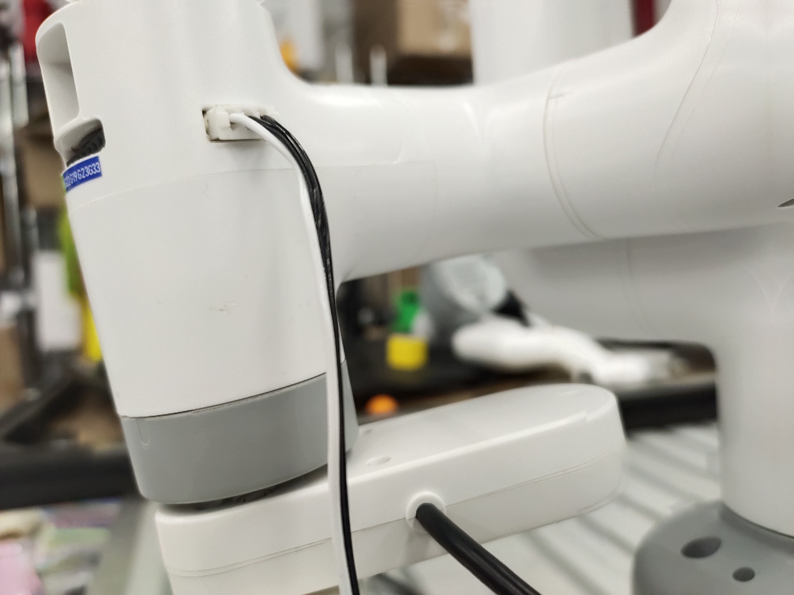
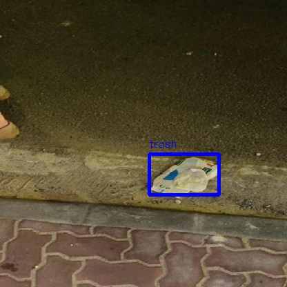
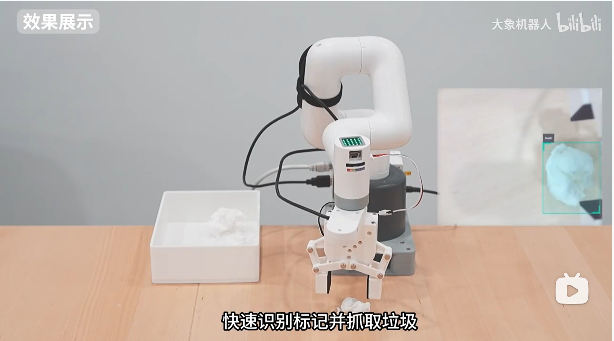

# Garbage detection case

## 1 Hardware installation
First manually align the end flange with the scale line


Then install the camera on the end flange according to the posture in the picture, and then connect the camera line to the USB interface of the main controller at the bottom


Then install the gripper on the Lego socket of the camera according to the posture in the picture.



Then connect the gripper line to the 3PIN interface of the robot arm



## 2 Software operation
Open a terminal and enter the command, press the keyboard Enter key to run
```bash
export CAM_TYPE=usb
```
Then enter the following command to start the camera recognition node
```bash
ros2 launch dnn_node_example dnn_node_example.launch.py dnn_example_config_file:=config/ppyoloworkconfig.json dnn_example_msg_pub_topic_name:=ai_msg_mono2d_trash_detection dnn_example_image_width:=640 dnn_example_image_height:=480
```
输出log显示，节点运行成功
```shell
[example-1] [INFO] [1665646256.967568866] [dnn]: The model input 0 width is 416 and height is 416
[example-1] [WARN] [1665646256.967698807] [dnn]: Run default SetOutputParser.
[example-1] [WARN] [1665646256.967754550] [dnn]: Set output parser with default dnn node parser, you will get all output tensors and should parse output_tensors in PostProcess.
[example-1] [INFO] [1665646256.967794962] [dnn impl]: Set default output parser
[example-1] [INFO] [1665646256.967972439] [dnn]: Task init.
[example-1] [INFO] [1665646256.970036756] [dnn]: Set task_num [4]
[example-1] [INFO] [1665646256.970176988] [example]: The model input width is 416 and height is 416
[example-1] [WARN] [1665646256.970260061] [example]: Create ai msg publisher with topic_name: hobot_dnn_detection
[example-1] [INFO] [1665646256.977452592] [example]: Dnn node feed with local image: config/trashDet0028.jpg
[example-1] [INFO] [1665646257.027170005] [dnn]: task id: 3 set bpu core: 2
[example-1] [INFO] [1665646257.057492754] [example]: Output from frame_id: feedback, stamp: 0.0
[example-1] [INFO] [1665646257.063816821] [PostProcessBase]: out box size: 1
[example-1] [INFO] [1665646257.064070497] [PostProcessBase]: det rect: 216.061 223.173 317.97 282.748, det type: trash, score:0.80733
[example-1] [INFO] [1665646257.064206479] [ClassificationPostProcess]: out cls size: 0
[example-1] [INFO] [1665646257.068688365] [ImageUtils]: target size: 1
[example-1] [INFO] [1665646257.068836554] [ImageUtils]: target type: trash, rois.size: 1
[example-1] [INFO] [1665646257.068884048] [ImageUtils]: roi.type: , x_offset: 216 y_offset: 223 width: 101 height: 59
[example-1] [WARN] [1665646257.071375688] [ImageUtils]: Draw result to file: render_feedback_0_0.jpeg
```

Enter http://IP:8000 in the browser on the PC to view the image and algorithm rendering effects (IP is the IP address of RDK):



### Example Program
```python
import rclpy
from rclpy.node import Node
from ai_msgs.msg import PerceptionTargets
from sensor_msgs.msg import CompressedImage
from pymycobot import MyCobot280RDKX5,utils
import time
import cv2
import numpy as np
import threading
class MinimalSubscriber(Node):
    def __init__(self):
        self.mc=MyCobot280RDKX5("/dev/ttyS1",1000000)
        self.mc.set_fresh_mode(1)
        self.mc.sync_send_angles([0,0,-90,0,0,136.21],50)
        self.mc.set_gripper_state(1,100)
        self.mc.get_angles()
        print("ok")
        super().__init__('minimal_subscriber')
        self.subscription = self.create_subscription(
            PerceptionTargets,
            '/ai_msg_mono2d_trash_detection',
            self.listener_callback,
            10)
        self.cameraMatrix =np.array([
            [827.29511682, 0., 368.87666292],
            [0.,  824.88958537, 262.03016541],
            [0., 0., 1.]])
        self.distCoeffs = np.array(([[0.21780081, -0.56324781, 0.01165061,   0.01845253,
                    -1.0631406]]))
        self.cam_coords=[170.0, -61.5, 189.6, 179.14, -1.87, -134.35] 
        self.lock = threading.Lock()
        self.flag=0
        self.count=1

    def calculate_center(self,roi):
        
        x_center = roi.x_offset + roi.width / 2
        y_center = roi.y_offset + roi.height / 2
        return [x_center, y_center]
    
    def pixel_to_camera(self,u, v):
        fx = self.cameraMatrix[0, 0]  
        fy = self.cameraMatrix[1, 1]  
        cx = self.cameraMatrix[0, 2]  
        cy = self.cameraMatrix[1, 2]  
        Z=0.241

        X = (u - cx) * Z / fx
        Y = (v - cy) * Z / fy
        X=float(round(X*1000,2))
        Y=float(round(Y*1000,2))
        
        return [X, Y]
    

    def listener_callback(self, msg):
        
        for target in msg.targets:
            for rois in target.rois:   
                with self.lock:
                    if  self.count==1:
                        # self.get_logger().info(f'Value: "{rois.type}",rect:"{rois.rect}"')
                        result=self.calculate_center(rois.rect)
                        xy=self.pixel_to_camera(result[0],result[1])
                        self.mc.set_gripper_state(0,100)
                        self.cam_coords[1]=self.cam_coords[1]+20
                        self.cam_coords[0]=self.cam_coords[0]+30
                        
                        self.cam_coords[0]=self.cam_coords[0]-xy[0]
                        self.cam_coords[1]=self.cam_coords[1]+xy[1]
                        self.cam_coords[2]=150
                        self.mc.send_coords(self.cam_coords,50,1)
                        time.sleep(3)
                        self.cam_coords[2]=120
                        self.mc.send_coords(self.cam_coords,50,1)
                        time.sleep(3)
                        self.mc.set_gripper_state(1,100)
                        time.sleep(2)
                        self.cam_coords[2]=150
                        self.mc.send_coords(self.cam_coords,50,1)
                        time.sleep(3)
                        self.mc.send_angles([-60,0,-90,0,0,136.21],50)
                        time.sleep(2)
                        self.mc.set_gripper_state(0,100)
                        time.sleep(2)
                        self.mc.set_gripper_state(1,100)
                        time.sleep(2)
                        self.cam_coords=None
                        self.mc.send_angles([0,0,-90,0,0,136.21],50)
                        time.sleep(2)
                        while self.cam_coords is None:
                            for i in range(3):
                                self.cam_coords=self.mc.get_coords()
                        self.flag=0
                        self.count=1

                    


def main(args=None):
    rclpy.init(args=args)
    minimal_subscriber = MinimalSubscriber()
    rclpy.spin(minimal_subscriber)
    minimal_subscriber.destroy_node()
    rclpy.shutdown()

if __name__ == '__main__':
    main()
```

## Effect display

[Video link](https://www.bilibili.com/video/BV1jTKweBEjJ/?spm_id_from=333.1387.homepage.video_card.click&vd_source=672e3f7240eaaca210b45e7c033dc45f)


