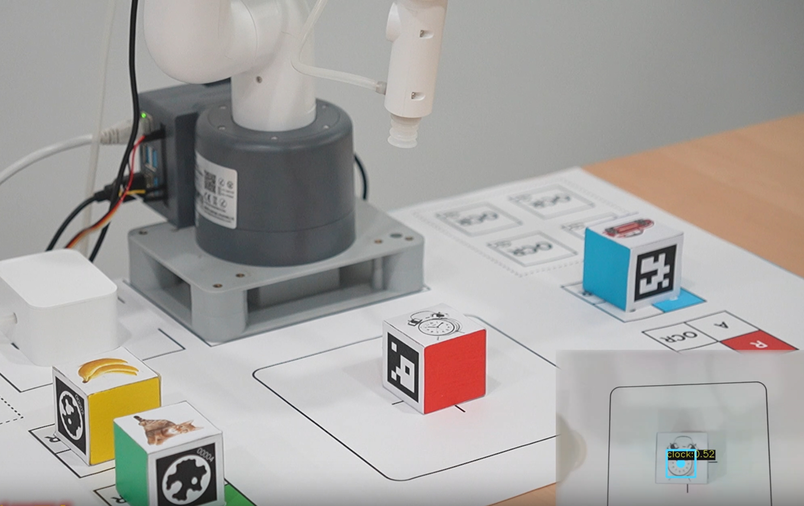

# mycobot280RDKX5 Vision Kit

## 1 Software Environment Configuration

Enter the following command in the terminal, press the Enter key on the keyboard, and clone the program to the local
```bash
git clone https://github.com/elephantrobotics/mycobot280RDKX5_vision_kit.git
```

Enter the following command in the terminal, press the Enter key on the keyboard, and enter the cloned folder
```bash
cd mycobot280RDKX5_vision_kit
```

Enter the following command in the terminal, press the Enter key on the keyboard, and install the required dependency library
```bash
pip install -r requirements.txt
```

## 2 Hardware Installation

Place the map on the edge of the table to facilitate the fixation of the robot arm behind


Align the base with the bottom mounting hole of the robot arm and fix it with an Allen wrench


Use the G-type clamp to fix the robot arm to the robot arm fixing area of ​​the map


Try to fit the base and the rectangular frame


Enter the mycobot280RDKX5_vision_kit folder, enter the following command in the terminal, press the Enter key on the keyboard, and the joints of the robot arm will return to zero position
```bash
python robot_test.py
```

Then be sure to install the camera on the end flange of the robot arm according to the position in the picture, otherwise the subsequent case program will not run normally.
**Note:** After the robot arm returns to zero position, observe whether J6 is in place. If not, the robot arm needs to be zero-calibrated.


After installation, you need to compare the actual installation with the picture to see if it is consistent.


Then install the end suction cup into the Lego plug-in hole of the camera


Then connect the control line of the suction pump box according to the picture


Connect the camera line to the USB port of the bottom main controller


## 3 Case Reproduction

**Note**: If you want to switch cases, you need to end the current case program first. First put the wooden block in the shooting area, then run the case program

### stag QR code sorting
Place 4 wooden blocks with the stag code facing up in the shooting area, try to place them in the middle to avoid the robot arm limit


Enter the mycobot280RDKX5_vision_kit folder, enter the following command in the terminal, press the keyboard Enter key, wait for a while, a camera window will open, and after successful recognition, the robot arm will start to grab
```bash
python stag_demo.py
```


### Color sorting
Place the 4 wooden blocks with the side without stickers facing up in the shooting area, try to place them in the middle to avoid the robot arm limit


Enter the mycobot280RDKX5_vision_kit folder, enter the following command in the terminal, press the Enter key on the keyboard, wait for a while, and a camera window will open. After successful recognition, the robot arm will start to grab
```bash
python color_demo.py
```


### Object sorting
Place the 4 wooden blocks with the side facing the object facing up in the shooting area, and try to place them in the middle to avoid the robot arm limit


Enter the mycobot280RDKX5_vision_kit folder, enter the following command in the terminal, press the Enter key on the keyboard, wait for a while, and a camera window will open. After successful recognition, the robot arm will start to grab
```bash
python yolo_demo.py
```


**Note**: If the wired object cannot be recognized for a long time, you can rotate or move the wooden block slightly by hand

### aruco QR code stacking
Place the 4 wooden blocks with the aruco QR code facing up in the shooting area, and try to place them in the middle to avoid the limit of the robot arm


Enter the mycobot280RDKX5_vision_kit folder, enter the following command in the terminal, press the Enter key on the keyboard, wait for a while, a camera window will open, and after successful recognition, the robot arm will start to grab
```bash
python aruco_demo.py
```


**Note**: If a wooden block is not successfully stacked, you need to end the program first, put the 4 wooden blocks back to the shooting area, and re-run the program to avoid collision in the stacking area

### OCR sorting
Place the 4 wooden blocks with the English words facing up in the OCR shooting area, and try to place them in the middle to avoid the robot arm limit


First enter the following command in the terminal and press the Enter key on the keyboard
```bash
export LD_PRELOAD=/home/sunrise/.local/lib/python3.10/site-packages/paddle/libs/libcommon.so
```

Then enter the mycobot280RDKX5_vision_kit folder, enter the following command in the terminal, press the Enter key on the keyboard, wait for a while, a camera window will open, and after successful recognition, the robot arm will start to grab
```bash
python ocr_demo.py
```


### Garbage detection
First remove the end suction cup from the end of the robot arm, connect the suction pump box to the main control, enter the mycobot280RDKX5_vision_kit folder, enter the following command in the terminal, press the Enter key on the keyboard, and the joints of the robot arm will return to zero position
```bash
python robot_test.py
```
Then connect the gripper as shown below


Connect the gripper cable to the 3Pin interface at the end of the robot arm


Open a terminal and enter the command, press the Enter key on the keyboard to run
```bash
export CAM_TYPE=usb
```
Then enter the following command to start the camera recognition node
```bash
ros2 launch dnn_node_example dnn_node_example.launch.py ​​dnn_example_config_file:=config/ppyoloworkconfig.json dnn_example_msg_pub_topic_name:=ai_msg_mono2d_trash_detection dnn_example_image_width:=640 dnn_example_image_height:=480
```
Enter http://192.168.127.10:8000 in the browser on the RDKX5 master to view the image and algorithm rendering effect:


Then enter the mycobot280RDKX5_vision_kit folder, enter the following command in the terminal, press the Enter key on the keyboard, and after successful recognition, the robot arm will start to grab
```bash
python garbage_demo.py
```