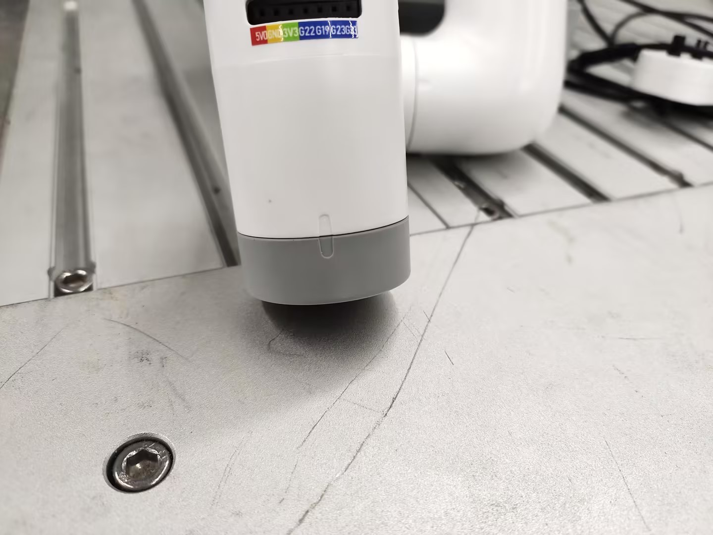
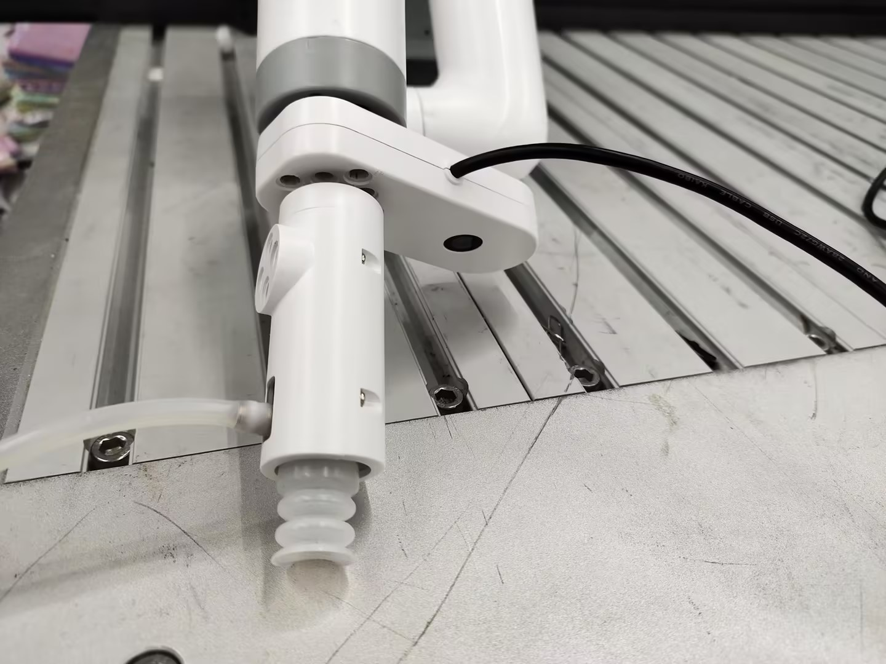
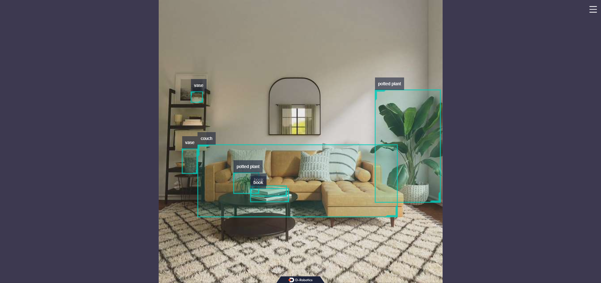
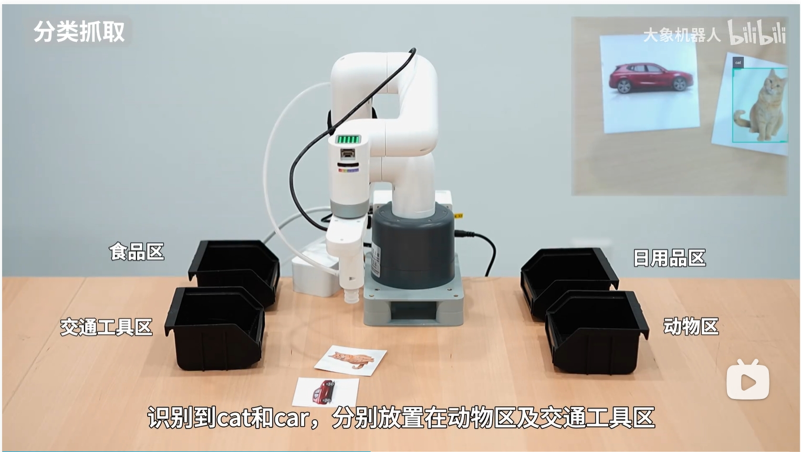

# 物品分类案例

## 1 Hardware Installation
First manually align the end flange with the scale line



Then install the camera on the end flange according to the posture in the picture, and then connect the camera line to the USB interface of the main controller at the bottom


Then install the suction pump on the Lego socket of the camera



Finally, connect the 4pin line of the suction pump box control to the main control IO at the bottom of the robot

> The left side is the suction pump pin, and the right side is the robot arm pin
> GND -> GND
> 5V -> 5V
> G2 -> 37

## 2 Software Running
Open a terminal and enter the command, press the keyboard Enter key to run
```bash
export CAM_TYPE=usb
```
Then enter the following command to start the camera recognition node
```bash
ros2 launch dnn_node_example dnn_node_example.launch.py dnn_example_config_file:=config/yolov8workconfig.json dnn_example_image_width:=640 dnn_example_image_height:=480
```
The output log shows that the node runs successfully
```shell
[example-3] [WARN] [1655095347.608475236] [example]: Create ai msg publisher with topic_name: hobot_dnn_detection
[example-3] [WARN] [1655095347.608640353] [example]: Create img hbmem_subscription with topic_name: /hbmem_img
[example-3] [WARN] [1655095348.709411619] [img_sub]: Sub img fps 12.95
[example-3] [WARN] [1655095348.887570945] [example]: Smart fps 12.10
[example-3] [WARN] [1655095349.772225728] [img_sub]: Sub img fps 11.30
[example-3] [WARN] [1655095349.948913662] [example]: Smart fps 11.31
[example-3] [WARN] [1655095350.834951431] [img_sub]: Sub img fps 11.30
[example-3] [WARN] [1655095351.011915729] [example]: Smart fps 11.30
```

Enter http://IP:8000 in the browser on the PC to view the image and algorithm rendering effects (IP is the IP address of RDK):



### Example Program
```python
#!/usr/bin/env python3
import rclpy
from rclpy.node import Node
from ai_msgs.msg import PerceptionTargets
from sensor_msgs.msg import CompressedImage
from pymycobot import MyCobot280RDKX5,utils
import time
import cv2
import numpy as np
import Hobot.GPIO as GPIO
GPIO.setwarnings(False)
GPIO.setmode(GPIO.BOARD)
output_pin1 = 37 
GPIO.setup(output_pin1, GPIO.OUT)
GPIO.output(output_pin1, GPIO.HIGH)

def pump_off():
    GPIO.output(output_pin1, GPIO.HIGH)
    time.sleep(0.05)
    #GPIO.output(output_pin2, GPIO.LOW)
    #time.sleep(0.05)


def pump_on():
    GPIO.output(output_pin1, GPIO.LOW)
    time.sleep(0.05)
    # GPIO.output(output_pin2, GPIO.HIGH)
    # time.sleep(0.05)

class MinimalSubscriber(Node):
    def __init__(self):
        self.mc=MyCobot280RDKX5("/dev/ttyS1",1000000)
        self.mc.sync_send_angles([0,0,-90,0,0,136.21],50)
        print("ok")
        super().__init__('minimal_subscriber')
        self.subscription = self.create_subscription(
            PerceptionTargets,
            '/hobot_dnn_detection',
            self.listener_callback,
            10)      
        self.target=["car","banana","cat","clock","pizza","remote"]
        self.cameraMatrix =np.array([
            [827.29511682, 0., 368.87666292],
            [0.,  824.88958537, 262.03016541],
            [0., 0., 1.]])

        self.distCoeffs = np.array(([[0.21780081, -0.56324781, 0.01165061,   0.01845253,
                    -1.0631406]]))
        self.cam_coords=[170.4, -59.2, 197.4, -178.16, -2.54, 134.06]
        self.a=[-35.33, -43.24, -28.56, -21.0, 0.79, 139.83]
        self.b=[-74.7, -16.43, -71.36, -5.88, 0.7, 143.87]
        self.c=[63.89, -39.9, -36.82, -15.99, 0.7, 136.93]
        self.d=[113.46, -5.27, -85.95, -1.58, 0.79, 138.86]

    def calculate_center(self,roi):  
        x_center = roi.x_offset + roi.width / 2
        y_center = roi.y_offset + roi.height / 2
        return [x_center, y_center]
    
    def pixel_to_camera(self,u, v):
        fx = self.cameraMatrix[0, 0]  
        fy = self.cameraMatrix[1, 1]  
        cx = self.cameraMatrix[0, 2]  
        cy = self.cameraMatrix[1, 2]  
        Z=0.241

        X = (u - cx) * Z / fx
        Y = (v - cy) * Z / fy
        X=float(round(X*1000,2))
        Y=float(round(Y*1000,2))
        
        return [X, Y]
        
    def listener_callback(self, msg):
        
        for target in msg.targets:
            for rois in target.rois:
                result=self.calculate_center(rois.rect)
                if rois.type in self.target:
                    xy=self.pixel_to_camera(result[0],result[1])
                    self.cam_coords[0]=self.cam_coords[0]+35       
                    self.cam_coords[0]=self.cam_coords[0]-xy[0]
                    self.cam_coords[1]=self.cam_coords[1]+xy[1]
                    self.cam_coords[2]=150
                    # print("cam_coords=",self.cam_coords)
                    self.mc.send_coords(self.cam_coords,50)
                    time.sleep(3)
                    self.cam_coords[2]=78
                    self.mc.send_coords(self.cam_coords,50)
                    time.sleep(3)
                    pump_on()
                    time.sleep(1)
                    self.cam_coords[2]=160
                    self.mc.send_coords(self.cam_coords,50)
                    time.sleep(3)
                    ["car","banana","cat","clock"]
                    if rois.type=="car":
                        self.mc.sync_send_angles(self.a,50)
                        
                    elif rois.type=="banana" or rois.type=="pizza":
                        self.mc.sync_send_angles(self.b,50)
                          
                    elif rois.type=="cat"  :
                        self.mc.sync_send_angles(self.c,50)
                        
                    elif rois.type=="clock" or rois.type=="remote":
                        self.mc.sync_send_angles(self.d,50)
                        
                    pump_off()
                    # time.sleep(1)
                    time.sleep(2)
                    self.cam_coords=None
                    self.mc.sync_send_angles([0,0,-90,0,0,136.21],100)
                    # self.cam_coords=[170.4, -59.2, 197.4, -178.16, -2.54, 134.06]
                    while self.cam_coords is None:
                        self.cam_coords=self.mc.get_coords()


def main(args=None):
    rclpy.init(args=args)
    minimal_subscriber = MinimalSubscriber()
    rclpy.spin(minimal_subscriber)
    minimal_subscriber.destroy_node()
    rclpy.shutdown()

if __name__ == '__main__':
    main()
```

## Effect display

[Video link](https://www.bilibili.com/video/BV1T2KGeQE51/?spm_id_from=333.1387.homepage.video_card.click&vd_source=672e3f7240eaaca210b45e7c033dc45f)

