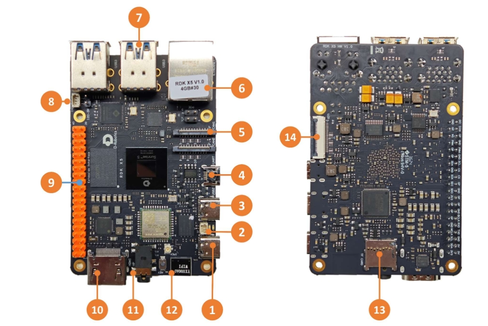
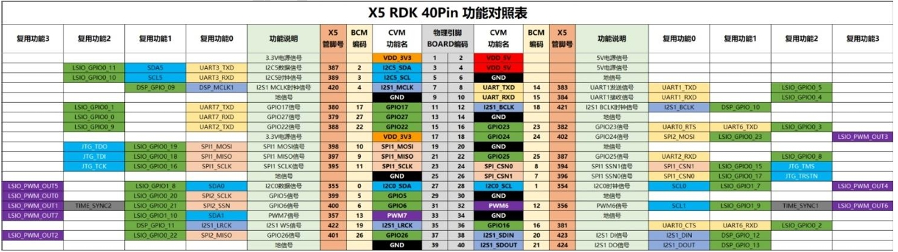

# RDK X5 User Guide

## **Product Introduction**

**RDK X5** is a full-featured development board with 10Tops edge-side inference computing power and 8-core ARM A55 processing power, supporting 2-way MIPI Camera access and 4-way USB3.0 interface. By matching a variety of sensors and expansion components, it provides developers with flexible hardware expansion and connection options.

The main features of the RDK X5 robot developer kit include: octa-core Cortex®A55 processor, 10Tops BPU computing power, 32GFlops GPU computing power, and up to LPDDR4 8GB memory. The main interfaces of the kit include: HDMI, Ethernet, USB3.0, USB2.0, 4-lane MIPI CSI, 4-lane MIPI DSI, 3.5mm audio interface, CAN interface, TF card slot, etc.

RDK X5 is equipped with dual-band 2.4/5GHz wireless LAN, supporting Wi-Fi 6 protocol and Bluetooth 5.4 protocol. The module itself is equipped with a high-performance onboard antenna and supports the use of an external antenna kit, thus achieving extremely fast and reliable wireless connection and reducing user development and testing costs.

## **Product Specifications**

| **Processor** | 8-core Cortex® A55 processor, 10Tops BPU computing power, 32GFlops GPU computing power |
| :----------- | :----------------------------------------------------------- |
| **Size** | 85mm x 56mm x 20mm |
| **Display** | 1 x 4-lane MIPI DSI interface, supports MIPI V1.2 protocol, 1 x HDMI Type-A interface, supports up to 1080P/60fps |
| **Memory** | Optional 4GB/8GB capacity |
| **Storage** | Onboard 1G-bit NAND, provides TF Card Socket, supports UHS-I mode |
| **Wireless communication** | Supports Wi-Fi6＆BT5.4 |
| **Wired network** | 1 x RJ45 interface, supports 1000M Ethernet and POE, provides high-performance onboard antenna and IPEX interface |
| **Audio interface** | 3.5mm standard audio interface, supports input and output |
| **USB interface** | 4-channel USB3.0 |
| **Debug interface** | 1 x USB 2.0 Device Type-C interface, USB 2.0 UART Micro-B interface, 1 x CAN FD interface, 28 GPIOs, 3.3V logic, supports SPI, I2C, I2S, PWM, UART and other protocols |
| **MIPI interface** | 4-lane MIPI CSI, 4-lane MIPI DSI |
| **Camera** | 2 x 4-lane MIPI CSI interface, supports MIPI V2.1 protocol |
| **Operating system** | Pre-installed RDK X5 OS, supports Ubuntu22.04 operating system |
| **Power input** | 5V/5A DC power input, Type-C interface; provides 5V, 3.3V external power supply capability |
| **Operating temperature** | -20℃ ~ 60℃ |

## **Schematic**

[RDK X5 Schematic](https://archive.d-robotics.cc/downloads/hardware/rdk_x5/RDK_X5_IO_CONN_PUBLIC_V1.0.pdf)

## **Interface Overview**

RDK X5 provides functional interfaces such as network port, USB, camera, LCD, HDMI, CANFD, 40PIN, etc., which facilitate users to develop and test applications such as image multimedia and deep learning algorithms. The interface layout of the development board is as follows:

| **Serial number** | **Function** |
| :----------- | :-------------------------------- |
| **1** | Power supply interface (USB Type C) |
| **2** | RTC battery interface |
| **3** | Easy-connect interface (USB Type C) |
| **4** | Debug serial port (Micro USB) |
| **5** | 2-way MIPI Camera interface |
| **6** | Gigabit Ethernet port, support POE |
| **7** | 4-way USB 3.0 Type A interface |
| **8** | CAN FD high-speed interface |
| **9** | 40PIN interface |
| **10** | HDMI display interface |
| **11** | Multi-standard compatible headphone interface |
| **12** | Onboard Wi-Fi antenna |
| **13** | TF card interface (bottom) |
| **14** | LCD display interface (MIPI DSI) |

## **Power interface**

The development board provides a USB Type C interface (interface 1) as a power supply interface. You need to use a power adapter that supports 5V/5A to power the development board. After connecting the power adapter to the development board, the green power indicator lights up, indicating that the development board is powered normally. After version 3.1.0, the orange status indicator flashes, indicating that the system is running normally.

**Note:** **Please do not use the computer USB interface to power the development board, otherwise the development board will be abnormally powered off and repeatedly restarted due to insufficient power supply. ! ! ! ! ! !**

## **Debug serial port**

The development board provides a debug serial port (interface 4) to realize serial port login and debugging functions. The parameters of the computer serial port tool are as follows:

- Baud rate: 115200
- Data bits: 8
- Parity: None
- Stop bits: 1
- Flow Control: None

When connecting the serial port, you need to connect the development board interface 4 to the PC through a Micro-USB cable.

Usually, when users use this interface for the first time, they need to install the CH340 driver on the computer. Users can search for the CH340 serial port driver keyword to download and install it.

## **Wired network port**

The development board provides a Gigabit Ethernet interface (interface 6), supports 1000BASE-T and 100BASE-T standards, and uses static IP mode by default. The IP address is `192.168.127.10`. If you need to confirm the IP address of the development board, you can log in to the device through the serial port and use the ifconfig command to view the configuration of the `eth0` network port.

In addition, this interface supports PoE (Power over Ethernet) function, which can transmit data and power through the network cable at the same time without an additional power cable, making the installation of the device easier and more flexible.

## **HDMI display interface**

The development board provides an HDMI (port 10) display interface, which supports up to 1080P resolution. The development board outputs the Ubuntu system desktop on the monitor through the HDMI interface (the Ubuntu Server version displays the logo icon). In addition, the HDMI interface also supports real-time display of cameras and network streaming images.

USB display interface
The development board implements multi-channel USB interface expansion through hardware circuits to meet the user's needs for multi-channel USB device access. The interface description is as follows:

| **Interface type** | **Interface serial number** | **Interface quantity** | **Interface description** |
| :----------- | :---------- | :---------- | :-------------|
| USB 2.0 Type C | Interface 3 | 1 channel | USB Device mode, used to connect to the host to implement ADB, Fastboot, system burning and other functions |
| USB 3.0 Type A | Interface 7 | 4 channels | USB Host mode, 4 USB ports are expanded through HUB for access to USB 3.0 peripherals |

### Access USB flash drive

The development board USB Type A interface (Interface 7) supports USB flash drive function and can automatically detect and mount USB flash drive access. The default mount directory is /media/sda1.

### Connecting to USB Serial Port Adapter

The USB Type A interface (interface 7) of the development board supports the USB Serial Port Adapter function. It can automatically detect the USB Serial Port Adapter connection and create the device node /dev/ttyUSB* or /dev/ttyACM* (the asterisk represents a number starting from 0). Users can refer to the Using Serial Port section to use the serial port.

### USB Camera

The USB Type A interface of the development board supports the USB camera function. It can automatically detect the USB camera connection and create the device node /dev/video0.

## **LCD display interface**

RDK X5 provides a MIPI DSI LCD display interface (interface 14), which can be used for LCD display and other access. The interface is 22pin, and DSI-Cable-12cm cable can be used to directly connect to multiple Raspberry Pi LCD displays.

## **Micro SD interface**

The development board provides a Micro SD memory card interface (interface 13). It is recommended to use a memory card with at least 16GB capacity to meet the installation requirements of the Ubuntu operating system and related function packages.

**Note:** Hot-swappable TF memory card is prohibited during the use of the development board, otherwise it will cause system operation abnormalities and even damage the memory card file system.

## **Wi-Fi antenna interface**

The wireless network of the development board supports both onboard and external antenna configurations. Under normal circumstances, the onboard antenna can meet the usage requirements. When the development board is installed with a metal shell, it is necessary to connect the external antenna to (the antenna interface next to interface 12) to enhance the signal strength.

## **CANFD interface**

RDK X5 development board provides CANFD interface, which can be used for CAN and CAN FD communication. For details, please refer to the [CAN usage](https://developer.d-robotics.cc/rdk_doc/Advanced_development/hardware_development/rdk_x5/can) section

## **40PIN interface**

RDK X5 development board provides 40PIN interface, and IO signal adopts 3.3 V level design.

## **Precautions**

RDK X5 is suitable for laboratory or engineering environment. Please read the following precautions before starting operation:

1. Do not hot-swap the screen interface, CSI interface and expansion board under any circumstances.

2. Before unpacking and installing the development board, please take necessary anti-static measures to avoid electrostatic discharge (ESD) damage to the development board hardware.
3. When holding the development board, please hold the edge of the development board and do not touch the exposed metal parts on the development board to avoid static electricity from damaging the components of the development board.
4. Please place the development board on a dry surface to ensure that it is away from heat sources, electromagnetic interference sources and radiation sources, and electromagnetic radiation sensitive equipment (such as medical equipment).