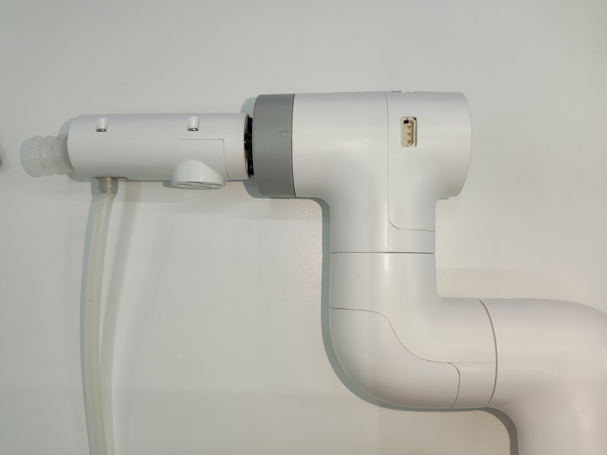
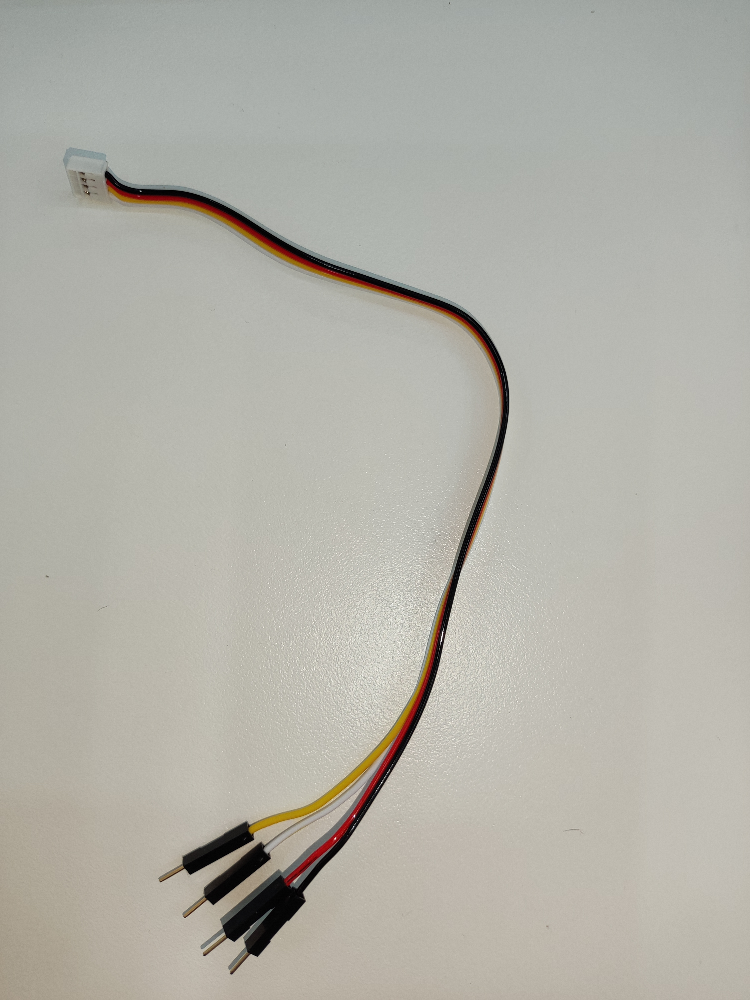

# Robot suction pump to carry wooden blocks

## 1 Functional description
The robot will use the suction pump to carry wooden blocks from point A to point B

## 2 Hardware installation
Insert the Lego connector into the reserved socket on the suction pump


Align the suction pump with the connector inserted into the socket at the end of the robot arm



Select the male-female DuPont wire, and insert the female end into the socket marked with pins on the suction pump box




Then connect the wire to the base IO of the robot arm


> The left side is the suction pump pin, and the right side is the robot arm pin
> GND -> GND
> 5V -> 5V
> G2 -> 21
> G5 -> 20

## 3 Pump test
Run the following program, the pump will repeat the opening and closing action twice
```python
from pymycobot import MyCobot280
import time
import Jetson.GPIO as GPIO

arm = MyCobot280("/dev/ttyTHS1", 1000000)
GPIO.setmode(GPIO.BCM)
GPIO.setup(20, GPIO.OUT)
GPIO.setup(21, GPIO.OUT)
# Turn on the pump
def pump_on():
    GPIO.output(20, 0)
    time.sleep(0.05)

# Stop the pump
def pump_off():
    GPIO.output(20, 1)
    time.sleep(0.05)
    GPIO.output(21, 0)
    time.sleep(1)
    GPIO.output(21, 1)
    time.sleep(0.05)

for i in range(2):
    pump_on()
    time.sleep(2)
    pump_off()
    time.sleep(2)
```

## 4 Software Usage
Use the fast movement function of myblockly to teach the grab point and placement point of the wooden block, and record the position information. After teaching, you need to disconnect the serial port connection, otherwise the serial port will be reported when running the python script. The error is that the serial port is occupied.


## 5 Composite application
```python
from pymycobot import MyCobot280
import time
import Jetson.GPIO as GPIO
init_angles=[18.36, 6.5, -124.45, 26.54, -1.84, -110.47]#6 joint angles at the initial position
grab_point=[158.4, -66.9, 77.9, 179.01, 0.88, 52.41]#Coordinates of the grab point
place_point=[158.4, 36.9, 77.9, 179.01, 0.88, 52.41]#Coordinates of the placement point

arm = MyCobot280("/dev/ttyTHS1", 1000000)
GPIO.setmode(GPIO.BCM)
GPIO.setup(20, GPIO.OUT)
GPIO.setup(21, GPIO.OUT)

# Turn on the pump
def pump_on():
    GPIO.output(20, 0)
    time.sleep(0.05)

# Stop the pump
def pump_off():
    GPIO.output(20, 1)
    time.sleep(0.05)
    GPIO.output(21, 0)
    time.sleep(1)
    GPIO.output(21, 1)
    time.sleep(0.05)

if __name__=="__main__":
    pump_off()#Turn off the pump first
    time.sleep(1)
    arm.send_angles(init_angles,100)#Move to the initial position
    time.sleep(2)
    arm.send_coords([grab_point[0],grab_point[1],grab_point[2]+70,grab_point[3],grab_point[4],grab_point[5]],100,1)#Move to 70mm above the grab point
    time.sleep(2)
    arm.send_coords([grab_point[0],grab_point[1],grab_point[2],grab_point[3],grab_point[4],grab_point[5]],100,1)#Move to the grab point
    time.sleep(2)
    pump_on() #Turn on the suction pump
    time.sleep(1)
    arm.send_coords([grab_point[0],grab_point[1],grab_point[2]+70,grab_point[3],grab_point[4],grab_point[5]],100,1)#Move to 70mm above the grab point
    time.sleep(2)
    
    arm.send_coords([place_point[0],place_point[1],place_point[2]+70,place_point[3],place_point[4],place_point[5]],100,1)#Move to 70mm above the placement point
    time.sleep(2)
    arm.send_coords([place_point[0],place_point[1],place_point[2],place_point[3],place_point[4],place_point[5]],100,1)#Move to the placement point
    time.sleep(2)
    pump_off() #Turn off the suction pump
    time.sleep(1)
    arm.send_coords([place_point[0],place_point[1],place_point[2]+70,place_point[3],place_point[4],place_point[5]],100,1)#Move to 70mm above the placement point
    time.sleep(2)

```

## 6 Effect display
