### 系统基础功能说明  

### 机器人系统介绍

- **系统简介**
  
  - Ubuntu是个人桌面操作系统中使用最广泛的linux操作系统。对于初学者来说，熟悉linux环境或一些嵌入式硬件操作系统是一个很好的选择。

    

- **系统功能简介**

  - **myBlockly**：图形化编程软件，可直接通过拖拽积木组成运行代码，控制机械臂  
  - **ROS2 Shell**：直接进入编译好的ROS2环境，可直接输入对应指令，运行对应的可直接运行ROS2代码  
  - **Github-ElephantRobotics**：大象机器人官方开源代码仓库  
  - **Home-ElephantRobotics**：大象机器人官网主页  
  - **UserManual - CN/EN**：机器使用手册，包含所有关于机械臂控制的内容  
  - **AIKits_UI**：AIKits高级套件的UI软件，涵盖目标检测、颜色识别、形状识别、二维码识别等
  - **TestTool**：生产测试工具
  - **Enter_flashmode**：一键进入刷机模式
  
  

### 系统密码说明

- **开机账户密码 & SSH 连接密码 & 管理员账户密码**
  
  - 统一为：Elephant
  
- **如何定义新的密码**
  - 更改账户密码
  
    - 使用快捷键 `ctrl + alt + T` 打开终端
    
    - 输入 `passwd`进行账户密码修改
    
    - 输入新密码两次即可
    
  - 更改SSH连接密码
  
    - SSH远程连接输入的就是管理员账户密码，无需单独修改
    
  - 更改管理员账户密码
  
    - 使用快捷键 `ctrl + alt + T` 打开终端
    
    - 输入 `sudo passwd`进行账户密码修改
    
    - 输入新密码两次即可
    

### 网络配置

#### 以太网连接

将网线插入机械臂以太网口后，系统会自动通过 DHCP 获取 IP 地址。若网络配置和设备正常，系统应能成功建立局域网连接。

#### WIFI连接

1. 打开 "设置"；
2. 打开 “Wi-Fi” 菜单；
3. 点击您要用的网络名称； 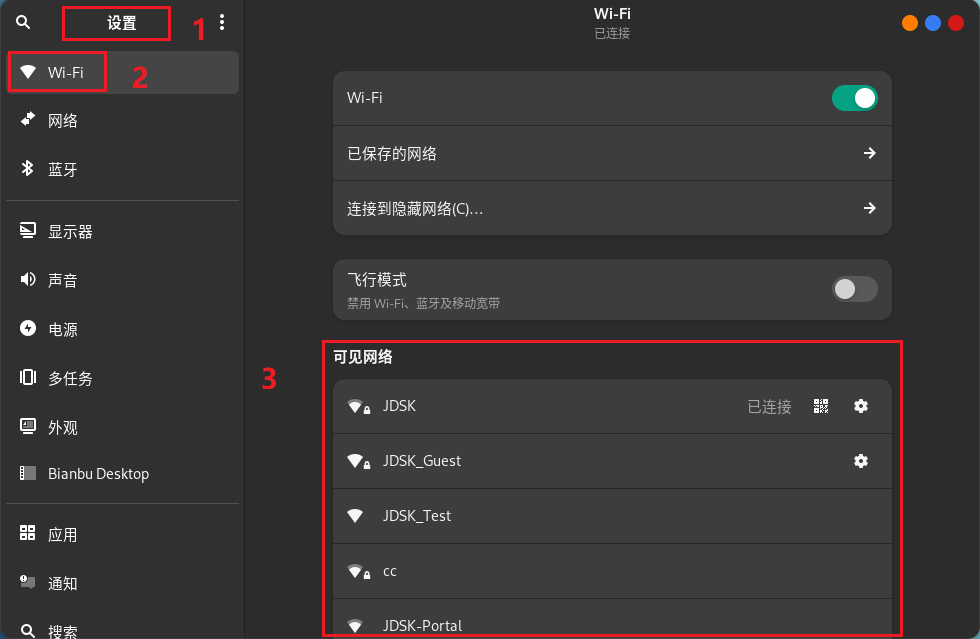
4. 如果网络受到密码保护，请在出现提示时输入密码并单击连接；
5. 当计算机连接到网络过程中，网络图标会发生变化；
6. 如果连接成功，图标会变成一个圆点加上弧状条纹。条纹越多表示网络连接越强。越少表示连接越弱而且可能不太稳定。

#### 查看网络 IP 地址

连接有线/无线网络之后，您可以通过以下方式确认网络是否已连接并正常工作：

**方法一：通过图形界面查看 IP 地址**

1. 打开 “设置”；
2. 打开 “网络” 菜单；
3. 找到已连接的有线网卡，点击其 “设置” 按钮；
4. 弹出对话框即可查看 IP 地址。 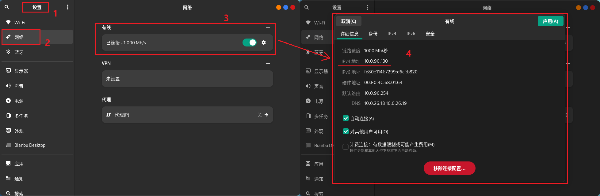

**方法二：终端命令**

打开Bianbu Robot终端，执行以下命令：

```bash
ifconfig
```

在输出内容中查找 `inet` 字段，对应的即为 IPv4 地址。 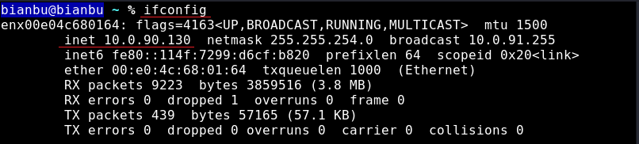

### SSH

SSH 是远程访问开发板的主要方式之一，适用于局域网环境。

#### SSH 服务端

机械臂默认已启用 SSH 服务。可通过以下命令验证服务状态：

```bash
systemctl status ssh
```

若 SSH 服务未启动，可手动启动：

```bash
sudo systemctl start ssh
sudo systemctl enable ssh
```

完成配置后，可通过 PC 使用 SSH 工具远程登录。

#### SSH 客户端

> ⚠️ 请确保开发板已成功联网，联网方法详见：[网络配置](#网络配置)

**Windows 客户端**

推荐使用 **MobaXterm** 工具，操作如下：

1. 打开 MobaXterm，点击 **"Sessions" → "New Session"**，选择 **SSH**。

2. 设置连接参数：

   - **Remote host**：开发板 IP 地址（如 `192.168.1.100`）；

   - **Specify username**：默认用户名为 `bianbu`；

   - **Port**：保持默认 `22`。

3. 点击 **OK** 发起连接，并输入密码完成登录。

#### Ubuntu 客户端

在终端中输入以下命令：

```bash
ssh er@<remote_ip>
```

将 `<remote_ip>` 替换为开发板的实际 IP 地址。首次连接时会提示确认主机指纹，输入 `yes` 即可。

### RDP

- **RDP 功能介绍**
  - 一款远程控制的软件，一般用于远程解决电脑故障或软件调试
- **RDP 端口说明**
  - RDP服务端口号为`3389`

#### RDP 服务端

1. 打开系统设置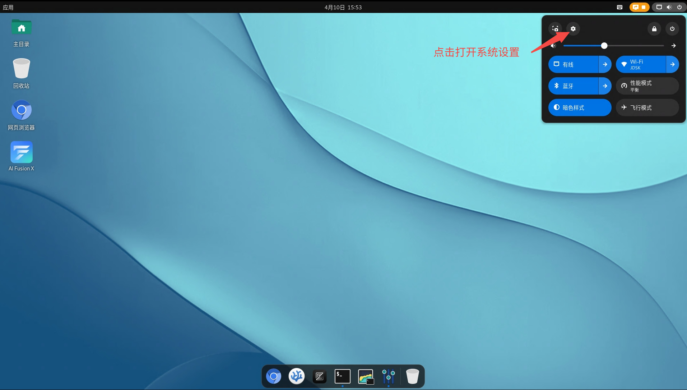
2. 导航到“系统->远程桌面”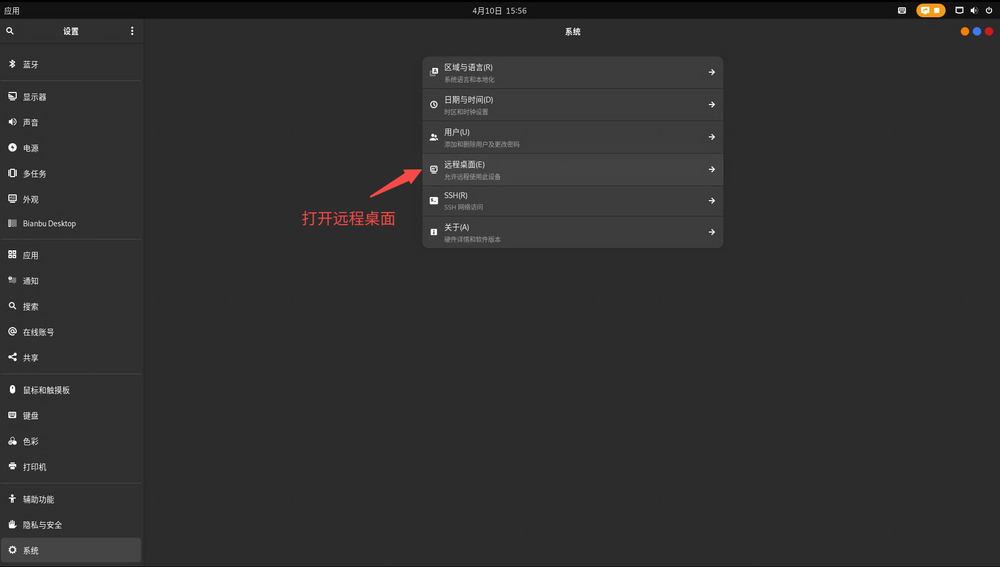
3. 打开“桌面共享”和“远程控制”选项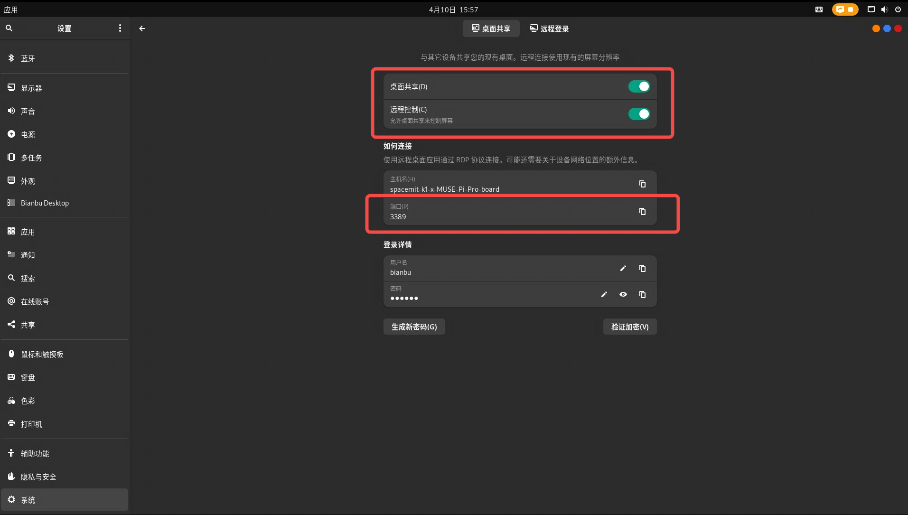

可以重置RDP登录的用户名和密码（默认均为`bianbu`），后续客户端登录需要使用这里的账户。

#### RDP 客户端

PC可通过开发板的RDP端口访问开发板桌面，支持Windows和Linux登录。

> [!NOTE]
>
> 1. 在进行远程连接之前，确保开发板已[联网](#联网)，并与PC处于同一局域网。
>
> 2. 第一次需要使用HDMI连接屏幕进入系统连接WIFI并获取IP。当不接HDMI显示器时，需要使用HDMI屏幕欺骗器才能登录远程桌面。

**Windows客户端**

Windows可使用“远程桌面连接”软件来访问开发板，连接时要计算机名称填写`remote_ip:port`。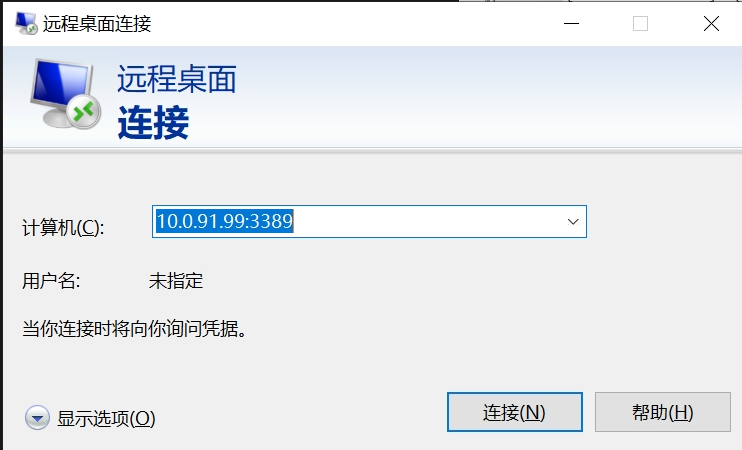

**Ubuntu客户端**

Ubuntu可使用Remmina软件来访问开发板桌面。

1. 下载Remmina

   ```
   sudo sudo apt update
   sudo sudo apt install remmina remmina-plugin-rdp remmina-plugin-vnc remmina-plugin-secret
   ```

2. 启动Remmina

   ```
   remmina
   ```

​	输入上述命令之后，会弹出登录界面，选择RDP协议并输入开发板的IP和RDP端口号，点击回车键进行连接。
​	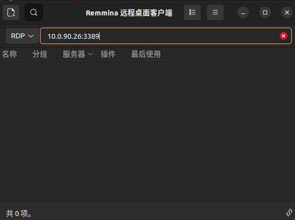

### 语言配置

1. 打开 “系统设置”；
2. 导航到 “系统->区域与语言” 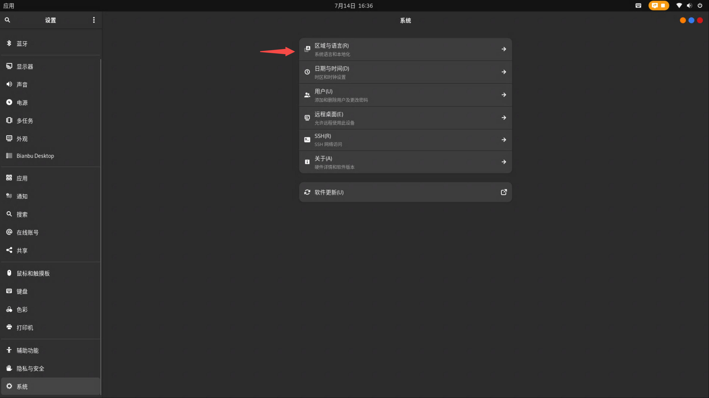

3. 点击 "语言"，选择想要切换的语言，切换之后重启系统生效。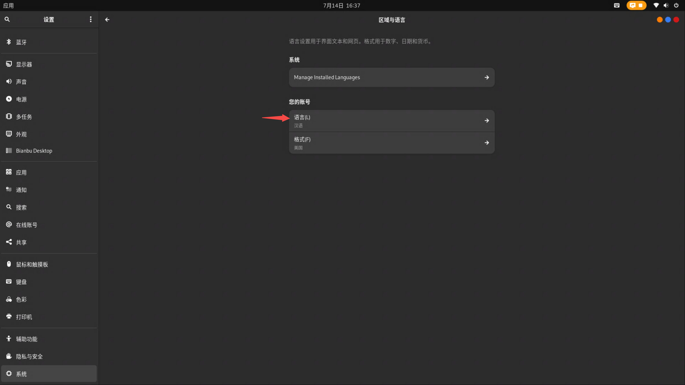

### 系统分辨率切换

1. 打开 “系统设置”；
2. 导航到 “显示器->”，点击 “分辨率”，选择目标分辨率。 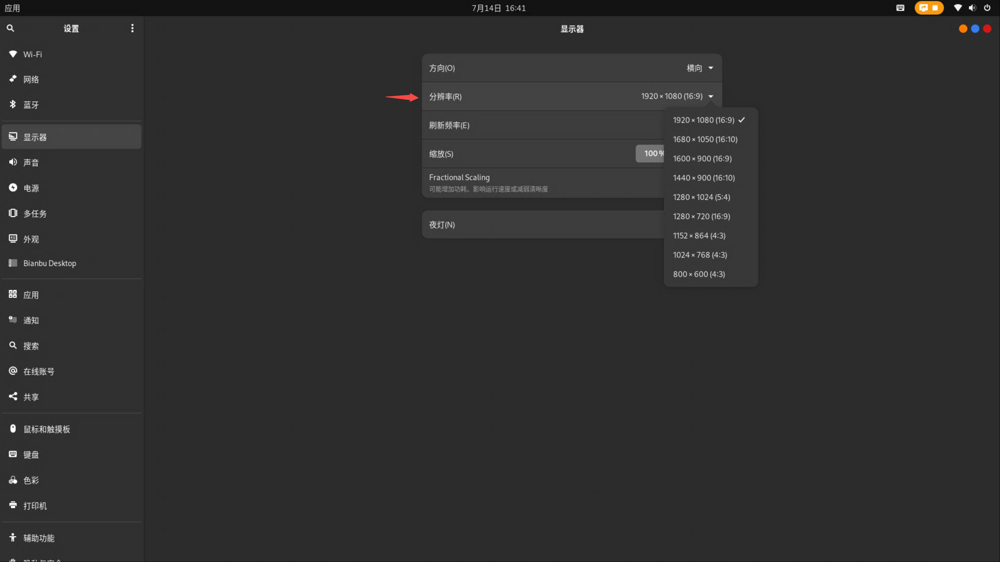


### python

- **机器人系统python简介**
  
  系统内置安装**Python3.12** ，无需自行安装
  
  已安装Python依赖：
  
  
  | Package | Version|
  | :------: | :------: |
  | pymycobot | 3.9.7 |
  | pyserial | 3.5 |
  | numpy | 1.26.4|
  | rospkg | 1.5.1 |
  
- **初次使用python**

  在终端中输入：

  ```
  python3
  ```

  出现 `>>> `标志后即代表进入了python的环境。

  可在输入框中尝试此代码：

  ```
  print ("Hello World!")
  ```

​	此时终端会反馈回`Hello World`字样

​	可以在终端输入`pip list`来查看目前已经有的python的包

- **运行机器人案例代码**
  
  具体案例代码可查看Python章节，直接将案例中代码复制下来即可使用
  
  