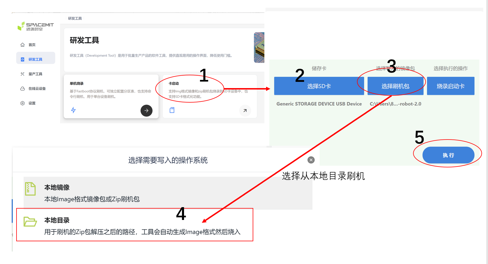

# Titan刷机工具

myCobot 280 RISC-V 采用进迭时空科技有限公司自主研发的 **Titan 刷机工具** 来烧录固件。

## 下载和安装

参考进迭时空官网：**[Titan 刷机工具使用指南](https://developer.spacemit.com/documentation?token=O6wlwlXcoiBZUikVNh2cczhin5d)**

## 刷机

支持将固件烧写到TF 卡。

### 烧写到 TF 卡

在电脑上解压固件到本地目录，然后插入 TF 卡，进行下图操作来进行卡烧录：

卡启动方式需要手动对文件系统进行扩容。开发板上电之后，按照下图操作：

