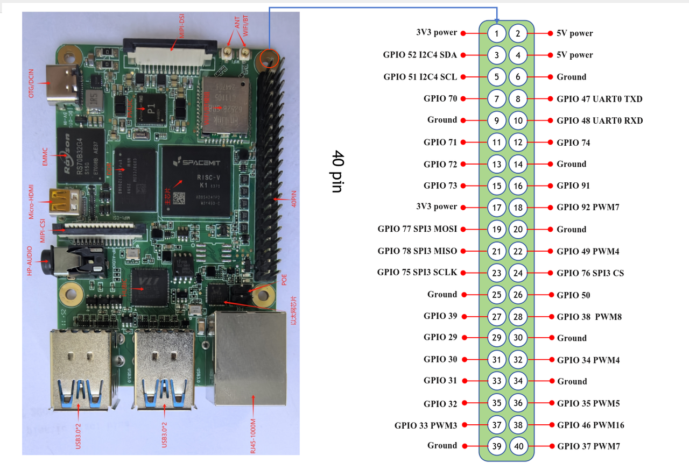

# gpiozero库使用

myCobot 280 RISC-V 目前暂未适配 `RPi.GPIO` 库，对 GPIO 设备的控制需要使用 `gpiozero` 库。`gpiozero` 是一个简单易用的 GPIO 控制库，支持多种 GPIO 设备操作。

### **安装gpiozero库**

使用以下命令安装 `gpiozero` 库（建议在虚拟环境中安装）：

```
pip install --index-url https://git.spacemit.com/api/v4/projects/33/packages/pypi/simple gpiozero==2.0.3
```

- `--index-url`：指定从 Spacemit 的 pip 源下载预编译好的 Python 包。

### **赋予GPIO设备读写权限**

默认情况下，GPIO 设备的访问权限受限。为了允许普通用户访问 GPIO 设备，需要修改设备文件的权限：

```
sudo chmod a+rw /dev/gpiochip0
```

### **gpiozero 使用教程**

关于 `gpiozero` 库的详细使用方法，请参考以下文档：

**[从 Python 使用 GPIO](https://bianbu.spacemit.com/development/python#%E4%BB%8E-python-%E4%BD%BF%E7%94%A8-gpio)**

注意：RV4B开发板的设备引脚布局参考下图。



### **测试代码**

以下是一个简单的测试代码，用于控制吸泵和泄气阀门：

```python
import time
from gpiozero.pins.lgpio import LGPIOFactory
from gpiozero import Device
from gpiozero import LED

# 显式指定 GPIO 设备文件
Device.pin_factory = LGPIOFactory(chip=0)  # 使用 /dev/gpiochip0

# 初始化 GPIO 控制的设备
valve = LED(72)  # 使用 LED 类控制 GPIO 72（泄气阀门）

# 打开吸泵，关闭泄气阀门
valve.off()
print("泄气阀门已关闭")
time.sleep(0.05)

time.sleep(4)

# 关闭吸泵，打开泄气阀门
valve.on()
print("泄气阀门已打开")
time.sleep(1)

```

测试过程中，注意以下几点：

- GPIO 引脚编号：确保使用的 GPIO 引脚编号与实际硬件连接一致。
- 权限问题：如果运行代码时提示权限不足或者无法打开设备，请确保已正确设置 `/dev/gpiochip0` 的权限。
- 硬件连接：确保吸泵和泄气阀门已正确连接到 GPIO 引脚。