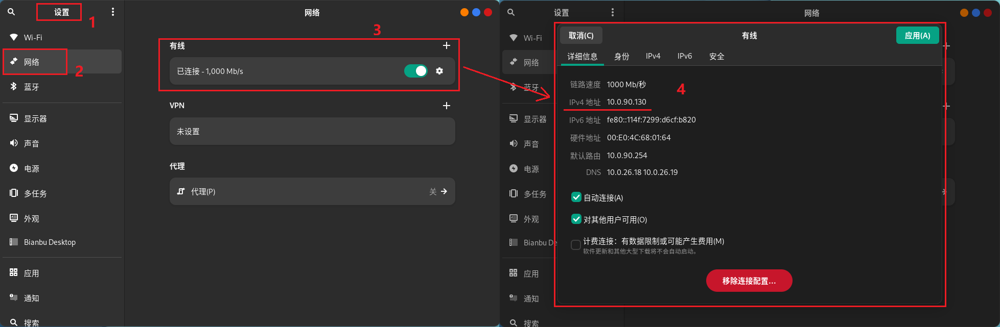
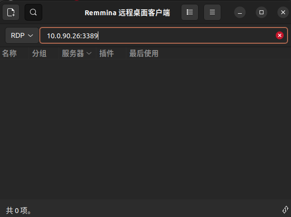

# 联网

## 连接以太网

将网线插入设备后，系统会自动通过 DHCP 获取 IP 地址。若网络配置和设备正常，系统应能成功建立局域网连接。

## 连接WIFI

1. 打开 "设置"；
2. 打开 “Wi-Fi” 菜单；
3. 点击您要用的网络名称； 
4. 如果网络受到密码保护，请在出现提示时输入密码并单击连接；
5. 当计算机连接到网络过程中，网络图标会发生变化；
6. 如果连接成功，图标会变成一个圆点加上弧状条纹。条纹越多表示网络连接越强。越少表示连接越弱而且可能不太稳定。

## 查看网络 IP 地址

连接有线/无线网络之后，您可以通过以下方式查看网络的IPv4地址：

**方法一：通过图形界面查看 IP 地址**

1. 打开 “设置”；
2. 打开 “网络” 菜单；
3. 找到已连接的有线网卡，点击其 “设置” 按钮；
4. 弹出对话框即可查看 IP 地址。 

**方法二：终端命令**

打开Bianbu Robot终端，执行以下命令：

```bash
ifconfig
```

在输出内容中查找 `inet` 字段，对应的即为IPv4地址。 

# SSH

Bianbu Robot默认开启SSH服务端，可直接通过`ssh hostname@remote_ip`命令连接到开发板。

# RDP

Bianbu Robot配置了RDP协议实现PC对开发板的远程访问。

## 服务端（开发板）

（1）打开系统设置


（2）导航到“系统->远程桌面”


（3）打开“桌面共享”和“远程控制”选项


记住端口号，同时可以设置登录的用户名和密码，后面客户端登录需要使用这里的账户。

## 客户端

PC（支持Windows和Linux）可通过远程连接客户端访问开发板桌面。在进行远程连接之前，确保开发板已[联网](#联网)，并与PC处于同一局域网。

第一次需要使用HDMI连接屏幕进入系统连接WIFI并获取IP。当不接HDMI显示器时，需要使用HDMI屏幕欺骗器才能登录远程桌面。

### Windows客户端

Windows可使用“远程桌面连接”软件来访问开发板，连接时要计算机名称填写`remote_ip:port`，如图所示。


### Ubuntu客户端

Ubuntu可使用Remmina软件来访问开发板桌面。

（1）下载Remmina

```python
sudo sudo apt update
sudo sudo apt install remmina remmina-plugin-rdp remmina-plugin-vnc remmina-plugin-secret
```

（2）启动Remmina

```python
remmina
```

输入上述命令之后，会弹出登录界面，选择RDP协议并输入开发板的IP和RDP端口号，点击回车键进行连接：

